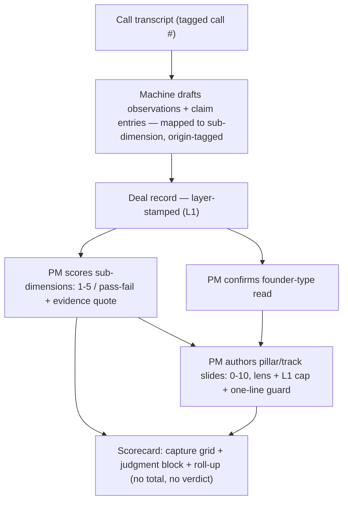
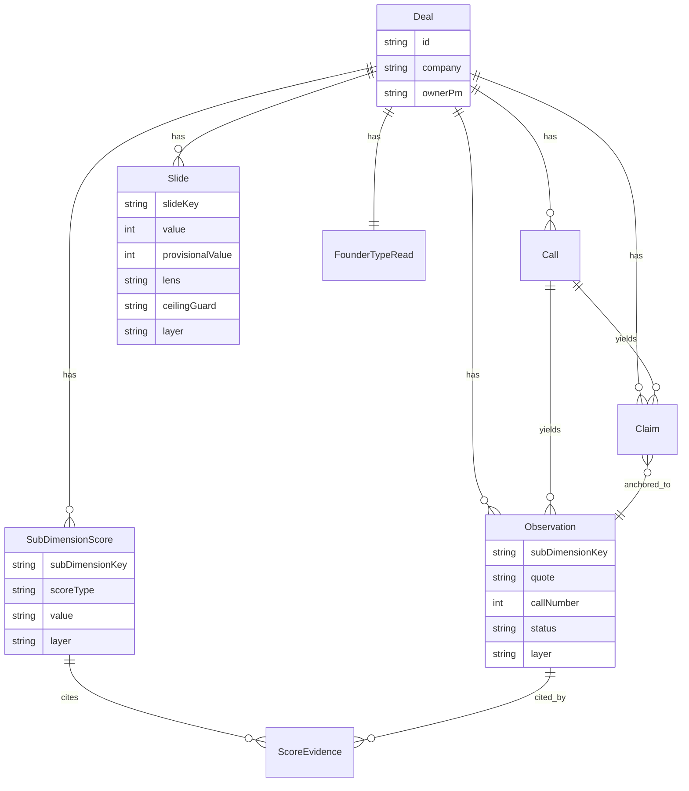

# Capture & Scorecard Skeleton (L1) - Plan

## Goal Capsule

- **Objective:** Build the **L1 (Conviction) layer** of Biome's evaluation skeleton as a working TypeScript app — the **capture module** (six rubrics scored from a call transcript) and the **scorecard** it renders (capture grid + judgment slides + roll-up).
- **Product authority:** Structure follows the Notion *Idea to Enterprises Framework* subpages only. The full skeleton (L1 → L2 → L3 → IC) is the eventual build; this plan owns **L1 only**, because it is foundational and every later layer deepens on top of it. L2/L3/IC and all non-scorecard gate-package artefacts are not active scope.
- **Execution:** Greenfield build in the `TARS` repo; land the units in dependency order. Stop and surface a blocker if any unit would contradict the Product Contract or require a product decision the plan doesn't carry.
- **Open blockers:** None block planning or implementation. Gate logic (pass thresholds, go/no-go) is still *Pending* in the framework and is deliberately deferred, not a blocker.

---

## Product Contract

### Summary

A TypeScript web app that runs the Conviction (L1) layer of the evaluation skeleton one deal at a time. A PM pastes a call transcript; the app's LLM drafts verbatim observations and claim-ledger entries mapped to the six rubrics; the PM authors every 1–5 / pass-fail sub-dimension score and every 0–10 pillar/track slide; and the app renders the scorecard — capture grid, judgment slides, and roll-up — with no total, composite, or gate verdict.

### Problem Frame

Biome evaluates founder deals through a framework that deliberately separates two things: **capture** (what a PM observes and scores from the calls) and **judgment** (the 0–10 human read drawn from that capture, never the same number). Today the framework lives as a written skeleton across Notion pages; there is no tool that holds a deal's record, enforces the authorship rule (machine drafts, PM scores), or renders the scorecard the framework specifies.

The framework runs four layers (L1 Conviction → L2 Refine & Verify → L3 Co-creation → IC). L1 is where a deal's record opens and every sub-dimension is scored for the first time; every later layer refines or deepens that same record. Building L1 first makes the foundational data model and authorship flow real, and lets L2/L3 attach later without rework. The cost of getting L1's shape wrong compounds through every layer above it, which is why it is worth pinning the record, the scoring rules, and the scorecard render now.

### Key Decisions

- KD1. **Structure from the Notion subpages only.** The six rubrics, sub-dimension anchors, rooting, pillars/tracks, slide logic, and scorecard shape all come from Notion; the other repo's drilldowns are not a structural source. *(session-settled: user-directed — chosen over the other repo's DD-03/04 constructs: that repo's `CLAUDE.md` informs working style, not structure.)* Governs R6, R9, R10, R12.
- KD2. **Full authorship model in slice 1.** Transcript in → machine drafts observations + claims → PM scores → app renders. *(session-settled: user-directed — chosen over a manual-first MVP: it is the real operating model.)* Governs R3, R4, R5.
- KD3. **L1 first, record layer-aware from day one.** Only the Conviction layer is built now; every observation and score is stamped with the layer it was made at, so L2/L3 refinement attaches to the same record later without rework. *(session-settled: user-directed — the full skeleton is the eventual build; L1 is foundational.)* Governs R1.
- KD4. **Founder-type read stays in slice 1.** *(session-settled: user-directed — chosen over deferring it: cheap, L1-native, and it sets the Founder-track floor.)* Governs R11.
- KD5. **TypeScript full-stack** (Next.js + Prisma + Anthropic TS SDK, SQLite → Postgres). *(session-settled: user-directed — chosen over Python: one language front-to-back for the rich scorecard UI.)*
- KD6. **The machine never scores.** It drafts observations and claim entries and maps them to sub-dimensions; the PM authors every 1–5, pass/fail, and 0–10 value. Grounded in the Notion authorship rule (*Spine + Delta artefact structuring*). Governs R5, R9.
- KD7. **No total, no composite, no gate verdict.** Pillars and tracks are never averaged into one number, and the scorecard renders roll-up facts but computes no gate decision — the framework's gate logic is *Pending*. Governs R12.

### Actors

- A1. **PM** — verifies and edits the machine's draft observations and claims, authors every sub-dimension score and pillar/track slide, confirms the founder-type read, and reads the scorecard.
- A2. **Extractor (the machine/LLM)** — on transcript ingest, drafts verbatim observations and claim-ledger entries, maps each to a rubric and sub-dimension, origin-tags claims, and renders the record's views. Never scores.

### Requirements

**Deal & record**

- R1. One append-style **record per deal** (company). A PM can create, list, and open a deal; all capture is scoped to a deal. Every observation and score is stamped with the layer it was made at (L1 now; the stamp is what lets L2/L3 attach later).
- R2. A PM pastes a **call transcript** into a deal, tagged with a call number; speaker labels and timestamps are used when present in the pasted text.

**Machine drafting (authorship)**

- R3. On ingest, the extractor drafts verbatim **observations** — each a quoted excerpt mapped to a rubric and sub-dimension (element), carrying its source (call #) and any speaker/timestamp. Observations are drafts the PM can accept, edit, or reject.
- R4. The extractor drafts **claim-ledger** entries — founder assertions, quote-anchored to an observation and origin-tagged (`founder-volunteered` / `founder-confirmed-after-PM-framing` / `machine-inferred`). At L1 the ledger opens at status *claimed* only.
- R5. The extractor never sets a score. Its mapping of an observation to a sub-dimension is a draft container; the sub-dimension stays unscored until the PM sets its value. Covers KD6.

**Capture scoring (six rubrics)**

- R6. The six rubrics and their sub-dimensions are encoded from the Notion *Assessment Rubrics*: each sub-dimension typed **Scale 1–5** or **Binary pass/fail**, carrying its 1/3/5 (or Fail/Unverified/Pass) anchor text shown to the PM at scoring time, and its "roots to" target (pillar / track / floor / capture-only).
- R7. A PM scores each sub-dimension by selecting its 1–5 or pass/fail value and attaching **≥1 evidence quote** (an observation). A sub-dimension scored with no evidence attached is treated as incomplete.
- R8. The binary hygiene sub-dimensions form the **floor**; the scorecard surfaces floor status and flags any Fail as deal-dropping. Kill-floor sub-dimensions (e.g., Ambition & exit-type fit, Cap-table health) are flagged when scored at their floor value.

**Judgment (pillars, tracks, founder-type)**

- R9. The **seven pillars + three tracks** each carry a 0–10 **human slide** authored by the PM. The app shows the rooted sub-dimension scores (the pillar's peak candidate or the slide's required set, per the Notion lens table) as context but never computes or averages the slide. Covers KD6, KD7.
- R10. Each slide is authored under its fixed **lens** (peak or weakest-link) and the **L1 verification cap** (bankable ceiling ~6 while the claim is unverified; a higher read is recorded as a provisional, e.g. "8 provisional — if the claim verifies"). Every slide requires a **one-line ceiling guard** naming which sub-dimension set the ceiling and why.
- R11. **Founder-type read:** the extractor drafts primary + secondary type from captured background; the PM confirms or overrides in one line. The type sets the Founder-track floor dimension and the expected-pillar profile, shown as context. No automated go / conditional-go / no-go verdict.

**Scorecard render**

- R12. The app renders the **scorecard** from the record: a **capture block** (rubric · sub-dimension · score · evidence · layer), a **judgment block** (pillar/track · critical/fillable · 0–10 slide · rooted sub-dimensions · ceiling-guard line), and a **roll-up** (number of exceptional pillars, whether ≥1 is critical, whether the Founder-track floor clears, floor status). No total, no composite, no gate verdict. Covers KD7.
- R13. Views are generated from the record, never authored directly; editing the scorecard means editing the underlying observations and scores.

### Authorship & render flow

### Key Flows

- F1. **Ingest & draft**
  - **Trigger:** PM opens a deal and pastes a transcript tagged with a call #.
  - **Actors:** A1, A2
  - **Steps:** Extractor drafts observations mapped to rubric/sub-dimension and claim entries (origin-tagged, status *claimed*) → PM reviews, edits, accepts or rejects each.
  - **Covers:** R2, R3, R4, R5
- F2. **Capture scoring**
  - **Trigger:** PM works a rubric on a deal with drafted observations.
  - **Actors:** A1
  - **Steps:** For each sub-dimension, PM reads the anchors → sets 1–5 or pass/fail → attaches ≥1 observation as evidence. Binary hygiene rows set floor status.
  - **Covers:** R6, R7, R8
- F3. **Judgment slides**
  - **Trigger:** Capture scored enough for the PM to read a pillar/track.
  - **Actors:** A1
  - **Steps:** App shows the rooted sub-scores + lens → PM sets the 0–10 slide within the L1 cap → PM writes the one-line ceiling guard. Founder-type read confirmed in one line.
  - **Covers:** R9, R10, R11
- F4. **Scorecard render**
  - **Trigger:** Any change to the record.
  - **Actors:** A2
  - **Steps:** App re-renders the capture grid, judgment block, and roll-up from the record; no total or verdict is produced.
  - **Covers:** R12, R13

### Acceptance Examples

- AE1. **Score without evidence.** **Given** a PM sets a sub-dimension's 1–5 value, **when** no observation is attached, **then** the sub-dimension is surfaced as incomplete rather than counted as scored. **Covers R7.**
- AE2. **Binary floor Fail.** **Given** a binary hygiene sub-dimension, **when** it is scored Fail, **then** the roll-up shows the floor as failed / deal-dropping. **Covers R8.**
- AE3. **L1 verification cap.** **Given** a PM reads a pillar as an 8 at L1 with the claim unverified, **when** the slide is saved, **then** the banked slide caps at ~6 and "8 provisional — if the claim verifies" is recorded. **Covers R10.**
- AE4. **Peak vs weakest-link.** **Given** a peak-lens pillar (e.g. Earned secret) with one strong rooted sub-score and weak others, the slide may sit high on the strong one; **given** a weakest-link slide (e.g. GTM engine) with one weak required root, the slide is capped by that weakest root. **Covers R9, R10.**
- AE5. **Machine drafts, PM scores.** **Given** the extractor maps an observation to a sub-dimension, **when** the PM has not yet set a value, **then** the sub-dimension stays unscored — the mapping never becomes a score. **Covers R5.**
- AE6. **Roll-up without a verdict.** **Given** all pillars/tracks are slid, **then** the roll-up reports # exceptional pillars, whether ≥1 is critical, whether the Founder-track floor clears, and floor status — and no pass/fail or go/no-go. **Covers R12.**

### Scope Boundaries

Deferred — later layers of the same skeleton, built on this L1 foundation:

- **L2 — Refine & Verify:** claim *validated / refuted*, Claim Verification Artefact, pitch-drift tracker, market-track deep-dive. (*How L2 attaches is itself a future `ce-ideate` topic.*)
- **L3 — Co-creation & IC:** co-development of fillable pillars, co-creation kickoff pre-pack, IC note, post-commit co-creation plan.
- **Gate packages beyond the scorecard:** conviction read, confirmed-understanding one-pager, ≥2 partner structural reads, reason-coded decision log.
- **Gate logic:** pass thresholds and go / conditional-go / no-go verdicts — *Pending* in the framework; the scorecard shows roll-up facts but decides nothing.
- **Coverage % / readiness thresholds**, file-upload / diarized transcripts, and **multi-user auth / roles / partner views** — local-first, single-workspace, operator-as-PM for now.

### Dependencies / Assumptions

- **Anthropic API access** for extraction (`ANTHROPIC_API_KEY`). The model is env-configurable (see KTD4).
- **Notion is the rubric source of truth.** The sub-dimensions, anchor text, rooting, lens assignments, and verification caps are transcribed into the app's rubric config from the Notion pages. Notion's "Open for discussion with Srini" items (gate logic, founder-type weighting, engineering-self-sufficiency flag-vs-kill) stay open and are not hardcoded as verdicts.
- **Greenfield TARS repo** — only `README.md` and `.claude/` are present; no existing code to integrate against.

### Outstanding Questions

Deferred to a later brainstorm:

- How L2 layer-refinement attaches to the layer-stamped record — flagged for a future `ce-ideate` pass; not this plan's job. The record's layer stamp (R1, KTD5) keeps that path open without pre-deciding it.

---

## Planning Contract

**Product Contract preservation:** unchanged except the Outstanding Questions section — its deferred-to-planning items (evidence enforcement, persistence shape, extraction prompt design, scorecard layout) are now resolved in this Planning Contract (no scope change). R/A/F/AE/KD IDs and meaning are preserved.

### Key Technical Decisions

- KTD1. **Stack: Next.js (App Router) + TypeScript + Tailwind + Prisma + SQLite (dev) + Anthropic TS SDK + Vitest.** One language front-to-back; server actions/route handlers for the API surface; Tailwind for the scorecard grid. *(session-settled: user-directed — chosen over Python, per KD5.)*
- KTD2. **Rubric & judgment model encoded as static typed config, not database rows.** The six rubrics, sub-dimension anchors, rooting, the seven pillars + three tracks with their lens and rooted sets, the founder-type expectation grid, and the L1 verification cap are fixed framework definitions transcribed from Notion into a versioned config module; scores and slides reference stable keys. Keeps the framework reviewable in code and stops it drifting into mutable data. Governs R6, R9, R10.
- KTD3. **Extraction uses structured outputs (`client.messages.parse()` + a Zod schema), not tool-use.** Extraction returns data, not function calls; `messages.parse()` validates the model output against the schema automatically. The schema shapes observations (quote, rubric, sub-dimension, source, speaker/timestamp) and claim drafts (value, anchor, origin tag, status *claimed*). Governs R3, R4.
- KTD4. **Extraction model is env-configurable (`EXTRACTION_MODEL`), default `claude-opus-4-8`; Sonnet 5 (`claude-sonnet-5`) is the recommended optimization.** The step is high-volume drafting where the machine never judges — Sonnet 5 is near-Opus on extraction at ~⅓ the cost and is a one-line config change. Default stays on the SDK's safe tier; the recommendation is surfaced for the user to confirm before pilot (see Open Questions). Governs R5.
- KTD5. **Append-style, layer-stamped record.** Observations, sub-dimension scores, and slides carry a `layer` field (`L1` now); a score/slide is unique per (deal, key, layer). This is the mechanism that lets L2/L3 refinement attach to the same record without rework. Governs R1; instantiates KD3.
- KTD6. **Evidence enforcement is a soft completeness rule, not a hard DB constraint.** A sub-dimension score requires ≥1 linked observation to count as complete; a score saved without evidence is stored but surfaced as incomplete, so a PM can work in progress. Resolves the requirements-plan fork toward soft-warn. Governs R7.
- KTD7. **No computed judgment.** Slides are human-authored; the app shows rooted sub-scores + lens + cap as context and stores the ceiling-guard line, but never calculates, averages, or rolls a slide up from sub-scores. The roll-up reports facts and computes no gate verdict. Governs R9, R12; instantiates KD6, KD7.

### High-Level Technical Design

Persistence shape (Prisma). Rubric/pillar/track/founder-type **definitions** are static config (KTD2), not tables; the tables below hold per-deal capture and judgment, all layer-stamped (KTD5).

### Sequencing

U1 → (U2, U3) → U4 → U5 → U6 → U7 → U8 → U9. U2 and U3 can proceed in parallel after the scaffold. U5 depends on U2 (schema to extract into) and U3 (tables to write to); U7–U9 build the human-authoring and render surfaces on top.

---

## Implementation Units

### U1. Project scaffold & tooling

- **Goal:** Stand up the Next.js App Router + TypeScript project with Tailwind, Prisma (SQLite), the Anthropic SDK, and Vitest, so every later unit has a place to land.
- **Requirements:** Enables all; carries no product requirement directly.
- **Dependencies:** none
- **Files:** `package.json`, `tsconfig.json`, `next.config.ts`, `tailwind.config.ts`, `postcss.config.mjs`, `vitest.config.ts`, `.env.example`, `app/layout.tsx`, `app/page.tsx`, `prisma/schema.prisma` (empty datasource/generator block), `README.md`
- **Approach:**
  - Scaffold Next.js App Router + TypeScript + Tailwind; add `@anthropic-ai/sdk`, `prisma`/`@prisma/client`, `zod`, `vitest` + `@testing-library/react`.
  - `.env.example` declares `DATABASE_URL`, `ANTHROPIC_API_KEY`, and `EXTRACTION_MODEL=claude-opus-4-8` (per KTD4).
  - README documents setup: install, `prisma migrate dev`, `npm run dev`, test command.
- **Patterns to follow:** standard Next.js App Router conventions; no repo precedent (greenfield).
- **Test scenarios:** `Test expectation: none -- scaffolding.` Smoke: `npm run build` succeeds and `npm run dev` boots.
- **Verification:** Project builds and the dev server serves the placeholder page.

### U2. Rubric & judgment config module

- **Goal:** Encode the Notion framework structure as typed, validated config the rest of the app references by key.
- **Requirements:** R6, R9, R10, R11; per KTD2.
- **Dependencies:** U1
- **Files:** `src/framework/rubrics.ts`, `src/framework/pillars.ts`, `src/framework/founderTypes.ts`, `src/framework/verificationCap.ts`, `src/framework/index.ts`, `src/framework/framework.test.ts`
- **Approach:**
  - Transcribe from Notion: the six rubrics → sub-dimensions, each with `key`, `label`, `scoreType` (`scale` | `binary`), the 1/3/5 (or Fail/Unverified/Pass) anchor text, and `rootsTo` (pillar/track/floor/capture). Flag binary hygiene rows as `floor`, and the kill-floor rows.
  - The seven pillars + three tracks → `key`, `critical | fillable`, `lens` (`peak` | `weakest-link`), and the rooted sub-dimension key(s) / required set (from *How the Capture and Judgment connect?*).
  - Founder-type expectation grid + Founder-track floor-by-type (from *Founder type overlay*). L1 verification cap = bankable ceiling ~6 while claimed.
- **Patterns to follow:** none (new domain module); mirror the Notion tables verbatim.
- **Test scenarios:**
  - Every sub-dimension has a non-empty `label`, a valid `scoreType`, anchor text for 1/3/5, and a `rootsTo`.
  - Every pillar/track has a `lens` and a non-empty rooted set; the four critical pillars are marked critical.
  - All keys are unique across rubrics/pillars/tracks; binary hygiene rows are flagged `floor`; kill-floor rows are flagged.
  - Each founder type resolves an expected-pillar profile and a Founder-track floor dimension.
- **Verification:** Config-integrity tests pass; the module exports typed lookups by key.

### U3. Prisma schema & data-access layer

- **Goal:** Persist the per-deal record — deals, calls, observations, claims, scores (with evidence), slides, founder-type read — all layer-stamped.
- **Requirements:** R1, R7 (evidence link), R13; per KTD5, KTD6.
- **Dependencies:** U1
- **Files:** `prisma/schema.prisma`, `prisma/migrations/*`, `src/db/client.ts`, `src/db/repository.ts`, `src/db/repository.test.ts`
- **Approach:**
  - Model `Deal`, `Call`, `Observation`, `Claim`, `SubDimensionScore`, `ScoreEvidence` (join `SubDimensionScore` ↔ `Observation`), `Slide`, `FounderTypeRead` per the ER diagram.
  - `Observation`, `SubDimensionScore`, `Slide` carry `layer` (default `"L1"`); a score/slide is unique per (dealId, key, layer). `Claim.status` defaults to `"claimed"`; `Claim.originTag` enumerated.
  - Thin repository functions for create/list/read used by units below (no ORM leakage into UI).
- **Patterns to follow:** Prisma + Next.js server-side client singleton.
- **Test scenarios:**
  - Migration applies cleanly; `prisma validate` passes.
  - Create deal → call → observation round-trips with `layer="L1"`.
  - Create a score and link two observations via `ScoreEvidence`; reading the score returns its evidence.
  - Create a claim with `status="claimed"` anchored to an observation.
  - Uniqueness: a second score for the same (deal, sub-dimension, layer) updates rather than duplicates.
- **Verification:** Schema migrates and repository CRUD round-trips for every entity.

### U4. Deal & transcript management

- **Goal:** Create/list/open a deal and paste a transcript tagged to a call number.
- **Requirements:** R1, R2.
- **Dependencies:** U3
- **Files:** `app/deals/page.tsx` (list + create), `app/deals/[dealId]/page.tsx` (open), `app/deals/[dealId]/calls/actions.ts` (server actions), `src/deals/deals.test.ts`
- **Approach:**
  - List deals and a create form (company, ownerPm). Deal page shows calls and a "paste transcript" form requiring a call number.
  - Server actions call the U3 repository; transcript text and call number persist as a `Call`.
- **Patterns to follow:** Next.js server actions + form submission.
- **Test scenarios:**
  - Create a deal → appears in the list.
  - Add a call with transcript text + call # → persisted and shown on the deal.
  - Submitting a transcript with no call number is rejected with a validation message.
- **Verification:** A PM can create a deal and attach a numbered transcript through the UI.

### U5. Extraction service (machine drafts observations + claims)

- **Goal:** Turn a transcript into drafted observations (mapped to sub-dimensions) and claim-ledger entries — never a score.
- **Requirements:** R3, R4, R5; per KTD3, KTD4, KD6.
- **Dependencies:** U2, U3
- **Files:** `src/extraction/schema.ts` (Zod), `src/extraction/extract.ts`, `src/extraction/prompt.ts`, `app/deals/[dealId]/calls/[callId]/extract/actions.ts`, `src/extraction/extract.test.ts`
- **Approach:**
  - Zod schema: `observations[]` (`quote`, `rubricKey`, `subDimensionKey`, `callNumber`, optional `speaker`/`timestamp`) and `claims[]` (`value`, `anchorQuote`, `originTag`, `status:"claimed"`).
  - `extract()` calls `client.messages.parse()` with the schema and a prompt that maps excerpts to the U2 sub-dimension keys and drafts origin-tagged claims; model = `process.env.EXTRACTION_MODEL ?? "claude-opus-4-8"`.
  - Persist results as `Observation` (status `draft`) and `Claim` (status `claimed`) via U3. The service sets no `SubDimensionScore`.
- **Patterns to follow:** Anthropic TS SDK `messages.parse()` + `zodOutputFormat`.
- **Technical design (directional, not spec):** the SDK client is injected so tests can pass a stub returning a canned parsed object — no live API call in tests.
- **Test scenarios:**
  - **Covers R3.** Given a stub parse result, observations persist mapped to their sub-dimension keys with `status="draft"`.
  - **Covers R4.** Claims persist with `status="claimed"`, an origin tag, and an anchor to an observation.
  - **Covers AE5 / R5.** After extraction, no `SubDimensionScore` rows exist for the deal — the mapping never becomes a score.
  - A parse failure (schema mismatch) surfaces an error without partially writing scores.
  - The model id is read from `EXTRACTION_MODEL` and falls back to `claude-opus-4-8`.
- **Verification:** Running extraction on a transcript populates draft observations + claimed claims and zero scores.

### U6. Observation & claim review

- **Goal:** Let the PM accept, edit, or reject drafted observations and see the claim ledger.
- **Requirements:** R3, R4.
- **Dependencies:** U5
- **Files:** `app/deals/[dealId]/review/page.tsx`, `app/deals/[dealId]/review/actions.ts`, `src/review/review.test.ts`
- **Approach:**
  - List drafted observations grouped by rubric/sub-dimension with accept / edit / reject controls; editing updates the quote or sub-dimension mapping. Claim ledger renders claimed entries with origin tag and anchor.
- **Patterns to follow:** server actions mutating via U3 repository.
- **Test scenarios:**
  - Accept an observation → status becomes `accepted`.
  - Edit an observation's sub-dimension mapping → persisted.
  - Reject an observation → status becomes `rejected` and it drops from the scoring surface.
  - The claim ledger lists claimed entries with their origin tag.
- **Verification:** A PM can curate the machine's drafts before scoring.

### U7. Capture scoring UI + rules

- **Goal:** Score each sub-dimension 1–5 or pass/fail with anchors shown and evidence attached; enforce the evidence + floor + NE rules.
- **Requirements:** R6, R7, R8; per KTD2, KTD6.
- **Dependencies:** U2, U3, U6
- **Files:** `app/deals/[dealId]/capture/page.tsx`, `app/deals/[dealId]/capture/actions.ts`, `src/capture/scoring.ts` (rules), `src/capture/scoring.test.ts`
- **Approach:**
  - Render the six rubrics from U2; per sub-dimension show the 1/3/5 (or Fail/Unverified/Pass) anchors, a value control, and an evidence picker over accepted observations. Store `SubDimensionScore` (layer `L1`) + `ScoreEvidence`.
  - `scoring.ts`: `isComplete(score)` = has value AND ≥1 evidence (KTD6); `NE` is a distinct value, never `1`; binary hygiene rows compute floor status; kill-floor rows flag at their floor value.
- **Patterns to follow:** U2 config lookups; U3 repository writes.
- **Test scenarios:**
  - **Covers AE1 / R7.** A score with a value but no evidence is surfaced incomplete.
  - A score with a value + one observation is complete.
  - `NE` is distinct from `1` (does not count as a low score).
  - **Covers AE2 / R8.** A binary hygiene row scored Fail marks the floor failed.
  - A kill-floor row scored at its floor value is flagged.
  - Anchors shown for a sub-dimension match its U2 config.
- **Verification:** A PM can score every rubric with evidence, and floor/incomplete/NE states behave per the rules.

### U8. Judgment slide authoring + rules

- **Goal:** Author each pillar/track 0–10 slide under its lens and the L1 cap, with a required ceiling guard, plus the founder-type read.
- **Requirements:** R9, R10, R11; per KTD7, KD6, KD7.
- **Dependencies:** U2, U3, U7
- **Files:** `app/deals/[dealId]/judgment/page.tsx`, `app/deals/[dealId]/judgment/actions.ts`, `src/judgment/slides.ts` (lens + cap rules), `src/judgment/slides.test.ts`
- **Approach:**
  - For each pillar/track show its rooted sub-scores (peak candidate or required set per U2), its lens label, and a 0–10 control. Enforce the L1 cap: a read above ~6 banks at 6 and records `provisionalValue` + the "N provisional — if the claim verifies" note. Require a non-empty `ceilingGuard` to save.
  - Founder-type read: pre-fill primary/secondary from captured background (machine draft), PM confirms/overrides one line; the confirmed type sets the Founder-track floor dimension shown as context.
  - `slides.ts` computes nothing upward — it only validates the cap and guard and surfaces the rooted context (KTD7).
- **Patterns to follow:** U2 lens/cap config; U3 writes.
- **Test scenarios:**
  - **Covers AE3 / R10.** Saving a read of 8 at L1 with an unverified claim banks 6 and records "8 provisional".
  - Saving a slide without a ceiling guard is blocked.
  - **Covers AE4 / R9.** A peak-lens pillar surfaces its strongest rooted sub-score as the ceiling candidate; a weakest-link slide surfaces its weakest required root as the cap.
  - **Covers AE5.** No slide value is auto-computed from sub-scores — the field is empty until the PM sets it.
  - **Covers R11.** Confirming a founder type sets the Founder-track floor dimension; the machine draft alone sets no score.
- **Verification:** A PM can author every slide within the cap with a guard, and the founder-type read is confirmed.

### U9. Scorecard render + roll-up

- **Goal:** Render the scorecard from the record — capture grid + judgment block + roll-up — with no total and no verdict.
- **Requirements:** R12, R13; per KTD7, KD7.
- **Dependencies:** U7, U8
- **Files:** `app/deals/[dealId]/scorecard/page.tsx`, `src/scorecard/rollup.ts`, `src/scorecard/rollup.test.ts`, `src/scorecard/scorecard.test.tsx`
- **Approach:**
  - Capture block: rubric · sub-dimension · score · evidence · layer. Judgment block: pillar/track · critical/fillable · slide (banked + any provisional) · rooted sub-dimensions · ceiling-guard line.
  - `rollup.ts`: count exceptional pillars (banked slide in the exceptional band), whether ≥1 exceptional is critical, whether the Founder-track floor clears, and floor status. Emit no total, no composite, no gate decision.
  - Render entirely from the record; editing a score/slide re-renders (R13).
- **Patterns to follow:** U2 for pillar critical/fillable + band; U3 reads.
- **Test scenarios:**
  - **Covers AE6 / R12.** The roll-up reports # exceptional pillars, ≥1-critical, Founder-track-floor-clears, and floor status — and exposes no pass/fail or go/no-go field.
  - No total or composite number appears anywhere in the rendered scorecard.
  - **Covers R13.** Changing a sub-dimension score updates the rendered capture block and roll-up.
  - A deal-dropping floor Fail is visible in the roll-up.
- **Verification:** The scorecard renders capture + judgment + roll-up from a seeded deal, verdict-free.

---

## Verification Contract

| Gate | Command | Proves |
|---|---|---|
| Unit + contract + component tests | `npm run test` | Scoring/rooting rules, extraction contract (mocked), and scorecard render behave per the AEs (AE1–AE6) |
| Type-check + build | `npm run build` | The App Router project compiles and builds |
| Schema | `npx prisma validate` + `npx prisma migrate dev` | The record schema is valid and migrates cleanly |
| Lint | `npm run lint` | Repo conventions hold |
| Manual smoke | create deal → paste transcript → extract (or stub) → review observations → score sub-dimensions with evidence → author slides with guard → open scorecard | The end-to-end L1 loop works and the scorecard shows a roll-up with no verdict |

No browser/e2e automation in slice 1.

---

## Definition of Done

**Global**

- All Verification Contract gates are green.
- Every feature-bearing unit's test scenarios are implemented and passing; the AEs (AE1–AE6) are each covered by a test.
- The six rubrics, seven pillars + three tracks, and the founder-type read are all encoded (U2) and exercised end to end.
- The scorecard renders capture + judgment + roll-up from a seeded deal and exposes **no total, composite, or gate verdict**.
- The extractor writes only observations and claims, never scores (AE5 holds).
- `.env.example` and `README.md` document setup, including `EXTRACTION_MODEL` (default `claude-opus-4-8`, Sonnet 5 recommended).
- No abandoned or experimental code is left in the diff.

**Per unit:** each unit's Verification bullet is satisfied.
