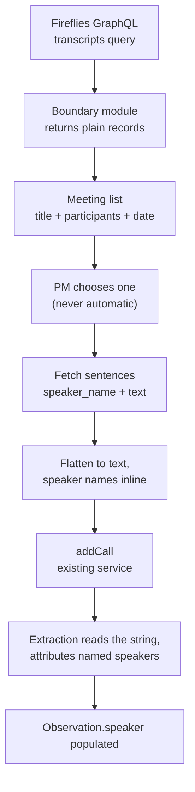
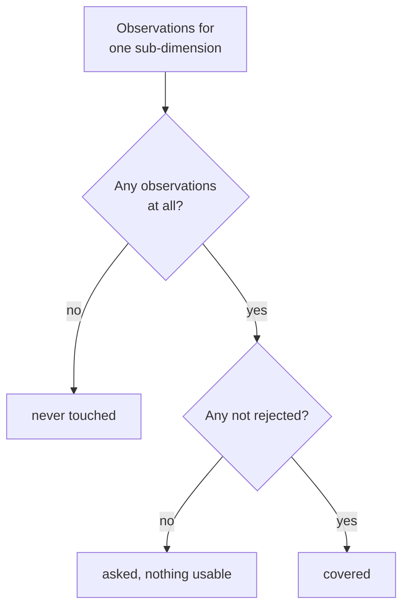

# L1 Completion - Plan

## Goal Capsule

- **Objective:** Close the gap between an L1 tool that works and one a team can run — the app says who you are, deals have visible owners you can hand over, transcripts arrive from Fireflies instead of the clipboard, and a PM can see which rubrics the calls so far have not drilled on.
- **Product authority:** This plan owns identity, roles, deal ownership, transcript ingestion, and capture coverage at L1. The L2 layer — claim verification, structural reads, layer comparison — is not active scope here and is planned separately in `docs/plans/2026-07-28-004-feat-l2-verification-core-plan.md`.
- **Execution profile:** Additive throughout. No migration rewrites existing rows, no existing screen changes behavior, and the paste path keeps working untouched. U1 lands first because every later unit assumes partners can author.
- **Stop conditions:** Stop and ask if the Fireflies credential turns out to be scoped to a single user rather than the workspace — that invalidates the shared-connection decision and changes what the import screen may show. Stop and ask if participant matching turns out to be email-only server-side, since R22 and AE7 then promise more than search delivers.
- **Open blockers:** None.

**Product Contract preservation:** changed — four requirements added and one widened, each from a finding the user then confirmed.

- R22 added: meeting-list identifiability, because Fireflies meeting titles follow no convention in practice.
- R23 added: a pinned session lifetime. Security review found that sessions never expire and are never re-checked, so a removed person kept read access to every transcript indefinitely.
- R24, R25 added: import attribution and duplicate-import detection. The build allows retrieving any workspace transcript, and nothing recorded who did it.
- R16 widened from disclosing *listing* to disclosing *retrieval*. The original text understated what the feature does.
- Two stale citations corrected: the deal-identifier Key Decision now governs R21 (was R16, a renumbering artefact), and the SSO dependency note now cites R16 (was R17).

---

## Product Contract

### Summary

Surface the identity the app already tracks, give deals owners that can be seen and transferred, let a PM pull a transcript from Fireflies instead of pasting one, and show which parts of the rubrics the calls so far have not drilled on. Partners become full authors of the record rather than read-only observers.

### Problem Frame

The L1 build runs end to end but assumes a single operator sitting in front of it. The machinery for a team is already there and none of it reaches a screen.

Auth is fully wired — `middleware.ts` protects every route, `lib/session.ts` reads the actor, `lib/authz.ts` guards every mutation — yet `components/TopBar.tsx` renders a brand and a theme toggle and nothing else. Nobody can tell which account they are using, and there is no way to sign out. `canManageUsers` in `lib/authz.ts` is defined and never called, so the only way to change someone's role is to edit the `ADMIN_EMAILS` environment variable and redeploy. `Deal.ownerId` is set once at creation in `lib/services/capture.ts` and can never change, while `listDeals` in `lib/repo/records.ts` hands every deal to everyone undifferentiated.

The role split is stricter than the team needs. `AUTHOR_ROLES` admits `PM` and `ADMIN` only, so a partner signing in today gets the full PM interface and an error on any control they touch.

Separately, every transcript still arrives by copy-paste. The team records founder calls in Fireflies, and moving that text by hand is both the slowest step in the flow and the one that discards the speaker labels the extraction path is already built to carry.

A last gap opens once a deal runs past its first call, which L1 explicitly allows. Every observation records the sub-dimension it was mapped to and the call it came from, so the record already knows what each call covered — but nothing reads it back. `progressOf` in `lib/steps.ts` counts sub-dimensions scored and sub-dimensions holding evidence; neither number tells a PM preparing for the second call which of the 41 rows nobody has asked about yet. That question is answered today by scrolling the capture grid and remembering.

### Key Decisions

- **Partners author the record on the same terms as PMs.** Attribution survives the change: `authorId` is already on every score, slide, and founder read, so the record keeps saying who did the work even when both roles may. Governs R5.
- **A partner sees exactly what a PM sees.** No partner-specific view, no read-only mode. Combined with the decision above, `PM` and `PARTNER` become a label describing who someone is rather than a rule constraining them. Governs R5.
- **Only user management stays privileged.** `ADMIN` remains the sole role that gates anything. Governs R6.
- **Reassignment is limited to a deal's owner or an ADMIN.** Letting any author reassign would let anyone take a deal in order to delete it, which defeats the owner-scoped delete rule in `lib/authz.ts`. Governs R9, R10.
- **A deal's identifier is a stable handle, not a name.** Renaming a company leaves every existing link working, and a stale slug costs less than maintaining a redirect table. Governs R21.
- **Founders stay a single free-text field.** Nothing in the L2 design turned out to need founders modelled as separate people, so the structure would carry cost without a consumer.
- **Fireflies import is always chosen, never automatic.** Opening a call on a record is a judgment; a title match is not. Governs R15.
- **Imported transcripts keep their speaker labels.** Spec §3 deferred diarization because paste made it expensive; Fireflies makes it free, and `Observation.speaker` already carries it end to end. Governs R13.
- **Coverage separates never-asked from asked-and-thin.** A row nobody probed and a row that yielded only rejected quotes both need work on the next call, but they are different conversations to have. Governs R17.
- **Coverage is shown, never enforced.** Spec §3 defers coverage percentages and readiness thresholds; this plan builds the reading and leaves the gate deferred, which keeps it consistent with the framework's rule that the app renders facts and returns no verdict. Governs R20.
- **TARS connects to Fireflies once, for the whole workspace, not per user.** Nothing is stranded because a call was recorded by a colleague. The accepted consequence is larger than browsing: every TARS user can also pull the full transcript of any workspace recording — a board discussion, a one-to-one — onto a deal of their choosing. Sign-in is restricted to `biome.in`, so the exposure is bounded to the team, and R24 makes each retrieval attributable since it cannot be prevented without giving up the shared connection. Governs R11, R16, R24.
- **Access is removed by letting the session expire, not by deleting the account.** Sessions carry the role in a token that is never re-checked against the database, so deleting a user row leaves every read working. A pinned lifetime is what makes removal take effect; rotating `AUTH_SECRET` remains the only immediate termination and signs out the whole team. Governs R23.
- **A meeting is identified by its participants, not its title.** Meeting titles follow no convention in practice — `Biome <> Founder`, `PM <> Founder`, and `Biome <> Company` all occur — so a title-only list would leave a PM guessing. Governs R22.

### Actors

- A1. **PM** — authors the record. Owns the deals they create.
- A2. **Partner** — authors on the same terms as a PM (R5).
- A3. **ADMIN** — everything a PM or partner can do, plus user management and reassignment of any deal.
- A4. **Fireflies** — external meeting recorder. Lists the workspace's meetings and returns transcripts on request.

### Requirements

**Identity and access**

- R1. The app shows the signed-in user's name and role on every screen, with a control to sign out.
- R2. An ADMIN can list the people who hold accounts and change their roles without leaving the app.
- R3. A role change takes effect at that user's next sign-in.
- R4. An address configured in `ADMIN_EMAILS` is promoted to ADMIN on every sign-in and cannot be demoted from within the app; the people page says so rather than appearing to accept the change.
- R5. A PARTNER authors the record on the same terms as a PM, and sees the same screens.
- R6. Only an ADMIN can change roles.
- R23. A session expires after a fixed lifetime, after which the user re-authenticates. Removing someone's access therefore takes effect within that window rather than never.

**Deal ownership**

- R7. The deals list can be filtered to the deals the signed-in user owns.
- R8. A deal shows who owns it, and the owner can be changed to another account holder.
- R9. Only a deal's current owner or an ADMIN may reassign it.
- R10. Deletion rights follow ownership: after a reassignment the new owner may delete the deal and the previous owner may not.

**Transcript ingestion**

- R11. A PM can import a call transcript from Fireflies by searching or browsing the workspace's recent meetings and choosing one.
- R12. Pasting a transcript stays available and behaves as it does today.
- R13. Speaker labels on an imported transcript reach the observations drafted from it.
- R14. An imported call carries a call number and a label, supplied the same way a pasted call supplies them.
- R15. No meeting is ever attached to a deal without a person choosing it.
- R16. The import screen states what the feature actually reaches: any meeting the workspace has recorded can be listed and its full transcript pulled onto a deal, not only the signed-in user's own meetings.
- R22. Each meeting in the list is identifiable without relying on its title: participants and date are shown alongside it, and search matches participants as well as title. (Numbered after R21 because IDs are never renumbered; it belongs to this group.)
- R24. An imported call records who imported it and which Fireflies meeting it came from.
- R25. Importing a meeting already present on the deal tells the person so before it is saved a second time.

**Capture coverage**

- R17. The record can be read as a coverage view across all six rubrics, showing each sub-dimension in one of three states: it holds usable evidence, it holds only evidence that was rejected, or no call has touched it.
- R18. Coverage reads per call as well as cumulatively, so a PM can see what a given call added and what remains untouched across every call so far.
- R19. Coverage is derived from the record and is never authored.
- R20. Coverage reports and never gates. It does not block scoring, judgment, or advancing a deal.

**Record identity**

- R21. A deal's identifier is fixed at creation and does not change when the company is renamed.

### Key Flows

- F1. Import a transcript from Fireflies
  - **Trigger:** A PM opens a deal's transcript page after recording a founder call.
  - **Actors:** A1, A4
  - **Steps:** The PM chooses to import; TARS lists the workspace's recent Fireflies meetings with title, participants, date, and duration; the PM searches or scrolls and selects one; TARS fetches the transcript; the PM confirms the call number and label; the call is saved with its speaker labels intact.
  - **Outcome:** A call exists on the deal, ready for extraction, with no text moved by hand.
  - **Covers R11, R13, R14, R15, R22.**

- F2. Hand a deal to another PM
  - **Trigger:** A PM is going on leave, or a deal moves to a colleague.
  - **Actors:** A1, A3
  - **Steps:** The owner (or an ADMIN) opens the deal, changes the owner to another account holder, and confirms.
  - **Outcome:** The deal appears under the new owner's "Mine" filter, and delete rights move with it.
  - **Covers R8, R9, R10.**

- F3. Change someone's role
  - **Trigger:** A new colleague signs in, or someone's responsibilities change.
  - **Actors:** A3
  - **Steps:** An ADMIN opens the people page, finds the person, and sets their role.
  - **Outcome:** The change applies the next time that person signs in.
  - **Covers R2, R3, R6.**

- F4. Plan what to ask on the next call
  - **Trigger:** A PM has run one or more L1 calls on a deal and is preparing the next one.
  - **Actors:** A1
  - **Steps:** The PM opens coverage. Rows holding usable evidence, rows that yielded only rejected quotes, and rows no call has touched are distinguishable at a glance, per rubric and per call. The PM picks what to probe.
  - **Outcome:** The next call targets the gaps instead of repeating ground already covered.
  - **Covers R17, R18.**

### Acceptance Examples

- AE1. Reassignment moves delete rights
  - **Covers R10.**
  - **Given:** Harshit owns the deal `halten` and Mehul is a PM.
  - **When:** Harshit reassigns `halten` to Mehul.
  - **Then:** Mehul may delete `halten` and Harshit may not.

- AE2. A configured admin cannot be demoted in the app
  - **Covers R4.**
  - **Given:** `harshit@biome.in` is listed in `ADMIN_EMAILS`.
  - **When:** Another ADMIN sets that account's role to PM on the people page.
  - **Then:** The account is ADMIN again at its next sign-in, and the app says so rather than appearing to have applied the change.

- AE3. A partner authors a score
  - **Covers R5.**
  - **Given:** Srini is signed in as PARTNER.
  - **When:** Srini scores a sub-dimension with evidence.
  - **Then:** The score saves and the record attributes it to Srini.

- AE4. An imported transcript without speaker labels
  - **Covers R13.**
  - **Given:** A Fireflies meeting whose transcript carries no speaker attribution.
  - **When:** The PM imports it and runs extraction.
  - **Then:** Observations are drafted with no speaker, exactly as a pasted transcript produces today — the import never invents one.

- AE5. Importing into an occupied call number
  - **Covers R14.**
  - **Given:** The deal already has a call numbered 2.
  - **When:** The PM imports a Fireflies meeting and leaves the call number at 2.
  - **Then:** The import is rejected with the same collision message a pasted call produces, and the transcript is not saved.

- AE6. A row asked about that yielded nothing
  - **Covers R17.**
  - **Given:** Call 1 produced two observations mapped to a GTM sub-dimension, both rejected by the PM, while a second GTM sub-dimension drew no observations at all.
  - **When:** The PM opens coverage before call 2.
  - **Then:** The first row reads as drilled on without usable result and the second reads as never touched — the two are distinguishable, not both shown as empty.

- AE7. A meeting whose title names nobody useful
  - **Covers R22.**
  - **Given:** A Fireflies meeting titled `Biome <> Aparna` for a deal recorded under the company name Halten.
  - **When:** The PM searches the import list for the founder's name or email.
  - **Then:** The meeting is found, and its row shows the participants and date so the PM can confirm it is the right call before importing.

- AE8. The same meeting imported twice
  - **Covers R25.**
  - **Given:** A Fireflies meeting already imported onto the deal as call 2.
  - **When:** The PM imports the same meeting again as call 3.
  - **Then:** The PM is told it is already on the deal as call 2 before anything is saved. The call-number collision rule does not catch this, because call 3 is free.

- AE9. A departed colleague's access ends
  - **Covers R23.**
  - **Given:** A PM whose account has been removed, with an active session.
  - **When:** The pinned session lifetime elapses.
  - **Then:** Their next request requires re-authentication, which fails. Before that point their existing session still reads the record — which is why the window is pinned rather than left open.

### Scope Boundaries

- Partner-specific views and read-only modes — a partner sees the PM application.
- Structured founder records — founders remain one text field.
- Automatic or scheduled Fireflies attachment.
- File upload and material exchange with founders — that belongs to the L2 deal-room work, not here.
- Linking a transcript's speaker to a founder record — speaker stays a free-text label.
- Changing a deal's identifier when its company is renamed, and any redirect machinery that would require.
- Coverage thresholds, readiness percentages, and anything that blocks on them (R20) — spec §3 keeps the gate deferred; this plan builds only the reading.

- An audit log of role changes and deal reassignments. Imports are attributed (R24), but a role change leaves no record of who made it — so an ADMIN can promote an account, act, and demote it back with the database ending where it started. Considered and deliberately not built now.
- Rate limiting the Fireflies proxy actions. The meeting list is an unthrottled authenticated proxy with paging built in, so one account can walk the archive at machine speed. Attribution (R24) was judged the higher-value control first.

#### Deferred to Follow-Up Work

- Retiring `Deal.ownerPm`. The display string and the `ownerId` relation both persist today; `toDeal` already prefers the relation, so the string is nearly vestigial. Removing it touches the record contract in `mock/types.ts` and is not worth bundling here.
- Terminating live sessions on demand, so a demotion or removal takes effect immediately rather than within the R23 window. Rotating `AUTH_SECRET` is the current stand-in and signs out the whole team.
- The deals index fetches a full record per deal inside a loop. R7's filter is a correctness feature, not a scaling fix — the default unfiltered view still loads every record.

### Dependencies and Assumptions

- Fireflies exposes a GraphQL API with a `transcripts` list query (arguments include `title`, `fromDate`/`toDate`, `limit` capped at 50, `skip`, `host_email`, `participant_email`, `organizers`, `participants`) and per-sentence speaker attribution via `sentences.speaker_name`. **Verified against published documentation**, not against a live key.
- A single Fireflies credential reaches the workspace's meetings rather than only its owner's. **Unverified** — the presence of `user_id`, `host_email`, and `organizers` filters implies it, but confirm against a real key before building the import list. This is the Goal Capsule's stop condition.
- Participant matching can be done by **name**, not only by email address. **Unverified**, and settled by the same real-key check. Every documented participant filter is address-shaped, so if name matching is server-side unsupported it can only run over the loaded page of 50 — which would make R22 and AE7 overstate what search does and require restating them.
- Sessions are JWT-strategy with the role in the token and no database re-check, which is why R23 pins a lifetime and why deleting an account does not end a session.
- Google SSO is domain-restricted to `biome.in` (backend plan B7), so everyone with an account is internal. This is what bounds the exposure R16 discloses.
- User rows are created on first sign-in, so "people who hold accounts" means "people who have signed in at least once".
- Sessions are JWT-strategy and carry `role`, which is why R3 lands at next sign-in rather than immediately.

### Outstanding Questions

Nothing blocks implementation.

**Deferred to planning — now resolved**

- The people page reflects the stored role immediately and states that it applies at next sign-in (R3, R4). Resolved by KTD7.
- "Mine" is a query-level filter, not a client-side one, so it stays correct as the deal list grows. Resolved by KTD9.

**Surfaced during planning — answer before U3 ships**

- KTD12 stops an ADMIN demoting the last ADMIN, which narrows R2's "change their roles" by one case. The alternative is to allow it and rely on database access for recovery, since an empty `ADMIN_EMAILS` leaves no configured backstop. The guard is the safe default and is one condition to remove if you would rather not have it.

<!-- ce-section: work-relationships -->
### How This Work Fits Together

This plan owns what L1 still needs before a team can run it. The breakdown below is how the surrounding work is currently understood, not a committed roadmap — a later plan may revise, split, or discard any of it.

- **L2 verification core** (`docs/plans/2026-07-28-004-feat-l2-verification-core-plan.md`)
  - Depends on the partner-authoring change here (R5); structural reads at L2 assume partners can write to the record.
  - Shares the layer stamps already present on observations, scores, and slides.
- **L2 deal room** — materials, uploads, and document exchange with founders.
  - Can proceed independently of this plan and of the verification core; it needs storage infrastructure that exists nowhere yet.
- **L3 co-development and IC**
  - Still to decide. Gate logic remains Pending in the framework (spec D1), unchanged by this plan.

---

## Planning Contract

### Key Technical Decisions

- KTD1. **Fireflies is reached through its GraphQL API, not its MCP server.** (session-settled: user-approved — chosen over the Fireflies MCP server: MCP is a protocol for an LLM to call tools and needs a client plus a host process, while TARS imports from server-side code on Vercel serverless where no such process exists.) The GraphQL API is a single authenticated fetch with no new runtime dependency. Governs R11.
- KTD2. **The Fireflies wire types are contained; one meeting record type is the module's public contract.** The precedent is `lib/extraction`, not `lib/repo` — `lib/repo` works because two type vocabularies already exist and it translates between them, whereas a meeting record has no prior home in `mock/types.ts` and none should be invented. What must not escape is the GraphQL response shape and the `sentences` array, which `format.ts` collapses to a string before it reaches `addCall`. The meeting record itself crosses into the picker by necessity and is declared in the module. Governs R11, R22.
- KTD3. **An imported transcript is flattened to text with each speaker's name inline.** This is the mechanism R13 depends on: `lib/extraction/prompt.ts` instructs the model to attribute a speaker only when the transcript names one, so the flattening format is what carries attribution into `Observation.speaker`. Governs R13.
- KTD4. **The Fireflies client is injected, like the Anthropic client.** `lib/extraction/extract.ts` already takes its client as a parameter so tests run without an API key; the import path follows that shape rather than reaching for a module-level singleton. Governs R11.
- KTD5. **The coverage grid is its own pure derivation; only a cheap count belongs on `progressOf`.** The cost is compute, not contract: `app/deals/page.tsx` calls `progressOf` inside a per-deal loop over full records, so a per-call, 41-row derivation there makes the index pay for data one page reads. The sidebar badge needs a single untouched-count, which is one pass and belongs on `progressOf`; the three-state per-call grid stays in its own module. Governs R17, R18, R19.
- KTD6. **Partner authoring is one entry in `AUTHOR_ROLES`, not a per-artifact capability model.** (session-settled: user-directed — chosen over per-artifact authorization: partners author on the same terms as PMs, so there is nothing left to differentiate.) Governs R5.
- KTD7. **Role changes write the stored role and take effect at next sign-in.** Sessions are JWT-strategy and carry `role` in the token, so a stored change cannot reach a live session without invalidating it. The page states this rather than implying immediacy. Governs R2, R3, R4.
- KTD8. **The import list is built from the `transcripts` query with `limit`/`skip` pagination.** Fireflies caps `limit` at 50, so the browse list pages rather than fetching everything. Governs R11, R22.
- KTD9. **"Mine" filters at the query level.** `listDeals` takes an optional owner filter rather than the page filtering an already-fetched list, so the behavior stays correct as the deal count grows. Governs R7.
- KTD10. **The Fireflies credential is read on the server and never reaches the browser.** `app/deals/[dealId]/transcript/page.tsx` already sets this precedent for the Anthropic key — it reads the environment server-side and passes the client component only a boolean saying whether the offer is available. The import control follows that shape exactly. Governs R11.
- KTD11. **The Fireflies actions are guarded with `requireAuthor` for consistency with every other action, and that guard narrows nothing today.** `Role` has three members and U1 admits all of them, so "authoring actor" and "authenticated user" are the same set once U1 lands. The guard is a regression barrier for any future read-only role, not a control — the `biome.in` domain restriction is the only real bound on who reaches the meeting list. Governs R11, R16.
- KTD12. **An ADMIN cannot demote the last ADMIN.** `lib/adminEmails.ts` treats an empty `ADMIN_EMAILS` as "nobody is an admin", so with no configured address there is no backstop and the demotion is unrecoverable without database access. Three details make or break it: the count and the write happen in one transaction, or two concurrent demotions both pass; demotion to PARTNER counts, since it is also a demotion; and the count is of stored ADMIN rows only, because a configured address may belong to someone who never signs in. This narrows R2 — kept deliberately. Governs R2.
- KTD13. **Sessions expire after a pinned lifetime rather than the inherited sliding default.** Auth.js refreshes an unpinned JWT session on every read, so the current effective lifetime for an active user is unbounded, and neither middleware nor `currentActor` re-checks the database. Eight hours bounds removal to one working day while Google re-authentication stays silent. Governs R23.
- KTD14. **`Call` gains an importer and a source meeting id.** Retrieval cannot be prevented without giving up the shared workspace connection, so it is made attributable instead. The same column answers "is this meeting already on this deal", which nothing detects today — the existing unique constraint catches only a repeated call number. Additive migration, no backfill. Governs R24, R25.

### High-Level Technical Design

The import path is the only new data flow in this plan, and its non-obvious property is that speaker attribution survives all the way to an observation. Fireflies returns structured sentences; `Call.transcript` is a single string; extraction reads that string and is forbidden from guessing a speaker. The flattening step (KTD3) is the hinge.

Coverage derives three states per sub-dimension from observation status alone. The distinction that matters is between a row with no observations and a row whose observations were all rejected — the same emptiness on screen today, two different conversations to have next call.

### Assumptions

- Fireflies participant data is rich enough to identify a meeting when its title is not (R22). If participant emails come back empty for some meetings, the list degrades to title and date, and search still matches title.
- The existing `AddCallInput` validation is the right gate for imported calls too, so an import that collides on call number fails the same way a paste does (AE5).

### Sequencing

U1 first — it changes who may write to the whole app, and landing it alone keeps that reviewable in isolation. U2, U3, U5, and U7 have no dependencies and can proceed in any order. U4 depends on U1 and U3; U6 depends on U5; U8 depends on U7.

`app/globals.css` is edited by U2, U3, U4, U6, and U8. It is one hand-written stylesheet with no module boundary, so units running in parallel should append in disjoint sections rather than reorganising it.

### System-Wide Impact

**The `AUTHOR_ROLES` change is one line with 24 enforcement points behind it, and they are not all the same shape.** Twenty-three read the constant directly: `assertMayAuthor` 11 times (8 in `lib/services/capture.ts`, 3 in `lib/services/judgment.ts`) and `requireAuthor` 12 times in `lib/actions.ts`. The twenty-fourth is `assertMayDeleteDeal` in `lib/services/capture.ts`, which reaches `AUTHOR_ROLES` through `canDeleteDeal` and is ownership-conditional rather than role-only — so it changes behavior under U1 for a different reason than the other 23. Verification means enumerating all of them and understanding that one is not like the rest.

**After U1 there is no read-only role in the product.** `Role` has three members and all three become authors. Any procedure that relies on making someone read-only — including the operator procedure in `docs/runbooks/deploy-vercel.md` — stops working, and the replacement is removing the account and waiting out the session window (R23).

**A new outbound network dependency enters the request path.** Fireflies is the second external service the app calls, after Anthropic. The import path inherits the same serverless constraints the extraction path already documents: `maxDuration` on the transcript route exists because a long call outruns Vercel's default limit, and a large transcript fetch sits in the same budget.

**A new secret joins the deployment.** The Fireflies credential has workspace-wide read scope — broader than anything the app holds today — and belongs in the same provisioning runbook as the existing environment variables.

**One additive migration.** `Call` gains an importer relation and a source meeting id (KTD14). Nothing else in the schema moves, no existing row is rewritten, and both columns are nullable so pasted and pre-existing calls stay valid.

**Session semantics change; the auth boundary does not.** No new sign-in path and no relaxation of the `biome.in` restriction, but R23 pins a session lifetime where none was set, so everyone re-authenticates on a cycle. The people page is the first ADMIN-only route, which makes it the first place route-level role gating matters — middleware authorizes on session presence alone, so every route under `/admin` has to assert for itself.

**`app/globals.css` is the shared file across five units.** It is one hand-written stylesheet and every new component in U2, U3, U4, U6, and U8 needs classes in it. Units that run in parallel should append in disjoint sections.

### Risks

| Risk | Treatment |
|---|---|
| The Fireflies credential turns out to be user-scoped, not workspace-scoped, invalidating the shared-connection decision | Verify against a real key before building the import list. This is the Goal Capsule's stop condition, and it is the assumption most likely to break the plan |
| The credential leaks to the browser | KTD10 binds the import control to the existing server-only pattern; U6 tests that no credential value crosses the component boundary |
| Any signed-in user retrieves any workspace recording's full transcript, including board calls and 1:1s | Accepted and disclosed (R16). It cannot be prevented while the connection is shared, so R24 makes each retrieval attributable. The `biome.in` restriction is the only bound on who can do it — KTD11 is not a control |
| A demoted or departed user keeps access until their session expires | Sessions are never re-checked against the database, so deleting the account leaves every read working. R23's pinned lifetime is what bounds this; rotating `AUTH_SECRET` is the only immediate termination and signs out the whole team |
| The same meeting is imported twice onto one deal as two calls | R25 surfaces it. The existing unique constraint catches only a repeated call number, which is a different collision |
| Participant *name* search may be server-side unsupported — the documented filters are address-shaped | Verify with the same real key that settles the workspace-scope question. If it is email-only, name matching covers just the loaded page of 50, and R22 and AE7 need restating — a Product Contract touch, not an implementation detail |
| An ADMIN demotes the last ADMIN and locks the workspace out of user management | KTD12 guards it. `ADMIN_EMAILS` is the recovery path when configured, and empty is a supported state, so the guard cannot rely on it |
| A large transcript outruns the serverless time limit on import | The import writes the call and offers extraction as a separate press, matching how `AddCallForm` already separates the two failures |

---

## Implementation Units

### U1. Partner authoring

- **Goal:** A partner authors the record on the same terms as a PM.
- **Requirements:** R5, R6. Implements the Key Decision governing R5 (partners author on the same terms), and KTD6.
- **Dependencies:** none.
- **Files:** `lib/authz.ts`, `lib/authz.test.ts` (new), `lib/services/capture.test.ts`, `lib/services/judgment.test.ts`, `lib/services/authoring.test.ts`, `README.md`, `prisma/schema.prisma`, `docs/runbooks/deploy-vercel.md`
- **Approach:** Add `Role.PARTNER` to `AUTHOR_ROLES`. `canAuthorRecord`, `assertMayAuthor`, and `requireAuthor` all read from that constant, so no other logic changes. `canManageUsers` stays ADMIN-only. `canDeleteDeal` already composes `canAuthorRecord` with the owner check, so a partner who owns a deal may delete it — consistent with R10 and intended. The documentation edits are part of the unit, not tidying: the docblock above `AUTHOR_ROLES`, the `Role` enum comment in the schema, the README's role table, and the runbook's make-someone-read-only procedure all assert the rule being inverted, and a reviewer trusting a stale comment on a security constant will reason wrongly about the next change to that line.
- **Patterns to follow:** the existing constant-driven shape in `lib/authz.ts`; do not introduce a capability map.
- **Execution note:** invert the five failing tests before touching `lib/authz.ts`, so the suite proves the change rather than reacting to it.
- **Test scenarios:**
  - Covers AE3. A PARTNER actor passes `assertMayAuthor` and can set a sub-dimension score, and the score records that partner as author.
  - A PARTNER actor fails `canManageUsers`.
  - A PARTNER who owns a deal passes `canDeleteDeal`; a PARTNER who does not own it fails. Both directions are needed — only the second is covered today.
  - Five existing tests invert, none are deleted: `lib/services/capture.test.ts` (creating a deal, scoring, running extraction), `lib/services/judgment.test.ts` (authoring a slide, authoring the founder read). Each keeps its assertion shape and gains a name reflecting the new rule.
  - `lib/services/authoring.test.ts` "refuses a PARTNER outright" is renamed, not inverted. It tests `deleteDeal` against a deal the partner does not own, so it keeps passing after U1 — but for a different reason, non-ownership rather than role. A test that goes green while its name turns false is worse than one that fails; rename it to say it tests non-ownership.
  - All 24 enforcement points are enumerated: 11 `assertMayAuthor`, 12 `requireAuthor`, and `assertMayDeleteDeal`, which is ownership-conditional and therefore behaves differently from the other 23.
- **Verification:** the service suite passes with a partner exercising every authoring path a PM has, and no documentation in the repo still claims PARTNER is read-only.

### U2. Identity and sign-out

- **Goal:** Every screen says who is signed in and offers a way out.
- **Requirements:** R1.
- **Dependencies:** none.
- **Files:** `components/TopBar.tsx`, `components/UserChip.tsx` (new), `components/UserChip.test.tsx` (new), `lib/actions.ts`, `app/globals.css`, `lib/auth.config.ts`
- **Approach:** `TopBar` reads the actor via `currentActor()` and passes name and role to a small client component owning the menu. `TopBar` is rendered from `app/layout.tsx`, so making it async is the change that reaches every screen. Sign-out goes through a server action wrapping the `signOut` already exported from `lib/auth.ts` — `lib/actions.ts` declares itself the only place auth and cache invalidation live, and reaching for the `next-auth/react` client helper would introduce a client-side auth dependency the app does not currently have. The chip takes its role as a `RoleName` string from `lib/adminEmails.ts` rather than Prisma's `Role`, which is a value import and would pull the Prisma client toward the browser bundle. When no actor is present the chip renders nothing — middleware guarantees a session on every non-auth route.
- **Approach (R23):** pin `session.maxAge` in `lib/auth.config.ts` to eight hours. It sits here rather than in its own unit because it is one line in a file this unit already opens, and the chip is where a user notices a session ended.
- **Patterns to follow:** `components/ThemeToggle.tsx` for the client-component-in-server-shell shape; `lib/adminEmails.ts` for the Prisma-free role representation and why it exists.
- **Test scenarios:**
  - The chip renders the actor's name and role.
  - An actor with no name falls back to the email local part rather than rendering blank.
  - Activating sign-out calls the sign-out action once.
  - The component test is named `.test.tsx`, not `.test.ts` — `vitest.components.config.ts` includes only `.tsx` under `components/`, so a `.ts` test there runs in neither suite and passes silently by never executing.
- **Verification:** the chip appears on the deals list, a deal overview, and the scorecard; sign-out returns to the sign-in screen; a session older than the pinned lifetime requires re-authentication.

### U3. People page

- **Goal:** An ADMIN can see who holds an account and change their role without a redeploy.
- **Requirements:** R2, R3, R4, R6. Implements KTD7.
- **Dependencies:** none. `canManageUsers` is `role === ADMIN` and untouched by U1, so this unit does not need to wait behind the plan's highest-risk change.
- **Files:** `lib/services/people.ts` (new), `lib/services/people.test.ts` (new), `lib/authz.ts`, `lib/session.ts`, `lib/actions.ts`, `lib/data.ts`, `lib/repo/records.ts`, `mock/types.ts`, `app/admin/people/page.tsx` (new), `components/PersonRow.tsx` (new), `components/PersonRow.test.tsx` (new), `app/globals.css`
- **Approach:** A `listPeople` repo read returns id, name, email, stored role, and created date, exposed as a record type in `mock/types.ts` so the repo's return-plain-records rule holds. `setRole` asserts, validates with Zod against Prisma's `Role`, and writes. Add `assertMayManageUsers(actor)` to `lib/authz.ts` — `canManageUsers` is a bare predicate today with no call sites, while every service calls an `assertMay*` sibling. The action uses `requireRole(Role.ADMIN)`, which already exists in `lib/session.ts` and is currently unused; following `lib/actions.ts` blindly would produce `requireAuthor`, which after U1 admits everyone. The page reads through `lib/data.ts` and returns `notFound()` for a non-admin. It renders both the stored role and the effective role from `resolveRole`, because for a configured admin those differ and showing only the stored one makes the page lie. `revalidatePath` covers `/admin/people`; the existing helper only revalidates deal paths.
- **Approach (R4):** `setRole` **rejects** a configured-admin target server-side with a typed error before it writes. A disabled control is not an authorization boundary — server actions are public endpoints — and letting the write land while relying on the next sign-in to repair it would leave the row lying for the whole interval, which is exactly what the sign-in write-back in `lib/auth.ts` exists to prevent.
- **Approach (KTD12):** the admin count and the role write run in one transaction, the way `lib/services/capture.ts` already handles read-then-write invariants. A demotion is any change away from ADMIN, PARTNER included.
- **Execution note:** write the `ADMIN_EMAILS` rejection test first, asserting the stored row is unchanged. It is the rule most likely to be implemented as a report-but-still-write.
- **Patterns to follow:** `lib/services/capture.ts` for assert-then-validate-then-write and for `db.$transaction` around a read-then-write invariant; `lib/actions.ts` for the `ActionResult` wrapper only, not for its guard; `components/ThemeToggle.tsx` for a flat-`components/` client control that is not a record mutation.
- **Test scenarios:**
  - Covers AE2. `setRole` against a configured-admin address throws, and the stored row is unchanged afterward. Assert the row, not the return value — reporting is not refusing.
  - A PM and a PARTNER each calling the role-change **action** get a rejected result. Test at the action layer, not only the service: the action's guard is the one most likely to be got wrong.
  - An ADMIN changes a PM to PARTNER and the stored role changes.
  - An invalid role string is rejected by validation.
  - `listPeople` returns every user row, including ones with no name.
  - With `ADMIN_EMAILS` empty and one ADMIN remaining, that ADMIN demoting themselves is rejected (KTD12).
  - Demoting the last ADMIN to PARTNER is rejected, not only demotion to PM.
  - Two concurrent demotions of the two remaining ADMINs leave at least one ADMIN.
  - With two ADMINs, either may be demoted.
  - A configured-admin row renders its effective role as ADMIN even when the stored role says otherwise.
  - The page states that a role change applies at next sign-in rather than immediately (KTD7).
- **Verification:** an ADMIN changes a colleague's role and sees it reflected; a PM navigating to the page gets a not-found.

### U4. Deal ownership

- **Goal:** Deals show an owner, can be handed over, and can be filtered to yours.
- **Requirements:** R7, R8, R9, R10, R21. Implements the Key Decision governing R9 and R10 (reassignment limited to owner or ADMIN), and KTD9.
- **Dependencies:** U1 (shared edits to `lib/authz.ts` and its test, and a partner-owner's reassignment right changes with it), U3 (the reassign picker needs a candidate list, and U3 owns the only user read).
- **Files:** `lib/authz.ts`, `lib/authz.test.ts`, `lib/services/capture.ts`, `lib/services/capture.test.ts`, `lib/repo/records.ts`, `lib/data.ts`, `lib/actions.ts`, `app/deals/page.tsx`, `app/deals/[dealId]/page.tsx`, `components/authoring/ReassignDeal.tsx` (new), `components/authoring/ReassignDeal.test.tsx` (new), `app/globals.css`
- **Approach:** Add `canReassignDeal` and `assertMayReassignDeal` alongside the existing delete guards, matching their owner-or-admin shape. `reassignDeal` asserts, validates the target user exists, and updates `ownerId`, refreshing `ownerPm` so the two representations do not drift while both exist. `listDeals` takes an optional owner filter and the deals page reads it from search params — the first page in the repo to do so.
- **Approach (`ownerId` never reaches the client):** the control renders for everyone and the server action rejects, which is exactly what `components/authoring/DeleteDeal.tsx` already does. The alternative — adding `ownerId` to the `Deal` record type — would change the front-end contract in `mock/types.ts` and break the strict fixture-equality assertion in `lib/repo/records.test.ts`. Not worth it for a permission the server checks anyway.
- **Approach (picker):** the candidate list is a narrowed read returning id and display name only. `listPeople` carries roles and timestamps and stays reachable only from the ADMIN page; putting everyone's role in front of every deal owner is unnecessary and is a useful map for anyone deciding whom to ask for a favour.
- **Patterns to follow:** `assertMayDeleteDeal` in `lib/authz.ts` — the new guard is its sibling, not a new mechanism. `components/authoring/DeleteCall.tsx` for the confirm shape: reassignment is recoverable, and `DeleteDeal`'s type-the-company-name gate is deliberately weighted for the irreversible case. `app/deals/[dealId]/page.tsx` for placement in the overview header row. Note the owner is already displayed in `components/Sidebar.tsx` — R8's display half is partly met, so do not add a second one that could contradict it.
- **Test scenarios:**
  - Covers AE1. After reassignment the new owner passes `canDeleteDeal` and the previous owner fails.
  - A non-owner PM is rejected by `assertMayReassignDeal`.
  - An ADMIN reassigns a deal they do not own and succeeds.
  - Reassigning to a user id that does not exist is rejected.
  - A deal with a null owner can be reassigned by an ADMIN and not by a PM.
  - `listDeals` with an owner filter returns only that owner's deals; without it, all deals.
  - Renaming a deal's company through `updateDeal` leaves its id unchanged (R21). Test-only obligation — no code change is needed, since `uniqueDealId` runs at create and `updateDeal` never touches `id`.
  - `updateDeal` cannot set `ownerId`, so reassignment stays the only path to a change of owner.
  - The reassign candidate read returns no `role` field.
  - `listDeals` still satisfies the strict fixture-equality assertion in `lib/repo/records.test.ts`.
- **Verification:** a deal moves between two accounts and the "Mine" filter reflects it from both sides.

### U5. Fireflies client

- **Goal:** A boundary module that lists the workspace's meetings and returns one transcript as text with speakers named.
- **Requirements:** R11, R13, R22. Implements KTD1, KTD2, KTD3, KTD4, KTD8.
- **Dependencies:** none.
- **Files:** `lib/fireflies/client.ts` (new), `lib/fireflies/schema.ts` (new), `lib/fireflies/format.ts` (new), `lib/fireflies/types.ts` (new), `lib/fireflies/client.test.ts` (new), `lib/fireflies/format.test.ts` (new), `.env.example`, `vitest.config.ts`, `docs/runbooks/deploy-vercel.md`
- **Approach:** A `FirefliesClient` interface with two operations — list meetings (paged, searchable) and fetch one transcript — implemented over the GraphQL endpoint with a bearer credential from the environment, and injected wherever it is used. Zod schemas validate responses at the boundary so malformed data fails there rather than downstream. The list operation returns plain records carrying id, title, participants, date, and duration; the fetch operation returns flattened text. Flattening lives in its own module because it is pure and carries the rule R13 depends on: each sentence is prefixed with its speaker's name when one is present, and left unprefixed when it is not, so the extractor sees names only where Fireflies actually attributed them.
- **Execution note:** build `format.ts` and its tests before the network client — it holds the load-bearing rule and needs no API access to prove.
- **Approach (config and secrets):** the credential must not carry a `NEXT_PUBLIC_` prefix — that is the one path by which Next would inline it into the client bundle, and every other path is closed by KTD2 and KTD10. Pin it to an empty string in `vitest.config.ts` the way `ANTHROPIC_API_KEY` already is, so a shell key cannot reach a test run. Add it to the provisioning runbook scoped to Production only: preview deployments share the production database, and this credential is broader than anything the app holds today.
- **Patterns to follow:** `lib/extraction/extract.ts` for the injected-client shape and for `describeApiFailure`'s status-to-message mapping — copy the mapping, not just the error class, since a bad key otherwise surfaces as an unhandled failure. `lib/extraction/schema.ts` for boundary validation.
- **Test scenarios:**
  - Sentences with speakers flatten with each speaker's name inline, in order.
  - Covers AE4. Sentences with no speaker flatten to bare text with no invented attribution.
  - A mix of attributed and unattributed sentences preserves the distinction per sentence.
  - A stubbed list response maps to plain records with participants populated.
  - A response missing participants yields records that still carry title and date.
  - A malformed response fails Zod validation with a typed error rather than propagating undefined.
  - Paging requests use `skip` and never ask for more than the documented `limit` cap of 50.
  - A credential-less environment surfaces a typed configuration error rather than an unhandled fetch failure.
  - An error response produces a typed error whose message does not contain the credential, and no error path serializes the request or its headers. GraphQL returns errors in a 200 body, so a boundary handler that stringifies the response is a plausible slip.
- **Verification:** the module's tests pass with no network access and no credential present. They still require Postgres, because `vitest.config.ts` runs a global setup for everything under `lib/`.

### U6. Import from Fireflies

- **Goal:** A PM picks a meeting and it becomes a call on the deal.
- **Requirements:** R11, R12, R14, R15, R16, R22, R24, R25. Implements KTD14.
- **Dependencies:** U5.
- **Files:** `lib/services/import.ts` (new), `lib/services/import.test.ts` (new), `lib/actions.ts`, `prisma/schema.prisma`, a new migration, `lib/repo/records.ts`, `mock/types.ts`, `app/deals/[dealId]/transcript/page.tsx`, `components/authoring/ImportFromFireflies.tsx` (new), `components/authoring/ImportFromFireflies.test.tsx` (new), `app/globals.css`
- **Approach:** Two actions — one lists meetings for the picker, one imports a chosen meeting. The import path fetches the transcript, flattens it, and calls the existing `addCall`, so every rule `addCall` enforces applies unchanged and the paste path is untouched. This lives in `lib/services/import.ts` rather than `lib/services/capture.ts`, whose header declares it the write side of capture — a meeting-list operation neither reads nor writes the record. The Fireflies client is constructed inside the service and threaded through as an option, mirroring how the extraction client is resolved.
- **Approach (attribution, KTD14):** `Call` gains a nullable importer relation and a nullable source meeting id. Both are null for pasted calls, so the migration is additive with no backfill. Before saving, the service checks whether that meeting id already exists on the deal and surfaces it (R25) — a different collision from the call-number one `addCall` already catches.
- **Approach (error handling):** `toResult` in `lib/actions.ts` rethrows anything it does not recognise, so a Fireflies error would escape as Next's generic render failure. Add the branch alongside the existing extraction one.
- **Approach (credential absent):** the import control is **replaced by a stated-off chip naming the missing credential**, not hidden. The transcript page already argues this for extraction: an absent button is indistinguishable from a broken page.
- **Patterns to follow:** `components/authoring/AddCallForm.tsx` for the prefilled-but-editable call number, the two-step save-then-extract offer, and the "extraction is off" note. `app/deals/[dealId]/transcript/page.tsx` for reading the credential server-side and passing only an availability boolean, plus the stated-off branch. Not `RunExtractionButton.tsx` — it takes no availability prop and does no gating.
- **Test scenarios:**
  - Covers AE5. Importing into an occupied call number is rejected with the existing collision message and persists nothing.
  - Covers AE7. Searching by a participant's name or email finds a meeting whose title does not contain it.
  - An imported call is persisted with its flattened transcript and the PM's call number and label.
  - Importing without a chosen meeting id is rejected (R15).
  - The picker renders participants and date for each meeting.
  - The picker states that the listed meetings belong to the workspace (R16).
  - With no Fireflies credential configured, the import control is replaced by a chip naming the missing credential, and the paste path still works (R12).
  - The client component receives only an availability boolean; no credential value crosses the server boundary (KTD10).
  - The built client bundle contains no credential value. Stronger than the props check — it tests the artifact rather than the component's interface.
  - An imported call records the importer and the source meeting id (R24); a pasted call leaves both null.
  - Importing a meeting already on the deal surfaces that fact instead of silently creating a second call (R25).
  - A Fireflies failure returns a typed `ActionResult` rather than escaping `toResult`.
  - The import action's result never carries transcript text back to the caller — the transcript goes to the database.
  - A signed-in actor who cannot author is rejected by the meeting-list action. This passes vacuously today (KTD11) and exists as a regression barrier for a future read-only role, not as evidence of a control.
  - Pasting a transcript behaves exactly as before, asserted by the existing add-call tests continuing to pass unchanged.
- **Verification:** a meeting recorded in Fireflies reaches a deal as a call, extraction runs on it, the resulting observations carry speakers, and the call records who imported it.

### U7. Coverage derivation

- **Goal:** A pure reading of which sub-dimensions the calls have covered.
- **Requirements:** R17, R18, R19. Implements KTD5.
- **Dependencies:** none.
- **Files:** `lib/coverage.ts` (new), `lib/coverage.test.ts` (new), `lib/steps.ts`, `app/deals/[dealId]/capture/page.tsx`, `app/deals/[dealId]/floor/page.tsx`
- **Approach:** A function over the record returning, for every sub-dimension in `ALL_SUBS`, one of three states plus the call numbers that contributed. A row with no observations is untouched; a row whose observations are all rejected is asked-without-result; anything else is covered. A second reading groups by call. Rubric grouping comes from the `rubricKey` already on each flattened sub-dimension. Nothing here reads or writes scores — coverage is about evidence, not judgment (R19).
- **Approach (the real duplication):** the observations-by-sub-dimension grouping already exists byte-identical in the capture and floor pages, and both **discard** rejected observations. Coverage needs them kept, since that is what separates asked-without-result from untouched (AE6). Export the grouping from `lib/coverage.ts` as a superset and retire the two page copies rather than adding a third.
- **Approach (layer):** fix the derivation to L1 observations. `Observation.layer` already exists and only L1 rows are written today, so `progressOf` ignores it — but the L2 plan is the declared successor, and an unfixed derivation would silently mix layers the moment it lands. One condition now, no cost.
- **Approach (the sidebar count):** add a single untouched-count to `progressOf` for the sidebar badge (KTD5). One pass, no per-call grouping, so the deals index does not pay for the grid.
- **Patterns to follow:** `lib/rollup.ts` for pure-function-over-record structure; `lib/steps.ts` `progressOf` for the derive-from-record shape.
- **Test scenarios:**
  - Covers AE6. A sub-dimension whose only observations are rejected reads as asked-without-result, and one with no observations reads as untouched — the two are distinguishable.
  - A sub-dimension with one accepted observation reads as covered.
  - A sub-dimension with one rejected and one accepted observation reads as covered.
  - Draft observations count as usable, since they are pending review rather than refused.
  - Every one of the framework's sub-dimensions appears in the output, including those no observation mentions.
  - Per-call grouping attributes each observation to the call number it carries.
  - A record with no calls returns every row untouched.
  - An observation stamped at a layer other than L1 does not affect the L1 coverage reading.
  - The capture and floor pages render identically after adopting the shared grouping.
- **Verification:** unit tests cover all three states, the per-call reading, and the layer filter. They need no network, but still require Postgres via the shared global setup.

### U8. Coverage page

- **Goal:** The coverage reading has a place in the deal flow.
- **Requirements:** R17, R18, R20.
- **Dependencies:** U7.
- **Files:** `app/deals/[dealId]/coverage/page.tsx` (new), `components/CoverageGrid.tsx` (new), `components/CoverageGrid.test.tsx` (new), `lib/steps.ts`, `components/Sidebar.tsx`, `components/icons.tsx`, `app/globals.css`
- **Approach:** A page rendering the six rubrics with their sub-dimensions, each in one of the three states, with a per-call breakdown alongside the cumulative reading. It joins the floor check and the claim ledger in `viewsFor` rather than the numbered flow in `stepsFor` — like those two it is a reading consulted when the question arises, not a step with a done state. Its sidebar state is the cheap untouched-count from `progressOf`, not the full grid (KTD5). `Sidebar` currently picks a view's icon with a two-way branch defaulting everything non-floor to the ledger icon, so a third view needs both that branch and a new icon. Nothing on the page blocks or gates anything (R20).
- **Patterns to follow:** `components/CaptureGrid.tsx` for the rubric-row and sub-dimension-cell **layout only**. Its state vocabulary is score bands plus incomplete and flagged, encoded as CSS classes and a tooltip — a different axis from coverage, and colour-only, which this unit's accessibility scenario rules out. Three new state classes are needed; treat the departure as deliberate.
- **Test scenarios:**
  - The three states are labelled in text, not conveyed by colour alone.
  - Every rubric renders with all of its sub-dimensions.
  - The per-call view shows one column per call on the deal.
  - A deal with no calls renders every row as untouched rather than empty.
  - No control on the page mutates the record (R19, R20).
  - The sidebar renders coverage with its own icon, not the claim ledger's.
- **Verification:** the page renders for a deal with two calls and shows what each added; the sidebar badge shows the untouched count.

---

## Verification Contract

| Gate | Command | Applies to |
|---|---|---|
| Types | `npm run typecheck` | every unit |
| Service and domain tests | `npm run test:services` | U1, U3, U4, U5, U6, U7 |
| Component tests | `npm run test:components` | U2, U4, U6, U8 |
| Full suite | `npm test` | before declaring done |
| Production build | `npm run build` | before declaring done |

**Every test under `lib/` needs Postgres**, including the new `lib/fireflies` and `lib/coverage` suites. `vitest.config.ts` registers one global setup for the whole config, and it throws without `DATABASE_URL` before any test runs. The modules themselves are database-free by construction (KTD4, KTD5) — the runner is not. Treat "no database" as a property of the code, not of the loop.

Component tests must be named `.test.tsx`. The two configs partition on extension as well as directory, so a `.test.ts` under `components/` runs in neither suite and passes by never executing.

The existing suite is the regression contract for R12: the add-call and extraction tests must pass unchanged, since the paste path is not supposed to move.

## Definition of Done

- Every requirement R1–R25 is demonstrable in the running app.
- Each unit's test scenarios exist as tests and pass.
- `npm test`, `npm run typecheck`, and `npm run build` all pass clean.
- Six existing PARTNER tests are accounted for: five inverted, one renamed to say it tests non-ownership. None deleted.
- No Fireflies GraphQL response type or `sentences` array appears outside `lib/fireflies`; the exported meeting record is the single crossing type (KTD2). No Prisma type appears outside `lib/repo`.
- No documentation in the repo still claims PARTNER is read-only — the authz docblock, the schema's `Role` comment, the README role table, and the runbook's read-only procedure.
- `.env.example` documents the Fireflies credential without a `NEXT_PUBLIC_` prefix, and the runbook scopes it to Production.
- The `Call` migration applies to a database holding existing calls, leaving them valid with null importer and source.
- Abandoned approaches are removed rather than left in the diff — no dead client wrappers, unused schema variants, or commented-out flattening attempts.

## Sources

- `docs/specs/2026-07-24-capture-scorecard-l1-spec.md` §3 (deferred items, including file upload and diarized transcripts), §4.4 (authorship rule), D8 (users, roles, and access), D10 (transcript ingestion).
- `docs/plans/2026-07-27-002-backend-l1-plan.md` — the authorization table this plan revises, and B7 for the domain-restricted SSO constraint.
- `CONCEPTS.md` — canonical vocabulary for the framework terms used throughout.
- `lib/authz.ts` — `AUTHOR_ROLES`, `canManageUsers`, `canDeleteDeal`, and the comment explaining why deletion is owner-scoped.
- `lib/adminEmails.ts` — `resolveRole`, and why configured admins survive a stored-role change.
- `lib/repo/records.ts` — `listDeals`, and `toDeal`'s preference for the owner relation over the stored display name.
- `lib/services/capture.ts` — `uniqueDealId`, `createDeal`, `updateDeal`, `AddCallInput`.
- `lib/extraction/extract.ts` — the injected-client pattern U5 follows.
- `lib/extraction/prompt.ts` — the instruction never to guess a speaker, which is why KTD3's flattening format is load-bearing.
- `lib/steps.ts` — `progressOf` and the `viewsFor` cross-cutting-view registration U8 joins.
- `framework/index.ts` — `ALL_SUBS` and `TOTAL_SUBS`, the denominator coverage reads against.
- `components/CaptureGrid.tsx` — the existing visual language for scored, unscored, and incomplete.
- [Fireflies `transcripts` query](https://docs.fireflies.ai/graphql-api/query/transcripts) — arguments, the `limit` cap of 50, and the `sentences` fields including `speaker_name`.
- [Fireflies API overview and key issuance](https://guide.fireflies.ai/articles/3737786777-fireflies-api-overview-get-api-key).
