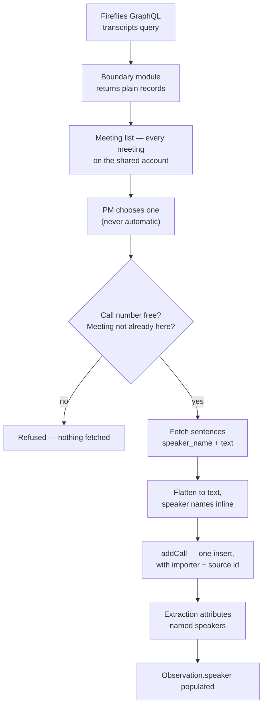
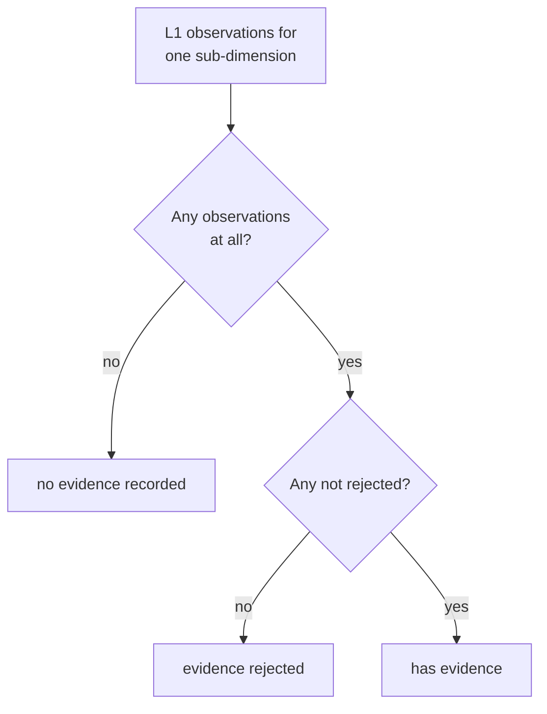

# L1 Completion - Plan

## Goal Capsule

- **Objective:** Close the gap between an L1 tool that works and one a team can run — the app says who you are, deals have visible owners you can hand over, transcripts arrive from Fireflies instead of the clipboard, a PM can see which rubrics hold no evidence yet, and access ends when a session expires rather than never.
- **Product authority:** This plan owns identity, roles, deal ownership, transcript ingestion, and capture coverage at L1. The L2 layer — claim verification, structural reads, layer comparison — is not active scope here and is planned separately in `docs/plans/2026-07-28-004-feat-l2-verification-core-plan.md`.
- **Execution profile:** Additive except session lifetime. No migration rewrites existing rows, the paste path keeps working untouched, and one additive migration adds two nullable columns — but R23 pins session bounds where none were set, so everyone re-authenticates on a cycle.
- **Stop conditions:** Step 0 in Sequencing settles one remaining assumption against a real Fireflies key before U5 begins. Stop and ask if participant matching turns out to be email-only server-side, since R22 and AE7 then promise more than search delivers — and with the list no longer scoped per person (R11), search is the only way to find a call rather than a convenience on top of a short list.
- **Open blockers:** None.

**Product Contract preservation:** changed — four requirements added, one widened, three amended, one narrowed. Each came from a review finding the user then confirmed, except the R11 amendment of 2026-07-29, which came from the user establishing a fact about their Fireflies setup.

- R22 added: meeting-list identifiability, because Fireflies meeting titles follow no convention in practice.
- R23 added: session bounds. Sessions were never re-checked and never expired for an active user, so a removed person kept read access to every transcript indefinitely.
- R24, R25 added: import attribution and duplicate detection. The build allows retrieving any workspace transcript, and nothing recorded who did it.
- R16 widened from disclosing *listing* to disclosing *retrieval*. The original text understated what the feature does.
- R11 amended (2026-07-28): the meeting list defaults to the signed-in user's own meetings with a control to widen. Listing the whole workspace by default buried the call a PM actually wanted.
- R11 amended again (2026-07-29), reversing that: **Biome records every call on one shared Fireflies account and nobody uses a personal one.** There is no per-person scope to default to — `host_email` is the same value for every meeting — so the scoped default and the widen control both describe a distinction that does not exist. One list, everything on it. The consequence is that R16's disclosure and R24's attribution become the only controls, and search (R22, AE7) stops being a convenience and becomes the only way to find a call.
- R17 amended: coverage states renamed from question language to evidence language. The record knows whether a quote was mapped to a row, not whether a question was asked.
- R2 narrowed: an ADMIN cannot demote the last ADMIN (KTD12).
- Two stale citations corrected: the deal-identifier Key Decision now governs R21 (was R16, a renumbering artefact), and the SSO dependency note now cites R16 (was R17).

---

## Product Contract

### Summary

Surface the identity the app already tracks, give deals owners that can be seen and transferred, let a PM pull a transcript from Fireflies instead of pasting one, and show which parts of the rubrics hold no evidence yet. Partners become full authors of the record, and sessions gain the bounds they never had.

### Problem Frame

The L1 build runs end to end but assumes a single operator sitting in front of it. The machinery for a team is already there and none of it reaches a screen.

Auth is fully wired — `middleware.ts` protects every route, `lib/session.ts` reads the actor, `lib/authz.ts` guards every mutation — yet `components/TopBar.tsx` renders a brand and a theme toggle and nothing else. Nobody can tell which account they are using, and there is no way to sign out. `canManageUsers` in `lib/authz.ts` is defined and never called, so the only way to change someone's role is to edit the `ADMIN_EMAILS` environment variable. `Deal.ownerId` is set once at creation in `lib/services/capture.ts` and can never change, while `listDeals` in `lib/repo/records.ts` hands every deal to everyone undifferentiated.

Underneath that, access has no end. Sessions are JWT-strategy with the role written into the token at sign-in, no expiry pinned, and no database re-check anywhere — so the token refreshes on every use and an active user's session never dies. Deleting their row does not help, because nothing on the sign-in path requires a row to exist.

The role split is stricter than the team needs. `AUTHOR_ROLES` admits `PM` and `ADMIN` only, so a partner signing in today gets the full PM interface and an error on any control they touch.

Separately, every transcript still arrives by copy-paste. The team records founder calls in Fireflies, and moving that text by hand is both the slowest step in the flow and the one that discards the speaker labels the extraction path is already built to carry.

A last gap opens once a deal runs past its first call, which L1 explicitly allows. Every observation records the sub-dimension it was mapped to and the call it came from, so the record already knows which rows hold evidence — but nothing reads it back. `progressOf` in `lib/steps.ts` counts sub-dimensions scored and sub-dimensions holding evidence; neither number tells a PM preparing for the second call which of the 41 rows have nothing recorded against them. That question is answered today by scrolling the capture grid and remembering.

### Key Decisions

- **Partners author the record on the same terms as PMs.** Attribution survives the change: `authorId` is already on every score, slide, and founder read, so the record keeps saying who did the work even when both roles may. Governs R5.
- **A partner sees exactly what a PM sees.** No partner-specific view, no read-only mode. Combined with the decision above, `PM` and `PARTNER` become a label describing who someone is rather than a rule constraining them, and the product has no way to express read-only access at all. Governs R5.
- **Only user management stays privileged.** `ADMIN` remains the sole role that gates anything. Governs R6.
- **Reassignment is limited to a deal's owner or an ADMIN.** Letting any author reassign would let anyone take a deal in order to delete it, which defeats the owner-scoped delete rule in `lib/authz.ts`. Governs R9, R10.
- **A deal's identifier is a stable handle, not a name.** Renaming a company leaves every existing link working, and a stale slug costs less than maintaining a redirect table. Governs R21.
- **Founders stay a single free-text field.** Nothing in the L2 design turned out to need founders modelled as separate people, so the structure would carry cost without a consumer.
- **Fireflies import is always chosen, never automatic.** Opening a call on a record is a judgment; a title match is not. Governs R15.
- **Imported transcripts keep their speaker labels.** Spec §3 deferred diarization because paste made it expensive; Fireflies makes it free, and `Observation.speaker` already carries it end to end. Governs R13.
- **Coverage reads evidence, not questions.** The record knows whether a quote was mapped to a row. It cannot know whether a question was asked, since a founder can answer something that yields no mapped quote. The three states are named for what is recorded so the reading never claims more than it knows. Governs R17.
- **Coverage is shown, never enforced.** Spec §3 defers coverage percentages and readiness thresholds; this plan builds the reading and leaves the gate deferred, which keeps it consistent with the framework's rule that the app renders facts and returns no verdict. Governs R20.
- **TARS connects to Fireflies once, and there is only one connection to make.** Biome records every call on a single shared Fireflies account; nobody uses a personal one. So the shared connection is not a trade-off the product chose — it is the only shape the account structure allows. Nothing is stranded because a colleague recorded a call, because every recording already belongs to the same account. The consequence is that **every TARS user can list, and pull the full transcript of, any call Biome has ever recorded** — a board discussion, a one-to-one. Scoping cannot mitigate it: `host_email` is identical across every meeting, so there is no per-person filter to apply. Disclosure (R16) and attribution (R24) are therefore not a chosen trade but the only available controls, and the `biome.in` domain restriction is the only bound on who reaches them. Governs R11, R16, R24.
- **Access ends when the session expires; removing the account does not end it.** Nothing on the sign-in path requires a user row to exist — the callback checks the domain and a verified address only — so a deleted row is recreated at the schema default on the next Google sign-in, as an authoring role. Real removal is suspending the person's `biome.in` Google account; R23's bounds are what limit the session already issued. Governs R23.
- **A meeting is identified by its participants, not its title.** Meeting titles follow no convention in practice — `Biome <> Founder`, `PM <> Founder`, and `Biome <> Company` all occur — so a title-only list would leave a PM guessing. Governs R22.

### Actors

- A1. **PM** — authors the record. Owns the deals they create.
- A2. **Partner** — authors on the same terms as a PM (R5).
- A3. **ADMIN** — everything a PM or partner can do, plus user management and reassignment of any deal.
- A4. **Fireflies** — external meeting recorder. Lists the workspace's meetings and returns transcripts on request.

### Requirements

**Identity and access**

- R1. The app shows the signed-in user's name and role on every screen, with a control to sign out.
- R2. An ADMIN can list the people who hold accounts and change their roles without leaving the app.
- R3. A role change takes effect at that user's next sign-in.
- R4. An address configured in `ADMIN_EMAILS` is promoted to ADMIN on every sign-in and cannot be demoted from within the app; the people page says so rather than appearing to accept the change.
- R5. A PARTNER authors the record on the same terms as a PM, and sees the same screens.
- R6. Only an ADMIN can change roles.
- R23. A session ends after a bounded period whether or not it is in use, so access granted at sign-in does not persist indefinitely. When a session ends mid-work the person is told and offered a way back rather than shown a bare failure.

**Deal ownership**

- R7. The deals list can be filtered to the deals the signed-in user owns.
- R8. A deal shows who owns it, and the owner can be changed to another account holder.
- R9. Only a deal's current owner or an ADMIN may reassign it.
- R10. Deletion rights follow ownership: after a reassignment the new owner may delete the deal and the previous owner may not.

**Transcript ingestion**

- R11. A PM can import a call transcript from Fireflies. The list shows the shared account's meetings — all of them, since that account holds every call Biome records and no per-person scope exists to narrow it to.
- R12. Pasting a transcript stays available and behaves as it does today.
- R13. Speaker labels on an imported transcript reach the observations drafted from it.
- R14. An imported call carries a call number and a label, supplied the same way a pasted call supplies them.
- R15. No meeting is ever attached to a deal without a person choosing it.
- R16. The import screen states what the feature actually reaches: any meeting Biome has recorded can be listed and its full transcript pulled onto a deal. With no scoping available (R11), this line is one of only two controls on that reach — the other is R24's attribution.
- R22. Each meeting in the list is identifiable without relying on its title: participants and date are shown alongside it, and search matches participants as well as title. (Numbered after R21 because IDs are never renumbered; it belongs to this group.)
- R24. An imported call records who imported it and which Fireflies meeting it came from, and that record outlives deletion of the importer's account.
- R25. Importing a meeting already present on the deal tells the person so before it is saved a second time.

**Capture coverage**

- R17. The record can be read as a coverage view across all six rubrics, showing each sub-dimension in one of three states: it holds accepted evidence, its only evidence was rejected, or no evidence is recorded against it.
- R18. Coverage reads per call as well as cumulatively, so a PM can see what a given call added and what remains unevidenced across every call so far.
- R19. Coverage is derived from the record and is never authored.
- R20. Coverage reports and never gates. It does not block scoring, judgment, or advancing a deal.

**Record identity**

- R21. A deal's identifier is fixed at creation and does not change when the company is renamed.

### Key Flows

- F1. Import a transcript from Fireflies
  - **Trigger:** A PM opens a deal's transcript page after recording a founder call.
  - **Actors:** A1, A4
  - **Steps:** The PM chooses to import; TARS lists the shared account's recent meetings with title, participants, date, and duration; the PM searches for the founder or company and selects one; TARS fetches the transcript; the PM confirms the call number and label; the call is saved with its speaker labels intact and the importer recorded.
  - **Outcome:** A call exists on the deal, ready for extraction, with no text moved by hand.
  - **Covers R11, R13, R14, R15, R22, R24.**

- F2. Hand a deal to another PM
  - **Trigger:** A PM is going on leave, or a deal moves to a colleague.
  - **Actors:** A1, A3
  - **Steps:** The owner (or an ADMIN) opens the deal, changes the owner to another account holder, and confirms after being told that delete rights move too and that only the new owner or an ADMIN can move it back.
  - **Outcome:** The deal appears under the new owner's "Mine" filter, and delete rights move with it.
  - **Covers R8, R9, R10.**

- F3. Change someone's role
  - **Trigger:** A new colleague signs in, or someone's responsibilities change.
  - **Actors:** A3
  - **Steps:** An ADMIN opens the people page, finds the person, and sets their role. Rows that cannot be changed say why before being pressed.
  - **Outcome:** The change applies the next time that person signs in.
  - **Covers R2, R3, R4, R6.**

- F4. Plan what to ask on the next call
  - **Trigger:** A PM has run one or more L1 calls on a deal and is preparing the next one.
  - **Actors:** A1
  - **Steps:** The PM opens coverage. Rows holding accepted evidence, rows whose evidence was rejected, and rows with nothing recorded are distinguishable at a glance, per rubric and per call. The PM picks what to probe.
  - **Outcome:** The next call targets the unevidenced rows instead of repeating ground already covered.
  - **Covers R17, R18.**

### Acceptance Examples

- AE1. Reassignment moves delete rights
  - **Covers R10.**
  - **Given:** Harshit owns the deal `halten` and Mehul is a PM.
  - **When:** Harshit reassigns `halten` to Mehul.
  - **Then:** Mehul may delete `halten` and Harshit may not.

- AE2. A configured admin cannot be demoted in the app
  - **Covers R4.**
  - **Given:** `harshit@biome.in` is listed in `ADMIN_EMAILS`.
  - **When:** Another ADMIN sets that account's role to PM on the people page.
  - **Then:** The change is refused before anything is written — the stored role is unchanged — and the page says the address is configured in `ADMIN_EMAILS` rather than appearing to have applied it.

- AE3. A partner authors a score
  - **Covers R5.**
  - **Given:** Srini is signed in as PARTNER.
  - **When:** Srini scores a sub-dimension with evidence.
  - **Then:** The score saves and the record attributes it to Srini.

- AE4. An imported transcript without speaker labels
  - **Covers R13.**
  - **Given:** A Fireflies meeting whose transcript carries no speaker attribution.
  - **When:** The PM imports it and runs extraction.
  - **Then:** Observations are drafted with no speaker, exactly as a pasted transcript produces today — the import never invents one.

- AE5. Importing into an occupied call number
  - **Covers R14.**
  - **Given:** The deal already has a call numbered 2.
  - **When:** The PM imports a Fireflies meeting and leaves the call number at 2.
  - **Then:** The import is rejected with the same collision message a pasted call produces, no transcript is retrieved from Fireflies, and nothing is saved.

- AE6. A row whose evidence was rejected
  - **Covers R17.**
  - **Given:** Call 1 produced two observations mapped to a GTM sub-dimension, both rejected by the PM, while a second GTM sub-dimension drew no observations at all.
  - **When:** The PM opens coverage before call 2.
  - **Then:** The first row reads as having had its evidence rejected and the second as having no evidence recorded — the two are distinguishable, not both shown as empty.

- AE7. A meeting whose title names nobody useful
  - **Covers R22.**
  - **Given:** A Fireflies meeting titled `Biome <> Aparna` for a deal recorded under the company name Halten.
  - **When:** The PM searches the import list for the founder's name or email.
  - **Then:** The meeting is found, and its row shows the participants and date so the PM can confirm it is the right call before importing.

- AE8. The same meeting imported twice
  - **Covers R25.**
  - **Given:** A Fireflies meeting already imported onto the deal as call 2.
  - **When:** The PM imports the same meeting again as call 3.
  - **Then:** The PM is told it is already on the deal as call 2 before anything is retrieved or saved. The call-number collision rule does not catch this, because call 3 is free.

- AE9. A departed colleague loses access
  - **Covers R23.**
  - **Given:** A colleague who has left, whose `biome.in` Google account has been suspended.
  - **When:** Their current session reaches the absolute bound.
  - **Then:** Their next request requires re-authentication, which fails at Google. Deleting only their TARS row would not have this effect — they would sign in again and be recreated as an author.

- AE10. A session ends mid-scoring
  - **Covers R23.**
  - **Given:** A PM part-way through scoring a rubric when their session reaches its bound.
  - **When:** They press save.
  - **Then:** They are told the session ended and offered a way to sign in again, rather than shown a bare authorization error.

### Scope Boundaries

- Partner-specific views and read-only modes — a partner sees the PM application, and after U1 the product has no way to express read-only access at all.
- Structured founder records — founders remain one text field.
- Automatic or scheduled Fireflies attachment.
- File upload and material exchange with founders — that belongs to the L2 deal-room work, not here.
- Linking a transcript's speaker to a founder record — speaker stays a free-text label.
- Changing a deal's identifier when its company is renamed, and any redirect machinery that would require.
- Coverage thresholds, readiness percentages, and anything that blocks on them (R20) — spec §3 keeps the gate deferred; this plan builds only the reading.

#### Deferred to Follow-Up Work

- An audit log of role changes and deal reassignments. Imports are attributed (R24), but a role change leaves no record of who made it — so an ADMIN can promote an account, act, and demote it back with the database ending where it started.
- Rate limiting the Fireflies proxy actions. The meeting list is an unthrottled authenticated proxy with paging built in, so one account can walk the archive at machine speed. Attribution was judged the higher-value control first.
- Terminating live sessions on demand, so a demotion takes effect immediately rather than within the R23 bound. Rotating `AUTH_SECRET` is the current stand-in and signs out the whole team.
- Retiring `Deal.ownerPm`. The display string and the `ownerId` relation both persist; `toDeal` already prefers the relation, so the string is nearly vestigial. Removing it touches the record contract in `mock/types.ts`.
- The deals index fetches a full record per deal inside a loop. R7's filter is a correctness feature, not a scaling fix — the default view still loads every record.

### Dependencies and Assumptions

- Fireflies exposes a GraphQL API with a `transcripts` list query (arguments include `title`, `fromDate`/`toDate`, `limit` capped at 50, `skip`, `host_email`, `participant_email`, `organizers`, `participants`) and per-sentence speaker attribution via `sentences.speaker_name`. **Verified against published documentation**, not against a live key.
- A single Fireflies credential reaches every meeting Biome records. **Settled 2026-07-29 by the user, not by a key:** Biome uses one shared Fireflies account for all recording and nobody uses a personal one, so the question of reaching a colleague's meetings does not arise — there are no per-person accounts to reach across.
- Participant matching works by **name**, not only by email address. **Settled 2026-07-29 against the shared account's key: it does.** The argument is address-shaped in the documentation (`participant_email`) and turns out not to be address-only in practice, so R22 and AE7 hold exactly as written — a meeting titled `Biome <> Aparna` is found by searching the founder's name. This was the last open item in Sequencing step 0, and it mattered more than a convenience: R11 dropped scoping, so search is the only way to find a call in a list of everything Biome has recorded. The contingency it was guarding against — restating R22/AE7 and compensating with date filtering — is not needed.
  - A date range was added anyway, on the user's judgment rather than as the fallback: search narrows by *who and what*, and on one shared account holding every recording the firm has made, *when* is the other thing a PM remembers. The two filters compose.
- Google SSO is domain-restricted to `biome.in` (backend plan B7), so everyone with an account is internal. This is what bounds the exposure R16 discloses.
- Removing someone's access requires suspending their `biome.in` Google account. Nothing in TARS can achieve it, because sign-in requires no pre-existing row and rows are created on first sign-in.
- Sessions are JWT-strategy with the role in the token and no database re-check, which is why R3 lands at next sign-in, why R23 needs both an idle and an absolute bound, and why deleting an account does not end a session.

### Outstanding Questions

Nothing blocks implementation.

**Deferred to planning — now resolved**

- The people page reflects the stored role immediately and states that it applies at next sign-in (R3, R4). Resolved by KTD7.
- "Mine" is a query-level filter, not a client-side one, so it stays correct as the deal list grows. Resolved by KTD9.
- KTD12 narrows R2 by one case. Kept deliberately, on the corrected understanding that a lockout is recoverable by editing `ADMIN_EMAILS` rather than requiring database access.

<!-- ce-section: work-relationships -->
### How This Work Fits Together

This plan owns what L1 still needs before a team can run it. The breakdown below is how the surrounding work is currently understood, not a committed roadmap — a later plan may revise, split, or discard any of it.

- **L2 verification core** (`docs/plans/2026-07-28-004-feat-l2-verification-core-plan.md`)
  - Depends on the partner-authoring change here (R5); structural reads at L2 assume partners can write to the record.
  - Constrained by it too: after U1 no role distinction remains, so if L2 needs structural reads to be partner-only it must reopen the per-artifact question KTD6 closes.
  - Shares the layer stamps already present on observations, scores, and slides.
- **L2 deal room** — materials, uploads, and document exchange with founders.
  - Can proceed independently of this plan and of the verification core; it needs storage infrastructure that exists nowhere yet.
- **L3 co-development and IC**
  - Still to decide. Gate logic remains Pending in the framework (spec D1), unchanged by this plan.

---

## Planning Contract

### Key Technical Decisions

- KTD1. **Fireflies is reached through its GraphQL API, not its MCP server.** (session-settled: user-approved — chosen over the Fireflies MCP server: MCP is a protocol for an LLM to call tools and needs a client plus a host process, while TARS imports from server-side code on Vercel serverless where no such process exists.) The GraphQL API is a single authenticated fetch with no new runtime dependency. Governs R11.
- KTD2. **The Fireflies wire types are contained; one meeting record type is the module's public contract.** The precedent is `lib/extraction`, not `lib/repo` — `lib/repo` works because two type vocabularies already exist and it translates between them, whereas a meeting record has no prior home in `mock/types.ts` and none should be invented. What must not escape is the GraphQL response shape and the `sentences` array, which `format.ts` collapses to a string before it reaches `addCall`. The meeting record itself crosses into the picker by necessity and is declared in `lib/fireflies/types.ts`. Governs R11, R22.
- KTD3. **An imported transcript is flattened to text with each speaker's name inline.** This is the mechanism R13 depends on: `lib/extraction/prompt.ts` instructs the model to attribute a speaker only when the transcript names one, so the flattening format is what carries attribution into `Observation.speaker`. Governs R13.
- KTD4. **The Fireflies client is injected, like the Anthropic client.** `lib/extraction/extract.ts` already takes its client as a parameter so tests run without an API key; the import path follows that shape rather than a module-level singleton. Governs R11.
- KTD5. **The coverage grid is its own pure derivation; only a cheap count belongs on `progressOf`.** The cost is compute, not contract: `app/deals/page.tsx` calls `progressOf` inside a per-deal loop over full records, so a per-call, 41-row derivation there makes the index pay for data one page reads. The sidebar badge needs a single unevidenced-count, which is one pass; the three-state per-call grid stays in its own module. Governs R17, R18, R19.
- KTD6. **Partner authoring is one entry in `AUTHOR_ROLES`, not a per-artifact capability model.** (session-settled: user-directed — chosen over per-artifact authorization: partners author on the same terms as PMs, so there is nothing left to differentiate.) Governs R5.
- KTD7. **Role changes write the stored role and take effect at next sign-in.** Sessions are JWT-strategy and carry `role` in the token, so a stored change cannot reach a live session without invalidating it. The page states this rather than implying immediacy. Governs R2, R3, R4.
- KTD8. **The import list is built from the `transcripts` query with `limit`/`skip` pagination.** Fireflies caps `limit` at 50, so the list pages rather than fetching everything. It no longer applies a default `host_email`/`participant_email` scope: with one shared recording account those filters are identical for every meeting (R11), so paging and search carry the whole load of finding a call. Governs R11, R22.
- KTD9. **"Mine" filters at the query level.** `listDeals` takes an optional owner filter rather than the page filtering an already-fetched list, so the behavior stays correct as the deal count grows. Governs R7.
- KTD10. **The Fireflies credential is read on the server and never reaches the browser.** `app/deals/[dealId]/transcript/page.tsx` already sets this precedent for the Anthropic key — it reads the environment server-side and passes the client component only a boolean saying whether the offer is available. Governs R11.
- KTD11. **The Fireflies actions are guarded with `requireAuthor` for consistency with every other action, and that guard narrows nothing today.** `Role` has three members and U1 admits all of them, so "authoring actor" and "authenticated user" are the same set once U1 lands. The guard is a regression barrier for any future read-only role, not a control — the `biome.in` domain restriction is the only real bound on who reaches the meeting list. Governs R11, R16.
- KTD12. **An ADMIN cannot demote the last ADMIN.** Without the guard, a workspace can reach zero stored ADMINs and nobody can manage users until an operator edits `ADMIN_EMAILS` and the promoted person signs out and back in. That is recoverable without database access — `lib/adminEmails.ts` exists precisely so it is — so the guard buys a clearer state rather than preventing disaster. Three details make or break it: the count and the write run in **one Serializable transaction**, since at Postgres' default isolation two concurrent demotions each read a count of two and both commit; demotion to PARTNER counts, being also a demotion; and the count is of stored ADMIN rows only, because a configured address may belong to someone who never signs in. Narrows R2. Governs R2.
- KTD13. **Sessions carry both an idle bound and an absolute bound.** (session-settled: user-directed — chosen over an idle bound alone: `session.maxAge` under the JWT strategy is an inactivity window that Auth.js refreshes on every session read, so it never fires for the active user R23 targets.) Eight hours idle, twelve hours absolute. The absolute bound needs a sign-in timestamp stamped on the token in the branch that runs only at sign-in, checked on each pass, with the callback returning null once it is exceeded — Auth.js clears the session cookie when it does. Twelve hours sits outside a working day, so most people re-authenticate between days rather than mid-deal. Governs R23.
- KTD14. **`Call` gains an importer, an importer email, and a source meeting id.** Retrieval cannot be usefully restricted while the connection is shared, so it is made attributable instead. The relation follows the `onDelete: SetNull` used by every other user relation in the schema, and the email is stored as a plain column beside it — the same shape as `Deal.ownerPm` — so attribution outlives the account deletion that offboarding performs. The source id also answers "is this meeting already on this deal", which nothing detects today. Additive migration, no backfill. Governs R24, R25.

### High-Level Technical Design

The import path is the only new data flow, and its non-obvious property is that speaker attribution survives all the way to an observation. Fireflies returns structured sentences; `Call.transcript` is a single string; extraction reads that string and is forbidden from guessing a speaker. The flattening step (KTD3) is the hinge. Note that both rejections happen **before** the transcript fetch, so a refused import never pulls a workspace recording.

Coverage derives three states per sub-dimension from observation status alone. The distinction that matters is between a row with no observations and a row whose observations were all rejected — the same emptiness on screen today, two different conversations next call. The states are named for recorded evidence because that is what the record actually knows.

### Assumptions

- Fireflies participant data is rich enough to identify a meeting when its title is not (R22). If participant emails come back empty for some meetings, the list degrades to title and date, and search still matches title.
- The existing `AddCallInput` validation is the right gate for imported calls too, so an import that collides on call number fails the same way a paste does (AE5).

### Sequencing

**Step 0 — settle the one remaining Fireflies assumption, before U5 begins.** Using the shared account's key, run a participant search by **name** rather than by email address, and record the outcome in Dependencies and Assumptions. The credential-scope half of this step was settled on 2026-07-29 without a key: Biome records everything on one shared account, so there is no cross-user reach to test. What is left cannot be settled by the test suite, because every Fireflies test runs against an injected stub — the AE7 scenario goes green whether or not Fireflies supports name matching. If it turns out to be email-only, R22 and AE7 need restating and the picker needs date-range filtering to compensate, since there is no scoped list to fall back on.

Then U1 — it changes who may write to the whole app, and landing it alone keeps that reviewable in isolation. Only U4 depends on it. U2, U3, U5, and U7 have no dependencies and can proceed in any order; U4 depends on U1 and U3; U6 depends on U5; U8 depends on U7.

`app/globals.css` is edited by five units — see System-Wide Impact for the disjoint-append rule.

### System-Wide Impact

**The `AUTHOR_ROLES` change is one line with 24 enforcement points behind it, and they are not all the same shape.** Twenty-three read the constant directly: `assertMayAuthor` 11 times (8 in `lib/services/capture.ts`, 3 in `lib/services/judgment.ts`) and `requireAuthor` 12 times in `lib/actions.ts`. The twenty-fourth is `assertMayDeleteDeal`, which reaches `AUTHOR_ROLES` through `canDeleteDeal` and is ownership-conditional rather than role-only — so it changes behavior under U1 for a different reason than the other 23.

**After U1 the product has no read-only role and no replacement for one.** All three `Role` members become authors. The runbook's make-someone-read-only procedure — which appears in two places, not one — stops working, and account removal is not a substitute: it revokes access rather than restricting it, and only in combination with suspending the Google account.

**One additive migration.** `Call` gains an importer relation, an importer email, and a source meeting id (KTD14). Nothing else in the schema moves, no existing row is rewritten, and the columns are nullable so pasted and pre-existing calls stay valid.

**Session semantics change; the auth boundary does not.** No new sign-in path and no relaxation of the `biome.in` restriction, but R23 pins bounds where none were set, so everyone re-authenticates on a cycle. The people page is the first ADMIN-only route, which makes it the first place route-level role gating matters — middleware authorizes on session presence alone, so every route under `/admin` has to assert for itself.

**A new secret joins the deployment.** The Fireflies credential has workspace-wide read scope — broader than anything the app holds today — and belongs in the provisioning runbook, scoped to Production only, since preview deployments share the production database.

**`app/globals.css` is the shared file across five units.** It is one hand-written stylesheet and every new component in U2, U3, U4, U6, and U8 needs classes in it. Units that run in parallel should append in disjoint sections rather than reorganising it.

### Risks

| Risk | Treatment |
|---|---|
| ~~The Fireflies credential turns out user-scoped~~ | Settled 2026-07-29: Biome records on one shared account, so there is no per-user scope for it to be limited to |
| ~~Participant *name* search may be server-side unsupported~~ | Settled 2026-07-29 against the shared account's key: `participant_email` matches a name as well as an address, so R22 and AE7 stand unchanged |
| Any signed-in user lists and retrieves any recording Biome has made | Accepted and disclosed (R16), with R24 making it attributable. Scoping is not available to mitigate it — one shared recording account means no per-person filter exists. The `biome.in` restriction is the only bound on who; KTD11 is not a control |
| A departed user keeps access | Only suspending their Google account removes it; deleting the TARS row lets them sign back in as an author. R23's absolute bound limits the session already issued |
| The same meeting is imported twice onto one deal | R25 surfaces it, using the source meeting id. The existing unique constraint catches only a repeated call number |
| An ADMIN demotes the last ADMIN | KTD12 guards it in a Serializable transaction. Recovery, if it ever happened, is an `ADMIN_EMAILS` edit and a re-sign-in |
| A large transcript outruns the serverless time limit on import | The import writes the call and offers extraction as a separate press, matching how `AddCallForm` already separates the two failures |

---

## Implementation Units

### U1. Partner authoring

- **Goal:** A partner authors the record on the same terms as a PM.
- **Requirements:** R5, R6. Implements KTD6.
- **Dependencies:** none.
- **Files:** `lib/authz.ts`, `lib/authz.test.ts` (new), `lib/services/capture.test.ts`, `lib/services/judgment.test.ts`, `lib/services/authoring.test.ts`, `lib/adminEmails.ts`, `lib/adminEmails.test.ts`, `README.md`, `prisma/schema.prisma`, `CONCEPTS.md`, `docs/runbooks/deploy-vercel.md`
- **Approach:** Add `Role.PARTNER` to `AUTHOR_ROLES`. `canAuthorRecord`, `assertMayAuthor`, and `requireAuthor` all read from that constant, so no other logic changes. `canManageUsers` stays ADMIN-only. `canDeleteDeal` already composes `canAuthorRecord` with the owner check, so a partner who owns a deal may delete it — consistent with R10 and intended.
- **Approach (documentation is part of the control):** six locations assert the rule being inverted — the `AUTHOR_ROLES` docblock, the `resolveRole` docblock in `lib/adminEmails.ts` and its echo in that file's test, the `Role` enum comment in the schema, the README role table, `CONCEPTS.md`'s authorship rule, and the runbook's read-only material in **two** places. The runbook procedure is deleted rather than rewritten: there is no read-only role to replace it with, and an operator reaching for a substitute that does not exist will remove an account instead, which revokes all access. `CONCEPTS.md` is restated to name the machine-versus-human split rather than the PM specifically.
- **Patterns to follow:** the existing constant-driven shape in `lib/authz.ts`; do not introduce a capability map.
- **Execution note:** invert the five failing tests before touching `lib/authz.ts`, so the suite proves the change rather than reacting to it.
- **Test scenarios:**
  - Covers AE3. A PARTNER actor passes `assertMayAuthor` and can set a sub-dimension score, and the score records that partner as author.
  - A PARTNER actor fails `canManageUsers`.
  - A PARTNER who owns a deal passes `canDeleteDeal`; a PARTNER who does not own it fails. Both directions are needed — only the second is covered today.
  - Five existing tests invert, none deleted: `lib/services/capture.test.ts` (creating a deal, scoring, running extraction), `lib/services/judgment.test.ts` (authoring a slide, authoring the founder read). Each keeps its assertion shape and gains a name reflecting the new rule.
  - `lib/services/authoring.test.ts` "refuses a PARTNER outright" is renamed, not inverted. It tests `deleteDeal` against a deal the partner does not own, so it keeps passing after U1 — but for a different reason, non-ownership rather than role. A test that goes green while its name turns false is worse than one that fails.
  - All 24 enforcement points are enumerated: 11 `assertMayAuthor`, 12 `requireAuthor`, and `assertMayDeleteDeal`, which is ownership-conditional and therefore behaves differently from the other 23.
- **Verification:** the service suite passes with a partner exercising every authoring path a PM has, and no documentation in the repo still claims PARTNER is read-only.

### U2. Identity, sign-out, and session bounds

- **Goal:** Every screen says who is signed in, offers a way out, and sessions stop lasting forever.
- **Requirements:** R1, R23. Implements KTD13.
- **Dependencies:** none.
- **Files:** `components/TopBar.tsx`, `components/UserChip.tsx` (new), `components/UserChip.test.tsx` (new), `lib/auth.config.ts`, `lib/auth.config.test.ts` (new), `lib/actions.ts`, `lib/useAction.ts`, `app/globals.css`
- **Approach:** `TopBar` reads the actor via `currentActor()` and passes name and role to a small client component. `TopBar` is rendered from `app/layout.tsx`, so making it async is the change that reaches every screen. The chip is an **inline group** — name, a role chip, and a ghost sign-out button beside `ThemeToggle` — not a dropdown; the app has no menu pattern today and one action does not warrant introducing the first. Sign-out goes through a server action wrapping the `signOut` already exported from `lib/auth.ts`, since `lib/actions.ts` declares itself the only place auth and cache invalidation live. The chip takes its role as a `RoleName` string from `lib/adminEmails.ts` rather than Prisma's `Role`, which is a value import and would pull Prisma toward the browser bundle.
- **Approach (R23, KTD13):** set `session.maxAge` to eight hours as the idle bound, and add the absolute bound by stamping a sign-in timestamp on the token in the callback branch that runs only at sign-in, then returning null once twelve hours have passed. Auth.js clears the session cookie when the callback returns null. Note `maxAge` is in **seconds** — a millisecond value typechecks, builds, and yields a roughly year-long session, which is why the config assertion below is not optional.
- **Approach (R23, mid-work):** `useAction` surfaces a `NotAuthenticated` result as a re-authenticate prompt linking to sign-in, rather than the bare error string. Handling it once there covers every control in the app. The chip cannot cover this case — `TopBar` is server-rendered, so an open page never updates.
- **Patterns to follow:** `components/ThemeToggle.tsx` for the client-component-in-server-shell shape; `lib/adminEmails.ts` for the Prisma-free role representation; `lib/adminEmails.test.ts` as the precedent for unit-testing a config-shaped module.
- **Test scenarios:**
  - The chip renders the actor's name and role.
  - An actor with no name falls back to the email local part rather than rendering blank.
  - Activating sign-out calls the sign-out action once.
  - Covers AE9. `authConfig.session.maxAge` is 28800 (seconds, not milliseconds) and the strategy is `jwt`.
  - The token callback returns null once the absolute bound is exceeded, and returns the token before it.
  - Covers AE10. An action rejected for an expired session renders a re-authenticate prompt, not a bare error string.
  - The component test is named `.test.tsx`, not `.test.ts` — `vitest.components.config.ts` includes only `.tsx` under `components/`, so a `.ts` test there runs in neither suite and passes by never executing.
- **Verification:** the chip appears on the deals list, a deal overview, and the scorecard; sign-out returns to the sign-in screen; a session past the absolute bound requires re-authentication.

### U3. People page

- **Goal:** An ADMIN can see who holds an account and change their role without a redeploy.
- **Requirements:** R2, R3, R4, R6. Implements KTD7, KTD12.
- **Dependencies:** none. `canManageUsers` is `role === ADMIN` and untouched by U1.
- **Files:** `lib/services/people.ts` (new), `lib/services/people.test.ts` (new), `lib/authz.ts`, `lib/session.ts`, `lib/actions.ts`, `lib/actions.test.ts` (new), `lib/data.ts`, `lib/repo/records.ts`, `mock/types.ts`, `app/admin/people/page.tsx` (new), `components/PersonRow.tsx` (new), `components/PersonRow.test.tsx` (new), `app/globals.css`
- **Approach:** A `listPeople` repo read returns id, name, email, stored role, and created date, exposed as a record type in `mock/types.ts` so the repo's return-plain-records rule holds. `setRole` asserts, validates with Zod against Prisma's `Role`, and writes. Add `assertMayManageUsers(actor)` to `lib/authz.ts` — `canManageUsers` is a bare predicate today with no call sites, while every service calls an `assertMay*` sibling. The action uses `requireRole(Role.ADMIN)`, which already exists in `lib/session.ts` and has no direct call site; following `lib/actions.ts` blindly would produce `requireAuthor`, which after U1 admits everyone. `revalidatePath` covers `/admin/people`; the existing helper only revalidates deal paths. `PersonRow` lives in flat `components/` rather than `components/authoring/`, which is for record mutations — this mutates users.
- **Approach (two columns, honestly named):** each row shows the stored role and the **role at next sign-in** computed by `resolveRole`. Not "effective role" — that would read as effective-right-now, while the person's live session carries the old role until it ends (KTD13), which is exactly the misreading the page-level note exists to prevent.
- **Approach (R4):** `setRole` **rejects** a configured-admin target server-side with a typed error before it writes. A disabled control is not an authorization boundary — server actions are public endpoints — and letting the write land while relying on the next sign-in to repair it would leave the row lying for the whole interval, which is what the sign-in write-back in `lib/auth.ts` exists to prevent.
- **Approach (both non-editable rows say why):** a configured-admin row and a last-ADMIN row are the same situation to a user, so both render the control in a stated-off form naming its reason — "configured in `ADMIN_EMAILS`" and "last remaining ADMIN" — following the stated-off chip the transcript page uses. Server-side rejection stays the boundary in both cases.
- **Approach (KTD12):** the admin count and the role write run in **one Serializable transaction**, passed as an option bag the way `runExtractionForCall` already passes one. At Postgres' default Read Committed, two concurrent demotions each read a count of two and both commit. A serialization failure surfaces as a rejected demotion.
- **Execution note:** write the `ADMIN_EMAILS` rejection test first, asserting the stored row is unchanged. It is the rule most likely to be implemented as report-but-still-write.
- **Patterns to follow:** `lib/services/capture.ts` for assert-then-validate-then-write and its `db.$transaction` option-bag shape; `lib/actions.ts` for the `ActionResult` wrapper only, not for its guard; `components/authoring/ScoreControl.test.tsx` for the module-mock shape the action test needs.
- **Test scenarios:**
  - Covers AE2. `setRole` against a configured-admin address throws, and the stored row is unchanged afterward. Assert the row, not the return value.
  - A PM and a PARTNER each calling the role-change **action** get a rejected result. `lib/actions.test.ts` mocks `lib/session` to supply each actor and exercises only the rejection path, so no `revalidatePath` runs outside a request context. No test imports `lib/actions.ts` today, which is why the file and the seam are named here.
  - An ADMIN changes a PM to PARTNER and the stored role changes.
  - An invalid role string is rejected by validation.
  - `listPeople` returns every user row, including ones with no name.
  - With `ADMIN_EMAILS` empty and one ADMIN remaining, that ADMIN demoting themselves is rejected.
  - Demoting the last ADMIN to PARTNER is rejected, not only demotion to PM.
  - Two concurrent demotions of the two remaining ADMINs leave at least one ADMIN.
  - With two ADMINs, either may be demoted.
  - A configured-admin row shows ADMIN in the role-at-next-sign-in column even when the stored role says otherwise, and states its reason before being pressed.
  - A last-ADMIN row states its reason before being pressed.
  - The page states that a role change applies at next sign-in rather than immediately.
- **Verification:** an ADMIN changes a colleague's role and sees it reflected; a PM navigating to the page gets a not-found.

### U4. Deal ownership

- **Goal:** Deals show an owner, can be handed over, and can be filtered to yours.
- **Requirements:** R7, R8, R9, R10, R21. Implements KTD9.
- **Dependencies:** U1 (shared edits to `lib/authz.ts` and its test; a partner-owner's reassignment right changes with it). U3 for shared-file coordination in `lib/repo/records.ts`, `lib/data.ts`, and `mock/types.ts` — not for `listPeople`, which the picker deliberately does not use.
- **Files:** `lib/authz.ts`, `lib/authz.test.ts`, `lib/services/capture.ts`, `lib/services/capture.test.ts`, `lib/repo/records.ts`, `lib/data.ts`, `lib/actions.ts`, `app/deals/page.tsx`, `app/deals/[dealId]/page.tsx`, `components/authoring/ReassignDeal.tsx` (new), `components/authoring/ReassignDeal.test.tsx` (new), `app/globals.css`
- **Approach:** Add `canReassignDeal` and `assertMayReassignDeal` alongside the existing delete guards, matching their owner-or-admin shape. `reassignDeal` asserts, validates the target user exists, and updates `ownerId`, refreshing `ownerPm` so the two representations do not drift. `listDeals` takes an optional owner filter.
- **Approach (`ownerId` never reaches the client):** the control renders for everyone and the server action rejects, which is what `components/authoring/DeleteDeal.tsx` already does. Adding `ownerId` to the `Deal` record type would change the front-end contract in `mock/types.ts` and break the strict fixture-equality assertion in `lib/repo/records.test.ts`.
- **Approach (picker):** a narrowed read returning id and display name only, declaring its own type. `listPeople` carries roles and timestamps and stays reachable only from the ADMIN page — the control needs neither.
- **Approach (Mine filter):** a two-option toggle, All deals / Mine, in the deals toolbar beside the existing search, defaulting to All and reflecting a search param. A filtered result of zero renders an empty block naming the active filter with a link back to all deals; the page has no empty branch today, and R7 makes a blank list routine where it was previously first-run-only.
- **Approach (confirmation):** the two-press pattern, with the armed state naming the new owner, stating that delete rights move with the deal, and stating that only the new owner or an ADMIN can move it back. Reassignment is recoverable — but **not by the person performing it**, since R9 strips their reassign right the instant the write lands. That is why the disclosure carries the weight rather than a heavier gate.
- **Patterns to follow:** `assertMayDeleteDeal` in `lib/authz.ts` — the new guard is its sibling. `components/authoring/DeleteCall.tsx` for the two-press confirm and its note stating what survives; `DeleteDeal`'s type-the-company-name gate is weighted for the irreversible case. The owner is already displayed in `components/Sidebar.tsx`, so do not add a second display that could contradict it.
- **Test scenarios:**
  - Covers AE1. After reassignment the new owner passes `canDeleteDeal` and the previous owner fails.
  - A non-owner PM is rejected by `assertMayReassignDeal`.
  - An ADMIN reassigns a deal they do not own and succeeds.
  - Reassigning to a user id that does not exist is rejected.
  - A deal with a null owner can be reassigned by an ADMIN and not by a PM.
  - `listDeals` with an owner filter returns only that owner's deals; without it, all deals.
  - Renaming a deal's company through `updateDeal` leaves its id unchanged (R21). Test-only obligation — no code change is needed.
  - `updateDeal` cannot set `ownerId`, so reassignment stays the only path to a change of owner.
  - The reassign candidate read returns no `role` field.
  - `listDeals` still satisfies the strict fixture-equality assertion in `lib/repo/records.test.ts`.
  - The armed confirm state names the new owner and states that delete rights move.
  - A Mine filter matching no deals renders the empty state, not a blank page.
- **Verification:** a deal moves between two accounts and the Mine filter reflects it from both sides.

### U5. Fireflies client

- **Goal:** A boundary module that lists meetings and returns one transcript as text with speakers named.
- **Requirements:** R11, R13, R22. Implements KTD1, KTD2, KTD3, KTD4, KTD8, KTD10.
- **Dependencies:** Sequencing step 0.
- **Files:** `lib/fireflies/client.ts` (new), `lib/fireflies/schema.ts` (new), `lib/fireflies/format.ts` (new), `lib/fireflies/types.ts` (new), `lib/fireflies/client.test.ts` (new), `lib/fireflies/format.test.ts` (new), `.env.example`, `vitest.config.ts`, `docs/runbooks/deploy-vercel.md`
- **Approach:** A `FirefliesClient` interface with two operations — list meetings (paged, searchable, scopeable to a participant) and fetch one transcript — implemented over the GraphQL endpoint with a bearer credential from the environment, and injected wherever used. Zod schemas validate responses at the boundary so malformed data fails there. The list operation returns plain records carrying id, title, participants, date, and duration; the fetch operation returns flattened text. Flattening lives in its own module because it is pure and carries the rule R13 depends on: each sentence is prefixed with its speaker's name when one is present and left unprefixed when it is not, so the extractor sees names only where Fireflies attributed them.
- **Approach (config and secrets):** the credential must not carry a `NEXT_PUBLIC_` prefix — that is the one path by which Next would inline it into the client bundle. Pin it to an empty string in `vitest.config.ts` the way `ANTHROPIC_API_KEY` already is. Add it to the provisioning runbook scoped to Production only, since preview deployments share the production database.
- **Execution note:** build `format.ts` and its tests before the network client — it holds the load-bearing rule and needs no API access to prove.
- **Patterns to follow:** `lib/extraction/extract.ts` for the injected-client shape and for `describeApiFailure`'s status-to-message mapping — copy the mapping, not just the error class, since a bad key otherwise surfaces as an unhandled failure. `lib/extraction/schema.ts` for boundary validation.
- **Test scenarios:**
  - Sentences with speakers flatten with each speaker's name inline, in order.
  - Covers AE4. Sentences with no speaker flatten to bare text with no invented attribution.
  - A mix of attributed and unattributed sentences preserves the distinction per sentence.
  - A stubbed list response maps to plain records with participants populated.
  - A response missing participants yields records that still carry title and date.
  - A malformed response fails Zod validation with a typed error rather than propagating undefined.
  - Paging requests use `skip` and never ask for more than the documented `limit` cap of 50.
  - A search request passes its filter through to the query rather than fetching everything and filtering locally. (There is no per-person scope filter to test — R11 dropped it.)
  - A credential-less environment surfaces a typed configuration error rather than an unhandled fetch failure.
  - An error response produces a typed error whose message does not contain the credential, and no error path serializes the request or its headers. GraphQL returns errors in a 200 body, so a handler that stringifies the response is a plausible slip.
- **Verification:** the module's tests pass with no network access and no credential present. They still require Postgres, because `vitest.config.ts` runs one global setup for everything under `lib/`.

### U6. Import from Fireflies

- **Goal:** A PM picks a meeting and it becomes an attributed call on the deal.
- **Requirements:** R11, R12, R14, R15, R16, R22, R24, R25. Implements KTD14.
- **Dependencies:** U5.
- **Files:** `lib/services/import.ts` (new), `lib/services/import.test.ts` (new), `lib/services/capture.ts`, `lib/services/capture.test.ts`, `lib/actions.ts`, `prisma/schema.prisma`, a new migration, `lib/repo/records.ts`, `mock/types.ts`, `app/deals/[dealId]/transcript/page.tsx`, `components/authoring/ImportFromFireflies.tsx` (new), `components/authoring/ImportFromFireflies.test.tsx` (new), `app/globals.css`
- **Approach:** Two actions — one lists meetings for the picker, one imports a chosen meeting. This lives in `lib/services/import.ts` rather than `lib/services/capture.ts`, whose header declares it the write side of capture; the client is constructed inside the service and threaded through as an option, mirroring how the extraction client is resolved.
- **Approach (validate before fetching):** the call-number availability check and the source-meeting-id duplicate check both run **before** the transcript fetch. Otherwise every rejected import still pulls a full workspace recording out of Fireflies and leaves no attributed row behind, since the `Call` that would carry R24 is never written.
- **Approach (attribution, KTD14):** `Call` gains a nullable importer relation with `onDelete: SetNull`, a nullable importer email beside it, and a nullable source meeting id. `AddCallInput` and `addCall` in `lib/services/capture.ts` are extended with the optional fields so the attributed row is written in **one insert** — threading values through an unchanged `addCall` is a no-op, since it builds its data block from a fixed column set and Zod strips unknown keys, and a follow-up update would leave an unattributed row whenever it failed. In `toCallMeta` the new fields are optional on the record type and spread conditionally, the way `toObservation` already handles `speaker`, so the fixture round-trip in `lib/repo/records.test.ts` still passes.
- **Approach (error handling):** `toResult` in `lib/actions.ts` rethrows anything it does not recognise, so a Fireflies error would escape as Next's generic render failure. Add the branch alongside the existing extraction one.
- **Approach (picker states):** five states, none of which the app has a precedent for, since every other control fetches on submit rather than on open — a pending state while the list loads; a no-recordings empty state; a no-matches empty naming the search term with a way to clear it; a list-failure state rendering the typed Fireflies error with a retry; and an explicit next-page control stating that Fireflies returns 50 at a time. There is no scope control: one shared recording account means one list (R11), which is why the search field and R16's disclosure both sit above it rather than beside it.
- **Approach (credential absent):** the import control is **replaced by a stated-off chip naming the missing credential**, not hidden. The transcript page already argues this for extraction: an absent button is indistinguishable from a broken page.
- **Patterns to follow:** `components/authoring/AddCallForm.tsx` for the prefilled-but-editable call number, the two-step save-then-extract offer, and the "extraction is off" note. `app/deals/[dealId]/transcript/page.tsx` for reading the credential server-side, passing only an availability boolean, and the stated-off branch. Not `RunExtractionButton.tsx` — it takes no availability prop and does no gating.
- **Test scenarios:**
  - Covers AE5. Importing into an occupied call number is rejected, **no transcript is fetched**, and nothing is persisted.
  - Covers AE8. Importing a meeting already on the deal is rejected before any fetch, naming the existing call number.
  - Covers AE7. Searching by a participant's name or email finds a meeting whose title does not contain it.
  - An imported call is persisted in one insert with its flattened transcript, the importer id, the importer email, and the source meeting id.
  - A pasted call leaves all three new fields null, and `getRecord` still satisfies the fixture round-trip.
  - The picker lists the shared account's meetings with no scope control, and says so rather than implying a personal list (R11).
  - The picker states that any workspace meeting can be listed **and its full transcript pulled onto a deal** (R16) — not only that the listed meetings belong to the workspace.
  - Each of the five picker states renders its named content.
  - With no Fireflies credential configured, the import control is replaced by a chip naming it, and the paste path still works (R12).
  - The client component receives only an availability boolean (KTD10).
  - A Fireflies failure returns a typed `ActionResult` rather than escaping `toResult`.
  - The import action's result never carries transcript text back to the caller.
  - A signed-in actor who cannot author is rejected by the meeting-list action. This passes vacuously today (KTD11) and exists as a regression barrier for a future read-only role.
  - Pasting a transcript behaves exactly as before, asserted by the existing add-call tests passing unchanged.
- **Verification:** a meeting recorded in Fireflies reaches a deal as a call, extraction runs on it, the observations carry speakers, and the call records who imported it.

### U7. Coverage derivation

- **Goal:** A pure reading of which sub-dimensions hold evidence.
- **Requirements:** R17, R18, R19. Implements KTD5.
- **Dependencies:** none.
- **Files:** `lib/coverage.ts` (new), `lib/coverage.test.ts` (new), `lib/steps.ts`, `app/deals/[dealId]/capture/page.tsx`, `app/deals/[dealId]/floor/page.tsx`
- **Approach:** A function over the record returning, for every sub-dimension in `ALL_SUBS`, one of three states plus the call numbers that contributed. No observations means no evidence recorded; all observations rejected means evidence rejected; anything else means has evidence. A second reading groups by call. Rubric grouping comes from the `rubricKey` already on each flattened sub-dimension. Nothing here reads or writes scores (R19).
- **Approach (the real duplication):** the observations-by-sub-dimension grouping already exists byte-identical in the capture and floor pages, and both **discard** rejected observations. Coverage needs them kept, since that is what separates evidence-rejected from no-evidence (AE6). Export the grouping as a superset and retire the two page copies rather than adding a third.
- **Approach (layer):** fix the derivation to L1 observations. `Observation.layer` already exists and only L1 rows are written today, but the L2 plan is the declared successor and an unfixed derivation would silently mix layers the moment it lands.
- **Approach (the sidebar count):** add a single unevidenced-count to `progressOf` for the sidebar badge (KTD5). One pass, no per-call grouping, so the deals index does not pay for the grid.
- **Patterns to follow:** `lib/rollup.ts` for pure-function-over-record structure; `lib/steps.ts` `progressOf` for the derive-from-record shape.
- **Test scenarios:**
  - Covers AE6. A sub-dimension whose only observations are rejected reads as evidence-rejected, and one with no observations reads as no-evidence — the two are distinguishable.
  - A sub-dimension with one accepted observation reads as has-evidence.
  - A sub-dimension with one rejected and one accepted observation reads as has-evidence.
  - Draft observations count as evidence, since they are pending review rather than refused.
  - Every one of the framework's sub-dimensions appears in the output, including those no observation mentions.
  - Per-call grouping attributes each observation to the call number it carries.
  - A record with no calls returns every row as no-evidence.
  - An observation stamped at a layer other than L1 does not affect the L1 coverage reading.
  - The exported grouping, filtered to non-rejected observations, reproduces the candidate set the capture and floor pages build today. This is the riskiest edit in the unit and a page-render test would run in neither Vitest suite, so it is asserted at the module.
- **Verification:** unit tests cover all three states, the per-call reading, and the layer filter; the capture and floor pages render identically after adopting the shared grouping.

### U8. Coverage page

- **Goal:** The coverage reading has a place in the deal flow.
- **Requirements:** R17, R18, R19, R20.
- **Dependencies:** U7.
- **Files:** `app/deals/[dealId]/coverage/page.tsx` (new), `components/CoverageGrid.tsx` (new), `components/CoverageGrid.test.tsx` (new), `components/Sidebar.tsx`, `components/Sidebar.test.tsx` (new), `components/icons.tsx`, `lib/steps.ts`, `app/globals.css`
- **Approach (layout):** one row per sub-dimension — 41 rows, with the rubric label as a group header rather than a row — the cumulative state as the leading cell and one cell per call after it, inside a horizontally scrollable container. `CaptureGrid`'s layout cannot be inherited wholesale: it spends both axes on rubric × sub-dimension and wraps its cell strip, so no axis is left for calls and wrapping destroys column alignment the moment call columns exist. Borrow its cell size and typography only.
- **Approach (labels):** the three states are named once and used everywhere — **has evidence**, **evidence rejected**, **no evidence** — each with a one- or two-character cell glyph and a legend row above the grid spelling all three out, following the legend the capture page already renders. Cells are too small for prose, so the glyph plus legend is what makes the distinction readable rather than colour alone.
- **Approach (sidebar):** register in `viewsFor` with `done: false`, like the claim ledger — deriving `done` from a zero unevidenced-count would paint a completion tick on a reading R20 says must never read as a gate. The state string is the cheap count from `progressOf` (KTD5). `Sidebar` picks a view's icon with a two-way branch defaulting everything non-floor to the ledger icon, so a third view needs both that branch and a new icon; `Icon` returns null for an unknown name, so a missed icon renders an empty element rather than erroring.
- **Patterns to follow:** `components/CaptureGrid.tsx` for cell size and typography only — its state axis is score bands plus incomplete and flagged, encoded as colour-only CSS classes, which this unit's accessibility requirement rules out. `components/authoring/ScoreControl.test.tsx` for the module-mock shape `Sidebar.test.tsx` needs to stub `usePathname`.
- **Test scenarios:**
  - The three states are labelled in text with their fixed names, not conveyed by colour alone.
  - The legend renders all three states above the grid.
  - Every rubric renders as a group header with all of its sub-dimensions as rows.
  - The per-call view shows one column per call on the deal.
  - A deal with no calls renders every row as no-evidence rather than empty.
  - No control on the page mutates the record (R19, R20).
  - The sidebar renders coverage with its own icon, not the claim ledger's, and with `done: false`.
- **Verification:** the page renders for a deal with two calls and shows what each added; the sidebar badge shows the unevidenced count without a completion tick.

---

## Verification Contract

| Gate | Command | Applies to |
|---|---|---|
| Types | `npm run typecheck` | every unit |
| Service and domain tests | `npm run test:services` | U1, U2, U3, U4, U5, U6, U7 |
| Component tests | `npm run test:components` | U2, U3, U4, U6, U8 |
| Full suite | `npm test` | before declaring done |
| Production build | `npm run build` | before declaring done |
| Bundle secret scan | after `npm run build`, grep `.next/static` for the credential value | U6 |

**Every test under `lib/` needs Postgres**, including the new `lib/fireflies` and `lib/coverage` suites. `vitest.config.ts` registers one global setup for the whole config, and it throws without `DATABASE_URL` before any test runs. The modules themselves are database-free by construction (KTD4, KTD5) — the runner is not.

The bundle scan is a post-build gate rather than a test scenario. A client bundle exists only after `npm run build`, `.next/` is gitignored, and the credential is pinned empty in the test environment — so as a test it would either fail or pass against a stale artifact while proving nothing. Run the build with a known sentinel credential value and assert the sentinel is absent.

Component tests must be named `.test.tsx`. The two configs partition on extension as well as directory, so a `.test.ts` under `components/` runs in neither suite and passes by never executing.

The existing suite is the regression contract for R12: the add-call and extraction tests must pass unchanged, since the paste path is not supposed to move.

## Definition of Done

- Sequencing step 0 is complete and both Fireflies assumptions are recorded as settled in Dependencies and Assumptions.
- Every requirement R1–R25 is demonstrable in the running app.
- Each unit's test scenarios exist as tests and pass.
- `npm test`, `npm run typecheck`, and `npm run build` all pass clean.
- Six existing PARTNER tests are accounted for: five inverted, one renamed to say it tests non-ownership. None deleted.
- No Fireflies GraphQL response type or `sentences` array appears outside `lib/fireflies`; the exported meeting record is the single crossing type (KTD2). No Prisma type appears outside `lib/repo`, except the `Role` enum used for server-side validation and role guards.
- No documentation in the repo still claims PARTNER is read-only — the `AUTHOR_ROLES` docblock, the `resolveRole` docblock in `lib/adminEmails.ts` and its test, the schema's `Role` comment, the README role table, `CONCEPTS.md`'s authorship rule, and the runbook's read-only material in both places. The runbook procedure is deleted, not rewritten.
- `.env.example` documents the Fireflies credential without a `NEXT_PUBLIC_` prefix, the runbook scopes it to Production, and the post-build bundle scan finds no sentinel.
- The `Call` migration applies to a database holding existing calls, leaving them valid with null importer and source.
- Abandoned approaches are removed rather than left in the diff.

## Sources

- `docs/specs/2026-07-24-capture-scorecard-l1-spec.md` §3 (deferred items, including file upload and diarized transcripts), §4.4 (authorship rule), D8 (users, roles, and access), D10 (transcript ingestion).
- `docs/plans/2026-07-27-002-backend-l1-plan.md` — the authorization table this plan revises, and B7 for the domain-restricted SSO constraint. Historical record; its PM/PARTNER table is superseded by U1.
- `CONCEPTS.md` — canonical vocabulary. Its authorship rule is edited by U1.
- `lib/authz.ts` — `AUTHOR_ROLES`, `canManageUsers`, `canDeleteDeal`, and the comment explaining why deletion is owner-scoped.
- `lib/adminEmails.ts` — `resolveRole`, why configured admins survive a stored-role change, and why recovery from a lockout needs no database access.
- `lib/auth.config.ts` — the `signIn` callback that requires no pre-existing row, and the `jwt` callback branch that runs only at sign-in.
- `lib/repo/records.ts` — `listDeals`, `toDeal`, `toCallMeta`, and `toObservation`'s conditional spread.
- `lib/services/capture.ts` — `uniqueDealId`, `createDeal`, `updateDeal`, `AddCallInput`, `addCall`, and the `db.$transaction` option-bag shape.
- `lib/extraction/extract.ts` — the injected-client pattern and `describeApiFailure`.
- `lib/extraction/prompt.ts` — the instruction never to guess a speaker, which is why KTD3's flattening format is load-bearing.
- `lib/steps.ts` — `progressOf` and the `viewsFor` cross-cutting-view registration.
- `framework/index.ts` — `ALL_SUBS` and `TOTAL_SUBS`.
- `app/deals/[dealId]/capture/page.tsx` and `app/deals/[dealId]/floor/page.tsx` — the duplicated grouping U7 retires, and the legend U8 follows.
- `vitest.config.ts` and `vitest.components.config.ts` — the suite partition, the global setup, and the pinned empty `ANTHROPIC_API_KEY`.
- `docs/runbooks/deploy-vercel.md` — admin recovery via `ADMIN_EMAILS`, the read-only procedure U1 deletes, and preview deployments sharing the production database.
- [Fireflies `transcripts` query](https://docs.fireflies.ai/graphql-api/query/transcripts) — arguments, the `limit` cap of 50, and the `sentences` fields including `speaker_name`.
- [Fireflies API overview and key issuance](https://guide.fireflies.ai/articles/3737786777-fireflies-api-overview-get-api-key).
