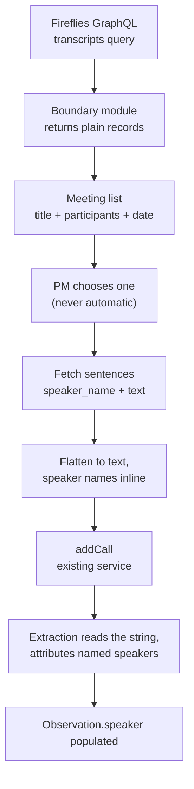
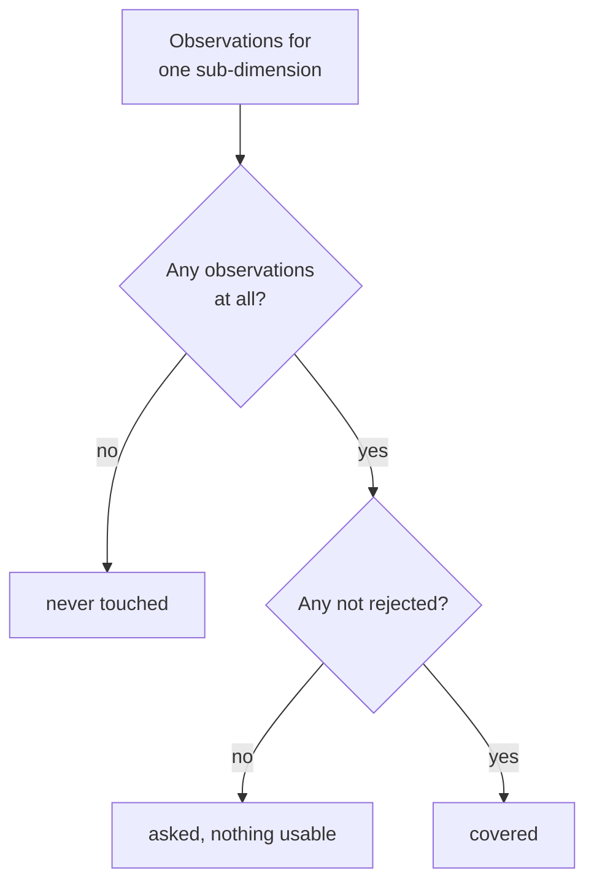

# L1 Completion - Plan

## Goal Capsule

- **Objective:** Close the gap between an L1 tool that works and one a team can run — the app says who you are, deals have visible owners you can hand over, transcripts arrive from Fireflies instead of the clipboard, and a PM can see which rubrics the calls so far have not drilled on.
- **Product authority:** This plan owns identity, roles, deal ownership, transcript ingestion, and capture coverage at L1. The L2 layer — claim verification, structural reads, layer comparison — is not active scope here and is planned separately in `docs/plans/2026-07-28-004-feat-l2-verification-core-plan.md`.
- **Execution profile:** Additive throughout. No migration rewrites existing rows, no existing screen changes behavior, and the paste path keeps working untouched. U1 lands first because every later unit assumes partners can author.
- **Stop conditions:** Stop and ask if the Fireflies credential turns out to be scoped to a single user rather than the workspace — that invalidates the shared-connection decision and changes what the import screen may show. Stop if a role change cannot take effect without invalidating live sessions.
- **Open blockers:** None.

**Product Contract preservation:** restructured, no scope change — R22 added for the meeting-list identifiability requirement (inconsistent Fireflies meeting titles, surfaced after the Product Contract was written). Two stale citations corrected: the deal-identifier Key Decision now governs R21 (was R16, a renumbering artefact), and the SSO dependency note now cites R16 (was R17). No requirement's meaning changed.

---

## Product Contract

### Summary

Surface the identity the app already tracks, give deals owners that can be seen and transferred, let a PM pull a transcript from Fireflies instead of pasting one, and show which parts of the rubrics the calls so far have not drilled on. Partners become full authors of the record rather than read-only observers.

### Problem Frame

The L1 build runs end to end but assumes a single operator sitting in front of it. The machinery for a team is already there and none of it reaches a screen.

Auth is fully wired — `middleware.ts` protects every route, `lib/session.ts` reads the actor, `lib/authz.ts` guards every mutation — yet `components/TopBar.tsx` renders a brand and a theme toggle and nothing else. Nobody can tell which account they are using, and there is no way to sign out. `canManageUsers` in `lib/authz.ts` is defined and never called, so the only way to change someone's role is to edit the `ADMIN_EMAILS` environment variable and redeploy. `Deal.ownerId` is set once at creation in `lib/services/capture.ts` and can never change, while `listDeals` in `lib/repo/records.ts` hands every deal to everyone undifferentiated.

The role split is stricter than the team needs. `AUTHOR_ROLES` admits `PM` and `ADMIN` only, so a partner signing in today gets the full PM interface and an error on any control they touch.

Separately, every transcript still arrives by copy-paste. The team records founder calls in Fireflies, and moving that text by hand is both the slowest step in the flow and the one that discards the speaker labels the extraction path is already built to carry.

A last gap opens once a deal runs past its first call, which L1 explicitly allows. Every observation records the sub-dimension it was mapped to and the call it came from, so the record already knows what each call covered — but nothing reads it back. `progressOf` in `lib/steps.ts` counts sub-dimensions scored and sub-dimensions holding evidence; neither number tells a PM preparing for the second call which of the 41 rows nobody has asked about yet. That question is answered today by scrolling the capture grid and remembering.

### Key Decisions

- **Partners author the record on the same terms as PMs.** Attribution survives the change: `authorId` is already on every score, slide, and founder read, so the record keeps saying who did the work even when both roles may. Governs R5.
- **A partner sees exactly what a PM sees.** No partner-specific view, no read-only mode. Combined with the decision above, `PM` and `PARTNER` become a label describing who someone is rather than a rule constraining them. Governs R5.
- **Only user management stays privileged.** `ADMIN` remains the sole role that gates anything. Governs R6.
- **Reassignment is limited to a deal's owner or an ADMIN.** Letting any author reassign would let anyone take a deal in order to delete it, which defeats the owner-scoped delete rule in `lib/authz.ts`. Governs R9, R10.
- **A deal's identifier is a stable handle, not a name.** Renaming a company leaves every existing link working, and a stale slug costs less than maintaining a redirect table. Governs R21.
- **Founders stay a single free-text field.** Nothing in the L2 design turned out to need founders modelled as separate people, so the structure would carry cost without a consumer.
- **Fireflies import is always chosen, never automatic.** Opening a call on a record is a judgment; a title match is not. Governs R15.
- **Imported transcripts keep their speaker labels.** Spec §3 deferred diarization because paste made it expensive; Fireflies makes it free, and `Observation.speaker` already carries it end to end. Governs R13.
- **Coverage separates never-asked from asked-and-thin.** A row nobody probed and a row that yielded only rejected quotes both need work on the next call, but they are different conversations to have. Governs R17.
- **Coverage is shown, never enforced.** Spec §3 defers coverage percentages and readiness thresholds; this plan builds the reading and leaves the gate deferred, which keeps it consistent with the framework's rule that the app renders facts and returns no verdict. Governs R20.
- **TARS connects to Fireflies once, for the whole workspace, not per user.** Nothing is stranded because a call was recorded by a colleague. The accepted consequence is that every TARS user can browse every meeting the workspace has recorded, including ones unrelated to any deal; sign-in is already restricted to `biome.in`, so the exposure is bounded to the team. Governs R11, R16.
- **A meeting is identified by its participants, not its title.** Meeting titles follow no convention in practice — `Biome <> Founder`, `PM <> Founder`, and `Biome <> Company` all occur — so a title-only list would leave a PM guessing. Governs R22.

### Actors

- A1. **PM** — authors the record. Owns the deals they create.
- A2. **Partner** — authors on the same terms as a PM (R5).
- A3. **ADMIN** — everything a PM or partner can do, plus user management and reassignment of any deal.
- A4. **Fireflies** — external meeting recorder. Lists the workspace's meetings and returns transcripts on request.

### Requirements

**Identity and access**

- R1. The app shows the signed-in user's name and role on every screen, with a control to sign out.
- R2. An ADMIN can list the people who hold accounts and change their roles without leaving the app.
- R3. A role change takes effect at that user's next sign-in.
- R4. An address configured in `ADMIN_EMAILS` is promoted to ADMIN on every sign-in and cannot be demoted from within the app; the people page says so rather than appearing to accept the change.
- R5. A PARTNER authors the record on the same terms as a PM, and sees the same screens.
- R6. Only an ADMIN can change roles.

**Deal ownership**

- R7. The deals list can be filtered to the deals the signed-in user owns.
- R8. A deal shows who owns it, and the owner can be changed to another account holder.
- R9. Only a deal's current owner or an ADMIN may reassign it.
- R10. Deletion rights follow ownership: after a reassignment the new owner may delete the deal and the previous owner may not.

**Transcript ingestion**

- R11. A PM can import a call transcript from Fireflies by searching or browsing the workspace's recent meetings and choosing one.
- R12. Pasting a transcript stays available and behaves as it does today.
- R13. Speaker labels on an imported transcript reach the observations drafted from it.
- R14. An imported call carries a call number and a label, supplied the same way a pasted call supplies them.
- R15. No meeting is ever attached to a deal without a person choosing it.
- R16. The import screen states that the meetings listed are the workspace's rather than the signed-in user's own.
- R22. Each meeting in the list is identifiable without relying on its title: participants and date are shown alongside it, and search matches participants as well as title. (Numbered after R21 because IDs are never renumbered; it belongs to this group.)

**Capture coverage**

- R17. The record can be read as a coverage view across all six rubrics, showing each sub-dimension in one of three states: it holds usable evidence, it holds only evidence that was rejected, or no call has touched it.
- R18. Coverage reads per call as well as cumulatively, so a PM can see what a given call added and what remains untouched across every call so far.
- R19. Coverage is derived from the record and is never authored.
- R20. Coverage reports and never gates. It does not block scoring, judgment, or advancing a deal.

**Record identity**

- R21. A deal's identifier is fixed at creation and does not change when the company is renamed.

### Key Flows

- F1. Import a transcript from Fireflies
  - **Trigger:** A PM opens a deal's transcript page after recording a founder call.
  - **Actors:** A1, A4
  - **Steps:** The PM chooses to import; TARS lists the workspace's recent Fireflies meetings with title, participants, date, and duration; the PM searches or scrolls and selects one; TARS fetches the transcript; the PM confirms the call number and label; the call is saved with its speaker labels intact.
  - **Outcome:** A call exists on the deal, ready for extraction, with no text moved by hand.
  - **Covers R11, R13, R14, R15, R22.**

- F2. Hand a deal to another PM
  - **Trigger:** A PM is going on leave, or a deal moves to a colleague.
  - **Actors:** A1, A3
  - **Steps:** The owner (or an ADMIN) opens the deal, changes the owner to another account holder, and confirms.
  - **Outcome:** The deal appears under the new owner's "Mine" filter, and delete rights move with it.
  - **Covers R8, R9, R10.**

- F3. Change someone's role
  - **Trigger:** A new colleague signs in, or someone's responsibilities change.
  - **Actors:** A3
  - **Steps:** An ADMIN opens the people page, finds the person, and sets their role.
  - **Outcome:** The change applies the next time that person signs in.
  - **Covers R2, R3, R6.**

- F4. Plan what to ask on the next call
  - **Trigger:** A PM has run one or more L1 calls on a deal and is preparing the next one.
  - **Actors:** A1
  - **Steps:** The PM opens coverage. Rows holding usable evidence, rows that yielded only rejected quotes, and rows no call has touched are distinguishable at a glance, per rubric and per call. The PM picks what to probe.
  - **Outcome:** The next call targets the gaps instead of repeating ground already covered.
  - **Covers R17, R18.**

### Acceptance Examples

- AE1. Reassignment moves delete rights
  - **Covers R10.**
  - **Given:** Harshit owns the deal `halten` and Mehul is a PM.
  - **When:** Harshit reassigns `halten` to Mehul.
  - **Then:** Mehul may delete `halten` and Harshit may not.

- AE2. A configured admin cannot be demoted in the app
  - **Covers R4.**
  - **Given:** `harshit@biome.in` is listed in `ADMIN_EMAILS`.
  - **When:** Another ADMIN sets that account's role to PM on the people page.
  - **Then:** The account is ADMIN again at its next sign-in, and the app says so rather than appearing to have applied the change.

- AE3. A partner authors a score
  - **Covers R5.**
  - **Given:** Srini is signed in as PARTNER.
  - **When:** Srini scores a sub-dimension with evidence.
  - **Then:** The score saves and the record attributes it to Srini.

- AE4. An imported transcript without speaker labels
  - **Covers R13.**
  - **Given:** A Fireflies meeting whose transcript carries no speaker attribution.
  - **When:** The PM imports it and runs extraction.
  - **Then:** Observations are drafted with no speaker, exactly as a pasted transcript produces today — the import never invents one.

- AE5. Importing into an occupied call number
  - **Covers R14.**
  - **Given:** The deal already has a call numbered 2.
  - **When:** The PM imports a Fireflies meeting and leaves the call number at 2.
  - **Then:** The import is rejected with the same collision message a pasted call produces, and the transcript is not saved.

- AE6. A row asked about that yielded nothing
  - **Covers R17.**
  - **Given:** Call 1 produced two observations mapped to a GTM sub-dimension, both rejected by the PM, while a second GTM sub-dimension drew no observations at all.
  - **When:** The PM opens coverage before call 2.
  - **Then:** The first row reads as drilled on without usable result and the second reads as never touched — the two are distinguishable, not both shown as empty.

- AE7. A meeting whose title names nobody useful
  - **Covers R22.**
  - **Given:** A Fireflies meeting titled `Biome <> Aparna` for a deal recorded under the company name Halten.
  - **When:** The PM searches the import list for the founder's name or email.
  - **Then:** The meeting is found, and its row shows the participants and date so the PM can confirm it is the right call before importing.

### Scope Boundaries

- Partner-specific views and read-only modes — a partner sees the PM application.
- Structured founder records — founders remain one text field.
- Automatic or scheduled Fireflies attachment.
- File upload and material exchange with founders — that belongs to the L2 deal-room work, not here.
- Linking a transcript's speaker to a founder record — speaker stays a free-text label.
- Changing a deal's identifier when its company is renamed, and any redirect machinery that would require.
- Coverage thresholds, readiness percentages, and anything that blocks on them (R20) — spec §3 keeps the gate deferred; this plan builds only the reading.

#### Deferred to Follow-Up Work

- Retiring `Deal.ownerPm`. The display string and the `ownerId` relation both persist today; `toDeal` already prefers the relation, so the string is nearly vestigial. Removing it touches the record contract in `mock/types.ts` and is not worth bundling here.
- Invalidating live sessions on a role change, so a demotion takes effect immediately rather than at next sign-in (R3).

### Dependencies and Assumptions

- Fireflies exposes a GraphQL API with a `transcripts` list query (arguments include `title`, `fromDate`/`toDate`, `limit` capped at 50, `skip`, `host_email`, `participant_email`, `organizers`, `participants`) and per-sentence speaker attribution via `sentences.speaker_name`. **Verified against published documentation**, not against a live key.
- A single Fireflies credential reaches the workspace's meetings rather than only its owner's. **Unverified** — the presence of `user_id`, `host_email`, and `organizers` filters implies it, but confirm against a real key before building the import list. This is the Goal Capsule's stop condition.
- Google SSO is domain-restricted to `biome.in` (backend plan B7), so everyone with an account is internal. This is what bounds the exposure R16 discloses.
- User rows are created on first sign-in, so "people who hold accounts" means "people who have signed in at least once".
- Sessions are JWT-strategy and carry `role`, which is why R3 lands at next sign-in rather than immediately.

### Outstanding Questions

Nothing blocks implementation.

**Deferred to planning — now resolved**

- The people page reflects the stored role immediately and states that it applies at next sign-in (R3, R4). Resolved by KTD7.
- "Mine" is a query-level filter, not a client-side one, so it stays correct as the deal list grows. Resolved by KTD9.

**Surfaced during planning — answer before U3 ships**

- KTD12 stops an ADMIN demoting the last ADMIN, which narrows R2's "change their roles" by one case. The alternative is to allow it and rely on database access for recovery, since an empty `ADMIN_EMAILS` leaves no configured backstop. The guard is the safe default and is one condition to remove if you would rather not have it.

<!-- ce-section: work-relationships -->
### How This Work Fits Together

This plan owns what L1 still needs before a team can run it. The breakdown below is how the surrounding work is currently understood, not a committed roadmap — a later plan may revise, split, or discard any of it.

- **L2 verification core** (`docs/plans/2026-07-28-004-feat-l2-verification-core-plan.md`)
  - Depends on the partner-authoring change here (R5); structural reads at L2 assume partners can write to the record.
  - Shares the layer stamps already present on observations, scores, and slides.
- **L2 deal room** — materials, uploads, and document exchange with founders.
  - Can proceed independently of this plan and of the verification core; it needs storage infrastructure that exists nowhere yet.
- **L3 co-development and IC**
  - Still to decide. Gate logic remains Pending in the framework (spec D1), unchanged by this plan.

---

## Planning Contract

### Key Technical Decisions

- KTD1. **Fireflies is reached through its GraphQL API, not its MCP server.** (session-settled: user-approved — chosen over the Fireflies MCP server: MCP is a protocol for an LLM to call tools and needs a client plus a host process, while TARS imports from server-side code on Vercel serverless where no such process exists.) The GraphQL API is a single authenticated fetch with no new runtime dependency. Governs R11.
- KTD2. **Fireflies lives behind a boundary module and its types never reach app code.** This mirrors the rule already holding for Prisma — `lib/repo` is the only place Prisma types are visible — so the import path returns plain records the rest of the app already understands. Governs R11, R22.
- KTD3. **An imported transcript is flattened to text with each speaker's name inline.** This is the mechanism R13 depends on: `lib/extraction/prompt.ts` instructs the model to attribute a speaker only when the transcript names one, so the flattening format is what carries attribution into `Observation.speaker`. Governs R13.
- KTD4. **The Fireflies client is injected, like the Anthropic client.** `lib/extraction/extract.ts` already takes its client as a parameter so tests run without an API key; the import path follows that shape rather than reaching for a module-level singleton. Governs R11.
- KTD5. **Coverage is its own pure derivation, not an extension of `progressOf`.** `progressOf` returns flat counts consumed by every page in the flow; coverage needs per-sub-dimension, per-call state, and widening the existing return shape would make every caller pay for data only one page reads. Governs R17, R18, R19.
- KTD6. **Partner authoring is one entry in `AUTHOR_ROLES`, not a per-artifact capability model.** (session-settled: user-directed — chosen over per-artifact authorization: partners author on the same terms as PMs, so there is nothing left to differentiate.) Governs R5.
- KTD7. **Role changes write the stored role and take effect at next sign-in.** Sessions are JWT-strategy and carry `role` in the token, so a stored change cannot reach a live session without invalidating it. The page states this rather than implying immediacy. Governs R2, R3, R4.
- KTD8. **The import list is built from the `transcripts` query with `limit`/`skip` pagination.** Fireflies caps `limit` at 50, so the browse list pages rather than fetching everything. Governs R11, R22.
- KTD9. **"Mine" filters at the query level.** `listDeals` takes an optional owner filter rather than the page filtering an already-fetched list, so the behavior stays correct as the deal count grows. Governs R7.
- KTD10. **The Fireflies credential is read on the server and never reaches the browser.** `app/deals/[dealId]/transcript/page.tsx` already sets this precedent for the Anthropic key — it reads the environment server-side and passes the client component only a boolean saying whether the offer is available. The import control follows that shape exactly. Governs R11.
- KTD11. **Listing meetings requires an authoring actor, not merely an authenticated one.** The list exposes every meeting title and participant set in the Fireflies workspace, so it is guarded like a write even though it reads nothing from the record. Governs R11, R16.
- KTD12. **An ADMIN cannot demote the last ADMIN.** `lib/adminEmails.ts` treats an empty `ADMIN_EMAILS` as "nobody is an admin", so with no configured address there is no backstop and the demotion is unrecoverable without database access. This narrows R2 — see Open Questions if that trade is unwanted. Governs R2.

### High-Level Technical Design

The import path is the only new data flow in this plan, and its non-obvious property is that speaker attribution survives all the way to an observation. Fireflies returns structured sentences; `Call.transcript` is a single string; extraction reads that string and is forbidden from guessing a speaker. The flattening step (KTD3) is the hinge.

Coverage derives three states per sub-dimension from observation status alone. The distinction that matters is between a row with no observations and a row whose observations were all rejected — the same emptiness on screen today, two different conversations to have next call.

### Assumptions

- Fireflies participant data is rich enough to identify a meeting when its title is not (R22). If participant emails come back empty for some meetings, the list degrades to title and date, and search still matches title.
- The existing `AddCallInput` validation is the right gate for imported calls too, so an import that collides on call number fails the same way a paste does (AE5).

### Sequencing

U1 first — every later unit assumes partners can author, and landing it alone keeps the permission change reviewable in isolation. U2, U5, and U7 have no dependencies and can proceed in any order. U3 and U4 depend on U1; U6 depends on U5; U8 depends on U7.

### System-Wide Impact

**The `AUTHOR_ROLES` change is one line with 24 enforcement points behind it.** `assertMayAuthor` is called 12 times across `lib/services/capture.ts` and `lib/services/judgment.ts`, and `requireAuthor` 12 times in `lib/actions.ts`. Adding `PARTNER` to that constant admits partners to every one of them at once. That is the intent (R5), and the constant-driven design is what makes it safe to do in one place — but verification means enumerating those call sites, not spot-checking two of them.

**A new outbound network dependency enters the request path.** Fireflies is the second external service the app calls, after Anthropic. The import path inherits the same serverless constraints the extraction path already documents: `maxDuration` on the transcript route exists because a long call outruns Vercel's default limit, and a large transcript fetch sits in the same budget.

**A new secret joins the deployment.** The Fireflies credential has workspace-wide read scope — broader than anything the app holds today — and belongs in the same provisioning runbook as the existing environment variables.

**Auth boundary, unchanged in shape.** No new sign-in path, no relaxation of the `biome.in` domain restriction, no new session semantics. The people page is the first ADMIN-only route, so it is the first place `canManageUsers` becomes load-bearing rather than decorative.

### Risks

| Risk | Treatment |
|---|---|
| The Fireflies credential turns out to be user-scoped, not workspace-scoped, invalidating the shared-connection decision | Verify against a real key before building the import list. This is the Goal Capsule's stop condition, and it is the assumption most likely to break the plan |
| The credential leaks to the browser | KTD10 binds the import control to the existing server-only pattern; U6 tests that no credential value crosses the component boundary |
| Any signed-in user enumerates the workspace's meetings, including board calls and 1:1s | Accepted and disclosed (R16). KTD11 narrows the surface to authoring actors; the `biome.in` restriction bounds it to the team |
| A demoted user keeps authoring rights until their session expires | Inherent to JWT sessions (KTD7). Acceptable for promotion, weaker for removal — session invalidation is named in Deferred to Follow-Up Work, and a removal that must take effect now is done by revoking the account, not the role |
| An ADMIN demotes the last ADMIN and locks the workspace out of user management | KTD12 guards it. `ADMIN_EMAILS` is the recovery path when configured, and empty is a supported state, so the guard cannot rely on it |
| A large transcript outruns the serverless time limit on import | The import writes the call and offers extraction as a separate press, matching how `AddCallForm` already separates the two failures |

---

## Implementation Units

### U1. Partner authoring

- **Goal:** A partner authors the record on the same terms as a PM.
- **Requirements:** R5, R6. Implements the Key Decision governing R5 (partners author on the same terms), and KTD6.
- **Dependencies:** none.
- **Files:** `lib/authz.ts`, `lib/authz.test.ts` (new), `lib/services/capture.test.ts`, `lib/services/authoring.test.ts`
- **Approach:** Add `Role.PARTNER` to `AUTHOR_ROLES`. `canAuthorRecord`, `assertMayAuthor`, and `requireAuthor` all read from that constant, so nothing else changes. `canManageUsers` stays ADMIN-only. `canDeleteDeal` already composes `canAuthorRecord` with the owner check, so a partner who owns a deal may delete it — consistent with R10 and intended.
- **Patterns to follow:** the existing constant-driven shape in `lib/authz.ts`; do not introduce a capability map.
- **Test scenarios:**
  - Covers AE3. A PARTNER actor passes `assertMayAuthor` and can set a sub-dimension score, and the score records that partner as author.
  - A PARTNER actor fails `canManageUsers`.
  - A PARTNER who owns a deal passes `canDeleteDeal`; a PARTNER who does not own it fails.
  - The existing test asserting a PARTNER write is rejected is updated to assert the opposite, and its name reflects the new rule.
  - Every `assertMayAuthor` and `requireAuthor` call site is enumerated and each admits a PARTNER — 24 sites across `lib/services/capture.ts`, `lib/services/judgment.ts`, and `lib/actions.ts`. Spot-checking two of them does not prove the change.
- **Verification:** the service suite passes with a partner exercising every authoring path a PM has.

### U2. Identity and sign-out

- **Goal:** Every screen says who is signed in and offers a way out.
- **Requirements:** R1.
- **Dependencies:** none.
- **Files:** `components/TopBar.tsx`, `components/UserChip.tsx` (new), `components/UserChip.test.tsx` (new)
- **Approach:** `TopBar` reads the actor via `currentActor()` and passes name and role to a small client component that owns the menu and the sign-out call. `TopBar` is rendered from `app/layout.tsx`, so making it async is the change that reaches every screen. Sign-out uses Auth.js's client helper. When no actor is present the chip renders nothing rather than a signed-out state — middleware already guarantees a session on every non-auth route.
- **Patterns to follow:** `components/ThemeToggle.tsx` for the client-component-in-server-shell shape.
- **Test scenarios:**
  - The chip renders the actor's name and role.
  - An actor with no name falls back to the email local part rather than rendering blank.
  - Activating sign-out calls the sign-out helper once.
- **Verification:** the chip appears on the deals list, a deal overview, and the scorecard; sign-out returns to the sign-in screen.

### U3. People page

- **Goal:** An ADMIN can see who holds an account and change their role without a redeploy.
- **Requirements:** R2, R3, R4, R6. Implements KTD7.
- **Dependencies:** U1.
- **Files:** `lib/services/people.ts` (new), `lib/services/people.test.ts` (new), `lib/actions.ts`, `app/admin/people/page.tsx` (new), `components/admin/PersonRow.tsx` (new), `lib/repo/records.ts`
- **Approach:** A `listPeople` repo read returns id, name, email, role, and created date. `setRole` in the service asserts `canManageUsers`, validates with Zod against the `Role` enum, and writes. The page is a server component that reads through `lib/data.ts` like every other page and returns `notFound()` for a non-admin rather than rendering a forbidden shell. Each row shows whether the address is configured in `ADMIN_EMAILS` — `isConfiguredAdmin` is already edge-safe and free of Prisma imports — and for those rows the control is disabled with the reason stated inline.
- **Execution note:** write the `ADMIN_EMAILS` interaction test first; it is the rule most likely to be implemented as a silent no-op.
- **Patterns to follow:** `lib/services/capture.ts` for the assert-then-validate-then-write shape; `lib/actions.ts` for the `ActionResult` wrapper.
- **Test scenarios:**
  - Covers AE2. Setting a configured-admin address to PM leaves the effective role ADMIN at next sign-in, and the service reports that the address is configured rather than silently succeeding.
  - A PM actor calling `setRole` is rejected.
  - A PARTNER actor calling `setRole` is rejected.
  - An ADMIN changes a PM to PARTNER and the stored role changes.
  - An invalid role string is rejected by validation.
  - `listPeople` returns every user row, including ones with no name.
  - With `ADMIN_EMAILS` empty and one ADMIN remaining, that ADMIN demoting themselves is rejected (KTD12).
  - With two ADMINs, either may be demoted.
  - The page states that a role change applies at next sign-in rather than immediately (KTD7).
- **Verification:** an ADMIN changes a colleague's role and sees it reflected; a PM navigating to the page gets a not-found.

### U4. Deal ownership

- **Goal:** Deals show an owner, can be handed over, and can be filtered to yours.
- **Requirements:** R7, R8, R9, R10, R21. Implements the Key Decision governing R9 and R10 (reassignment limited to owner or ADMIN), and KTD9.
- **Dependencies:** U1.
- **Files:** `lib/authz.ts`, `lib/authz.test.ts`, `lib/services/capture.ts`, `lib/services/capture.test.ts`, `lib/repo/records.ts`, `lib/data.ts`, `lib/actions.ts`, `app/deals/page.tsx`, `app/deals/[dealId]/page.tsx`, `components/authoring/ReassignDeal.tsx` (new), `components/authoring/ReassignDeal.test.tsx` (new)
- **Approach:** Add `canReassignDeal` and `assertMayReassignDeal` alongside the existing delete guards, matching their owner-or-admin shape. `reassignDeal` in the capture service asserts, validates the target user exists, and updates `ownerId`; it also refreshes `ownerPm` so the two representations do not drift while both exist. `listDeals` takes an optional `ownerId` filter and the deals page reads a filter from search params. The deal overview renders the owner with a reassign control for those permitted.
- **Patterns to follow:** `assertMayDeleteDeal` in `lib/authz.ts` — the new guard is its sibling, not a new mechanism; `components/authoring/DeleteDeal.tsx` for the confirm-then-act control.
- **Test scenarios:**
  - Covers AE1. After reassignment the new owner passes `canDeleteDeal` and the previous owner fails.
  - A non-owner PM is rejected by `assertMayReassignDeal`.
  - An ADMIN reassigns a deal they do not own and succeeds.
  - Reassigning to a user id that does not exist is rejected.
  - A deal with a null owner can be reassigned by an ADMIN and not by a PM.
  - `listDeals` with an owner filter returns only that owner's deals; without it, all deals.
  - Renaming a deal's company through `updateDeal` leaves its id unchanged (R21).
- **Verification:** a deal moves between two accounts and the "Mine" filter reflects it from both sides.

### U5. Fireflies client

- **Goal:** A boundary module that lists the workspace's meetings and returns one transcript as text with speakers named.
- **Requirements:** R11, R13, R22. Implements KTD1, KTD2, KTD3, KTD4, KTD8.
- **Dependencies:** none.
- **Files:** `lib/fireflies/client.ts` (new), `lib/fireflies/schema.ts` (new), `lib/fireflies/format.ts` (new), `lib/fireflies/client.test.ts` (new), `lib/fireflies/format.test.ts` (new), `.env.example`
- **Approach:** A `FirefliesClient` interface with two operations — list meetings (paged, searchable) and fetch one transcript — implemented over the GraphQL endpoint with a bearer credential from the environment, and injected wherever it is used. Zod schemas validate responses at the boundary so malformed data fails there rather than downstream. The list operation returns plain records carrying id, title, participants, date, and duration; the fetch operation returns flattened text. Flattening lives in its own module because it is pure and carries the rule R13 depends on: each sentence is prefixed with its speaker's name when one is present, and left unprefixed when it is not, so the extractor sees names only where Fireflies actually attributed them.
- **Execution note:** build `format.ts` and its tests before the network client — it holds the load-bearing rule and needs no API access to prove.
- **Patterns to follow:** `lib/extraction/extract.ts` for the injected-client shape and the typed-error handling; `lib/extraction/schema.ts` for boundary validation.
- **Test scenarios:**
  - Sentences with speakers flatten with each speaker's name inline, in order.
  - Covers AE4. Sentences with no speaker flatten to bare text with no invented attribution.
  - A mix of attributed and unattributed sentences preserves the distinction per sentence.
  - A stubbed list response maps to plain records with participants populated.
  - A response missing participants yields records that still carry title and date.
  - A malformed response fails Zod validation with a typed error rather than propagating undefined.
  - Paging requests use `skip` and never ask for more than the documented `limit` cap of 50.
  - A credential-less environment surfaces a typed configuration error rather than an unhandled fetch failure.
- **Verification:** the module's tests pass with no network access and no credential present.

### U6. Import from Fireflies

- **Goal:** A PM picks a meeting and it becomes a call on the deal.
- **Requirements:** R11, R12, R14, R15, R16, R22.
- **Dependencies:** U5.
- **Files:** `lib/services/capture.ts`, `lib/services/capture.test.ts`, `lib/actions.ts`, `app/deals/[dealId]/transcript/page.tsx`, `components/authoring/ImportFromFireflies.tsx` (new), `components/authoring/ImportFromFireflies.test.tsx` (new)
- **Approach:** Two actions — one lists meetings for the picker, one imports a chosen meeting. The import path fetches the transcript, flattens it, and calls the existing `addCall`, so every rule `addCall` already enforces applies unchanged and the paste path is untouched. The picker shows title, participants, date, and duration per row, with a search box that matches participants as well as title, and states above the list that these are the workspace's meetings. The call number and label are confirmed by the PM in the same step, prefilled the way `AddCallForm` prefills them. The import action never runs without a chosen meeting id.
- **Patterns to follow:** `components/authoring/AddCallForm.tsx` for the prefilled-but-editable call number and the two-step save-then-extract offer; `components/authoring/RunExtractionButton.tsx` for the availability-gated control when no credential is configured.
- **Test scenarios:**
  - Covers AE5. Importing into an occupied call number is rejected with the existing collision message and persists nothing.
  - Covers AE7. Searching by a participant's name or email finds a meeting whose title does not contain it.
  - An imported call is persisted with its flattened transcript and the PM's call number and label.
  - Importing without a chosen meeting id is rejected (R15).
  - The picker renders participants and date for each meeting.
  - The picker states that the listed meetings belong to the workspace (R16).
  - With no Fireflies credential configured, the import control is absent and the paste path still works (R12).
  - The client component receives only an availability boolean; no credential value crosses the server boundary (KTD10).
  - A signed-in actor who cannot author is rejected by the meeting-list action (KTD11).
  - Pasting a transcript behaves exactly as before, asserted by the existing add-call tests continuing to pass unchanged.
- **Verification:** a meeting recorded in Fireflies reaches a deal as a call, extraction runs on it, and the resulting observations carry speakers.

### U7. Coverage derivation

- **Goal:** A pure reading of which sub-dimensions the calls have covered.
- **Requirements:** R17, R18, R19. Implements KTD5.
- **Dependencies:** none.
- **Files:** `lib/coverage.ts` (new), `lib/coverage.test.ts` (new)
- **Approach:** A function over the record returning, for every sub-dimension in `ALL_SUBS`, one of three states plus the call numbers that contributed. A row with no observations is untouched; a row whose observations are all rejected is asked-without-result; anything else is covered. A second reading groups by call so a PM can see what one call added. Rubric grouping comes from the `rubricKey` already carried on each flattened sub-dimension. Nothing here reads or writes scores — coverage is about evidence, not judgment (R19).
- **Patterns to follow:** `lib/steps.ts` `progressOf` for the derive-from-record shape and `lib/rollup.ts` for pure-function-over-record structure.
- **Test scenarios:**
  - Covers AE6. A sub-dimension whose only observations are rejected reads as asked-without-result, and one with no observations reads as untouched — the two are distinguishable.
  - A sub-dimension with one accepted observation reads as covered.
  - A sub-dimension with one rejected and one accepted observation reads as covered.
  - Draft observations count as usable, since they are pending review rather than refused.
  - Every one of the framework's sub-dimensions appears in the output, including those no observation mentions.
  - Per-call grouping attributes each observation to the call number it carries.
  - A record with no calls returns every row untouched.
- **Verification:** unit tests cover all three states and the per-call reading with no database access.

### U8. Coverage page

- **Goal:** The coverage reading has a place in the deal flow.
- **Requirements:** R17, R18, R20.
- **Dependencies:** U7.
- **Files:** `app/deals/[dealId]/coverage/page.tsx` (new), `components/CoverageGrid.tsx` (new), `components/CoverageGrid.test.tsx` (new), `lib/steps.ts`
- **Approach:** A page rendering the six rubrics with their sub-dimensions, each in one of the three states, with a per-call breakdown alongside the cumulative reading. It joins the floor check and the claim ledger in `viewsFor` rather than the numbered flow in `stepsFor` — like those two it is a reading of the record consulted when the question arises, not a step with a done state. Nothing on the page blocks or gates anything (R20).
- **Patterns to follow:** `components/CaptureGrid.tsx` for the rubric-and-sub-dimension layout and its existing visual distinction between states; `lib/steps.ts` `viewsFor` for the cross-cutting-view registration.
- **Test scenarios:**
  - The three states are visually distinguishable and labelled, not conveyed by colour alone.
  - Every rubric renders with all of its sub-dimensions.
  - The per-call view shows one column per call on the deal.
  - A deal with no calls renders every row as untouched rather than empty.
  - No control on the page mutates the record (R19, R20).
- **Verification:** the page renders for a deal with two calls and shows what each added.

---

## Verification Contract

| Gate | Command | Applies to |
|---|---|---|
| Types | `npm run typecheck` | every unit |
| Service and domain tests | `npm run test:services` | U1, U3, U4, U5, U6, U7 |
| Component tests | `npm run test:components` | U2, U4, U6, U8 |
| Full suite | `npm test` | before declaring done |
| Production build | `npm run build` | before declaring done |

Service and repository tests need the local Postgres test database the backend plan provisions; `lib/fireflies` and `lib/coverage` tests need neither a database nor network access, by construction (KTD4, KTD5).

The existing suite is the regression contract for R12: the add-call and extraction tests must pass unchanged, since the paste path is not supposed to move.

## Definition of Done

- Every requirement R1–R22 is demonstrable in the running app.
- Each unit's test scenarios exist as tests and pass.
- `npm test`, `npm run typecheck`, and `npm run build` all pass clean.
- The existing add-call, extraction, and authoring tests pass without modification, except the single partner-rejection test U1 deliberately inverts.
- No Fireflies type appears outside `lib/fireflies` (KTD2); no Prisma type appears outside `lib/repo`.
- `.env.example` documents the Fireflies credential alongside the existing entries.
- Abandoned approaches are removed rather than left in the diff — no dead client wrappers, unused schema variants, or commented-out flattening attempts.

## Sources

- `docs/specs/2026-07-24-capture-scorecard-l1-spec.md` §3 (deferred items, including file upload and diarized transcripts), §4.4 (authorship rule), D8 (users, roles, and access), D10 (transcript ingestion).
- `docs/plans/2026-07-27-002-backend-l1-plan.md` — the authorization table this plan revises, and B7 for the domain-restricted SSO constraint.
- `CONCEPTS.md` — canonical vocabulary for the framework terms used throughout.
- `lib/authz.ts` — `AUTHOR_ROLES`, `canManageUsers`, `canDeleteDeal`, and the comment explaining why deletion is owner-scoped.
- `lib/adminEmails.ts` — `resolveRole`, and why configured admins survive a stored-role change.
- `lib/repo/records.ts` — `listDeals`, and `toDeal`'s preference for the owner relation over the stored display name.
- `lib/services/capture.ts` — `uniqueDealId`, `createDeal`, `updateDeal`, `AddCallInput`.
- `lib/extraction/extract.ts` — the injected-client pattern U5 follows.
- `lib/extraction/prompt.ts` — the instruction never to guess a speaker, which is why KTD3's flattening format is load-bearing.
- `lib/steps.ts` — `progressOf` and the `viewsFor` cross-cutting-view registration U8 joins.
- `framework/index.ts` — `ALL_SUBS` and `TOTAL_SUBS`, the denominator coverage reads against.
- `components/CaptureGrid.tsx` — the existing visual language for scored, unscored, and incomplete.
- [Fireflies `transcripts` query](https://docs.fireflies.ai/graphql-api/query/transcripts) — arguments, the `limit` cap of 50, and the `sentences` fields including `speaker_name`.
- [Fireflies API overview and key issuance](https://guide.fireflies.ai/articles/3737786777-fireflies-api-overview-get-api-key).
