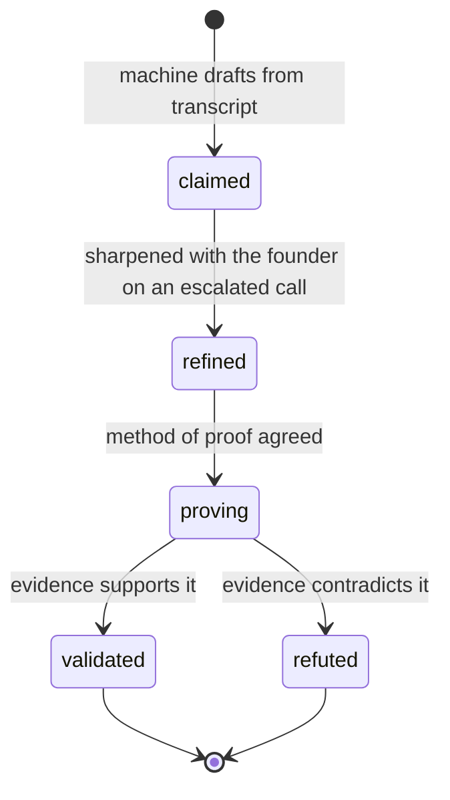

# L2 Verification Core - Plan

## Goal Capsule

- **Objective:** Open the record for a second pass. Claims get sharpened with the founder and proven, the escalated rubrics get re-scored with the cap lifted, partners write structural reads around each call, and the record shows what changed between L1 and L2.
- **Product authority:** This plan owns the record-shaped half of L2 — claims, layers, scoring, structural reads, drift. The deal room (materials, uploads, document exchange with founders) is not active scope and is planned separately.
- **Open blockers:** None.

---

## Product Contract

### Summary

Let a deal advance from L1 to L2 and be worked a second time: claims move from abstract assertions to proven or disproven ones, the sub-dimensions that prompted the escalation get re-scored without the L1 ceiling, and both layers stay side by side so the change is legible.

### Problem Frame

The framework's L2 is where conviction gets tested. A PM runs a screening call; a weak deal drops there. A deal with conviction but thin understanding on some rubrics escalates to a partner call or a tech-operator call, and on that call the claim itself is the work: an abstract assertion is sharpened with the founder into something concrete, and a way to prove it is agreed. Alongside those calls sits substantial desk work — market intel, product deep dives, financial modelling.

None of that can be recorded today. Claims are written only inside the extraction transaction in `lib/services/capture.ts` and are immutable to humans afterwards — there is no claim mutation anywhere in the codebase, so the ledger the framework treats as the spine of verification is machine-written and frozen at `claimed`. `assertLayer` in `lib/domain/rules.ts` rejects every layer but L1 by design, and nothing anywhere sets `Deal.layer`. `Call` and `Claim` carry no layer stamp at all, though `Observation`, `SubDimensionScore`, and `Slide` do.

The consequence is that a deal that has been through three verification calls is indistinguishable from one that has been through a single screening call. Every slide is still banked at the L1 ceiling with a provisional beside it recording what the PM believed it would become — and no way for it to ever become that.

What the record does have is the seam. Layer-keyed uniqueness on scores and slides means an L2 row sits beside its L1 row rather than replacing it, so the before-and-after that makes verification legible is free the moment L2 writes anything.

### Key Decisions

- **A claim moves through four states, not two.** Sharpening the wording and agreeing the method of proof are separate recorded steps, so "validated" always points at a concrete claim and a stated way it was proven. Governs R1, R2, R3.
- **The L2 verification cap is 10.** The L1 cap of 6 exists because the claims behind a slide are unverified (`framework/verificationCap.ts`); verification retires the reason. L3 is where weak slides get worked on together, which makes L2's job the honest reading rather than a hedged one. Governs R10.
- **L2 re-scores the escalated rubrics before the slides.** A slide's `ceilingGuard` names the sub-dimension that held it down, so re-banking without re-scoring would leave that stated reason pointing at a number nobody revisited. Governs R9, R11.
- **Re-scoring is targeted, not a full second pass.** Escalation happens because specific rubrics are thin; rows nothing new was learned about keep their L1 score. Governs R12.
- **L1 rows are never overwritten.** This is what makes the comparison possible, and it costs nothing — the uniqueness constraints already work this way. Governs R16.
- **Structural reads are barred to the machine.** Extraction is already asserted by test to write zero score rows; the same guard shape applies here. Governs R14.
- **Drift is machine-flagged and human-ruled, with a materiality threshold.** This mirrors `MappingConfidence`, where the machine rates its own output and only the uncertain cases interrupt a person. Governs R18, R19, R20.
- **Advancing a deal to L2 is a deliberate act.** `DealHeaderForm` already withholds `layer` from ordinary editing because a stray restamp would silently detach every score from the layer it was authored at. Governs R6.
- **A tech operator never signs into TARS.** Their contribution reaches the record through the PM or partner who writes it up, which keeps sign-in restricted to `biome.in` and adds no external-account surface to an application holding founder call transcripts. The record attributes the read to its author, not to the expert consulted.

### Actors

- A1. **PM** — escalates the deal, runs the L2 call, refines claims, re-scores, writes the pre-call structural read.
- A2. **Partner** — joins the escalated call, writes the post-call structural read, and authors the record on the same terms as a PM.
- A3. **Tech operator** — a technical expert brought onto an escalated call to test a claim. Holds no TARS account and never writes to the record directly.
- A4. **Machine** — drafts observations and claims from transcripts and flags candidate drift. Never rules, never scores, never writes a structural read.

### Requirements

**The claim ledger**

- R1. A claim can be refined: its wording replaced with a sharper version while the original stays readable.
- R2. A claim can carry the agreed method of proof, recorded before any evidence exists.
- R3. A claim can be ruled validated or refuted, with the reason recorded.
- R4. Every claim carries the layer at which it was refined or ruled.
- R5. Only a person changes a claim's wording, method, or status. The machine creates claims at `claimed` and never moves them.

The states a claim passes through:

**Escalating to L2**

- R6. A deal advances from L1 to L2 through a deliberate action, distinct from editing the deal's details.
- R7. Advancing records who advanced it and when.
- R8. A call carries the layer it belongs to, so evidence drafted from it is attributable to that layer.

**Scoring at L2**

- R9. A sub-dimension can be re-scored at L2, with evidence, leaving its L1 score intact.
- R10. At L2 a banked slide may take any value from 0 to 10.
- R11. An L2 slide carries its own ceiling guard, authored at L2 rather than inherited from L1.
- R12. L2 does not require every sub-dimension to be scored again; a row not revisited keeps its L1 score and says so.

**Structural reads**

- R13. A structural read is a written document attached to a call, in one of two forms: written before the call, naming the levers to test; or written after it, recording the read.
- R14. A structural read is authored by a person. The machine never drafts one, and no path exists by which it could.
- R15. Both PMs and partners author structural reads.

**Layer comparison**

- R16. The record can be read as a comparison between two layers, showing which sub-dimension scores, slides, and ceiling guards changed and which did not.
- R17. The comparison attributes observations and claims to the layer of the call they came from.

**Pitch drift**

- R18. When extracting a call, the machine compares what it finds against the claims already on the deal and flags contradictions.
- R19. Only material deviations surface. A rewording of the same substance does not.
- R20. A person rules whether a flagged deviation is drift. The machine never rules.

### Key Flows

- F1. Escalate a deal after the screening call
  - **Trigger:** The PM finishes L1 scoring with conviction on the deal but thin understanding on one or more rubrics.
  - **Actors:** A1
  - **Steps:** The PM advances the deal to L2, naming the rubrics that prompted it. The record stamps who advanced it and when.
  - **Outcome:** The deal is at L2 and the record can accept L2 writes.
  - **Covers R6, R7.**

- F2. Prepare, run, and record an escalated call
  - **Trigger:** A deal at L2 needs a partner or tech-operator call.
  - **Actors:** A1, A2, A3
  - **Steps:** The PM writes a pre-call structural read naming the levers to test. The call happens and is captured as a call stamped L2. Afterwards the partner writes their structural read against the same call.
  - **Outcome:** Two human documents bracket the call, and the transcript is on the record at the right layer.
  - **Covers R8, R13, R15.**

- F3. Refine a claim and prove it
  - **Trigger:** An abstract claim is the thing blocking conviction.
  - **Actors:** A1, A2
  - **Steps:** On the call the claim is sharpened with the founder and the refined wording recorded. The method of proof is agreed and recorded. When evidence arrives, the claim is ruled validated or refuted with a reason.
  - **Outcome:** The claim carries a concrete statement, a stated proof, and a verdict — and its original wording is still readable.
  - **Covers R1, R2, R3, R4.**

- F4. Re-score and re-bank
  - **Trigger:** Claims behind the escalated rubrics have been ruled.
  - **Actors:** A1, A2
  - **Steps:** The sub-dimensions in those rubrics are re-scored at L2 with evidence. The slides rooted in them are re-banked without the L1 ceiling, each with a fresh guard.
  - **Outcome:** The deal's judgment reflects what was proven, and the L1 reading is still there beside it.
  - **Covers R9, R10, R11, R12.**

- F5. See what changed
  - **Trigger:** Anyone wants to know how the deal moved between layers — typically a partner picking it up, or a PM preparing for IC.
  - **Actors:** A1, A2
  - **Steps:** Open the comparison, which sets the L1 and L2 readings side by side across capture, judgment, and guards.
  - **Outcome:** The change between layers is legible without reading both scorecards and diffing by eye.
  - **Covers R16, R17.**

### Acceptance Examples

- AE1. A refined claim that turns out to be false
  - **Covers R1, R3.**
  - **Given:** A claim reading "we have a technical moat", refined on an L2 call to "10M-document queries return in under 50ms".
  - **When:** The benchmark shows 400ms and the claim is ruled refuted.
  - **Then:** The claim reads as refuted with its reason, the refined wording is what was refuted, and the original wording is still readable.

- AE2. An L2 slide above the L1 ceiling
  - **Covers R10, R16.**
  - **Given:** A pillar banked at 6 at L1 with a provisional of 8.
  - **When:** The claims behind it are validated and the PM banks 9 at L2.
  - **Then:** The L2 slide reads 9, the L1 slide still reads 6, and the comparison shows both.

- AE3. A rubric nobody revisited
  - **Covers R12, R16.**
  - **Given:** A deal escalated on Product/Tech only.
  - **When:** The comparison is opened.
  - **Then:** Financial & Legal rows show their L1 scores and are marked as not revisited at L2, rather than appearing unscored or silently carried forward.

- AE4. Drift on a number, not on wording
  - **Covers R18, R19.**
  - **Given:** A claim from call 1 reading "three paying customers".
  - **When:** Call 3 is extracted and says "two pilots and one paying customer".
  - **Then:** The deviation is flagged for a person to rule on. The same claim restated as "we have three customers paying us" is not flagged.

- AE5. The machine cannot write a structural read
  - **Covers R14.**
  - **Given:** Any extraction run on a deal at L2.
  - **When:** The run completes.
  - **Then:** Zero structural reads exist that no person authored, asserted the same way the extraction service is asserted to write zero score rows.

### Scope Boundaries

**Deferred for later**

- The deal room — materials, uploads, financial models, and document exchange with founders. It needs storage infrastructure that exists nowhere in the codebase and nothing in this plan waits on it.
- L3 co-development and the IC layer.
- Gate decisions and go / conditional-go / no-go verdicts. Spec D1 remains Pending in the framework, unchanged by this plan.
- Within-layer score history. Spec D11 stands: one current score per deal, sub-dimension, and layer.

**Outside this work's identity**

- Machine-authored structural reads (R14) — the artifact exists because a person formed a view.
- Machine-ruled drift or machine-ruled claims (R5, R20) — the machine files and flags; people judge.

### Dependencies and Assumptions

- Depends on the partner-authoring change in `docs/plans/2026-07-28-003-feat-l1-completion-plan.md` (R5 there). Structural reads at L2 assume a partner can write to the record at all.
- Google SSO stays domain-restricted to `biome.in` (backend plan B7). Nothing in this plan requires an external account.
- The L2 cap of 10 is a partner-level call on the same footing as spec D4's cap of 6 at L1, and is taken.
- `Claim` and `Call` gaining a layer stamp is assumed available to this work; both are absent today.

### Outstanding Questions

Nothing blocks planning.

**Deferred to planning**

- Where the materiality line sits for R19, and how it gets tuned. Too sensitive and every call floods the reviewer; too blunt and the tracker misses the drift it exists to catch. R19 fixes the intent; the threshold is proposed during planning and tuned against real transcripts.
- Whether a refined claim is a new row superseding the old one or the same row carrying its history. R1 fixes the outcome — the original stays readable — not the shape.
- How the comparison presents a sub-dimension that was scored at L1 and never revisited, beyond the requirement in R12 that it says so.
- Whether the pre-call and post-call structural reads are one entity with two moments or two entities.

<!-- ce-section: work-relationships -->
### How This Work Fits Together

This plan owns the record-shaped half of L2. The breakdown below is how the surrounding work is currently understood, not a committed roadmap — a later plan may revise, split, or discard any of it.

- **L1 completion** (`docs/plans/2026-07-28-003-feat-l1-completion-plan.md`)
  - Enables this plan: partners must be able to author before they can write a structural read.
  - Shares nothing else; its transcript and ownership work is independent of the layer model.
- **L2 deal room** — materials, uploads, tagging to a claim or rubric, and document exchange with founders.
  - Can proceed independently of this plan. It was split out because it is the only piece of L2 needing storage infrastructure that does not exist, and no requirement here depends on it.
  - Shares the claim and rubric keys this plan establishes, since materials tag against them.
- **L3 co-development and IC**
  - Still to decide. The framework treats L3 as where fillable pillars get built together, which is the reason this plan lifts the cap rather than raising it — L2 records the true reading, L3 acts on it.

### Sources

- `docs/specs/2026-07-24-capture-scorecard-l1-spec.md` §3 (L2 deferrals: claim validated/refuted, verification artefact, pitch-drift tracker), §4.4 (partners author structural reads and the gate decision), D1 (gate logic still Pending), D4 (the L1 cap), D11 (score history).
- `lib/domain/rules.ts` — `assertLayer`, the gate this work opens, and `assertSlide`'s cap logic explaining why the cap exists.
- `framework/verificationCap.ts` — `L1_CAP` and the reasoning that makes 10 the right L2 value.
- `prisma/schema.prisma` — layer-keyed uniqueness on scores and slides, and the missing stamps on `Call` and `Claim`.
- `lib/services/capture.ts` — the extraction transaction, the only writer of claims today.
- `lib/extraction/prompt.ts` — the drafting contract that drift detection extends.
- `components/authoring/DealHeaderForm.tsx` — why `layer` is withheld from ordinary editing.
