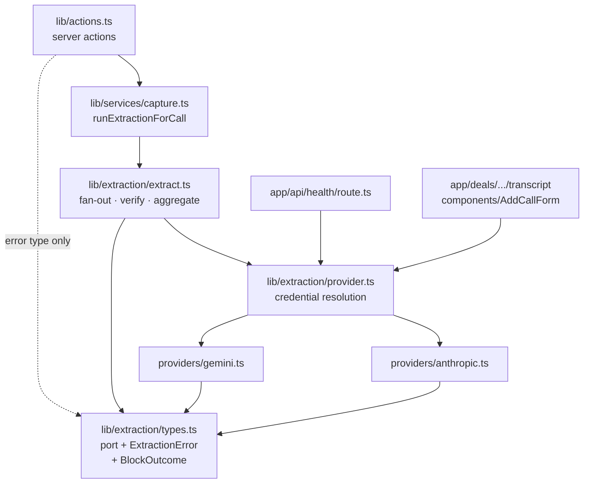
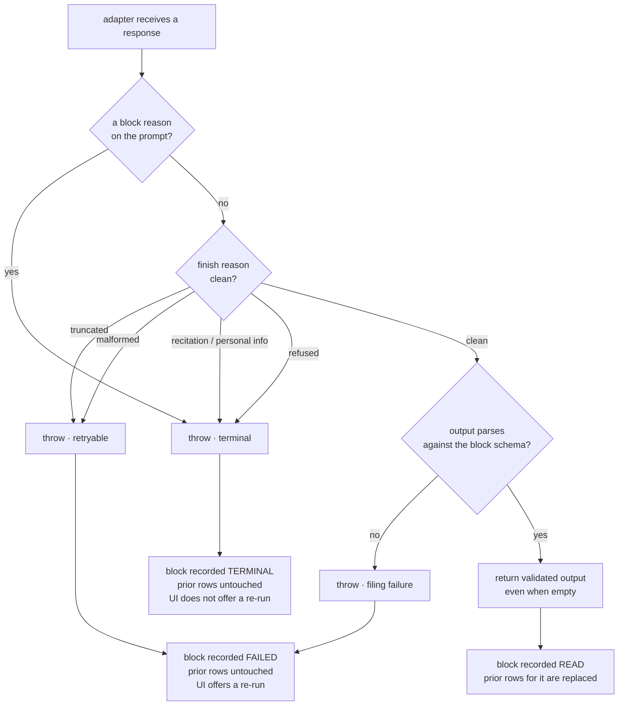
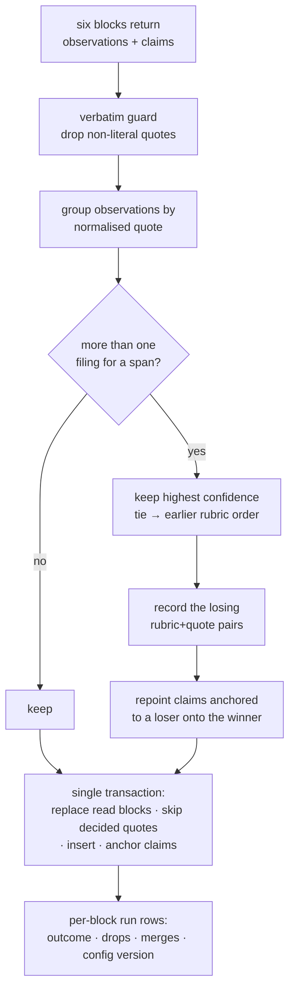

# Extraction Overhaul - Plan

## Goal Capsule

- **Objective:** Make one extraction click cheap, honest, and tunable. The model provider becomes Google Gemini at roughly a twentieth of today's cost, the drafts land better filed, an admin can shape how each macro dimension is read, and the record stops hiding what the machine failed to read.
- **Product authority:** This plan owns the extraction path end to end — provider, prompt, filing, and the surfaces that report on a run. It does not touch scoring, judgment, or the framework's content. The authorship rule is unchanged and untouchable: the machine quotes, a person scores.
- **Execution profile:** One migration, additive. Every schema change adds a table or a nullable column; nothing is dropped and no existing row is rewritten. The port is staged so the Anthropic path keeps working at every commit — the seam lands first, Anthropic moves behind it second, Gemini arrives third.
- **Stop conditions:** Stop and ask if the Gemini adapter cannot distinguish "this block returned nothing" from "this block was blocked." That distinction gates a destructive delete (KTD5), and getting it wrong destroys a PM's evidence rather than failing a run. Stop if the verbatim guard's drop rate on a real transcript exceeds today's Anthropic baseline by more than a small margin — quotes stay verbatim (KTD3), so a weaker model shows up as lost observations, and that is the signal to escalate the model tier rather than proceed.
- **Open blockers:** None. Two settled decisions carry recorded conflicts (KTD10, KTD12); both are workable as settled.

---

## Product Contract

### Summary

Extraction moves to Gemini as the default provider with Anthropic still selectable, quality is raised inside the same 60-second one-click budget, every observation files itself against a row with low-confidence filings marked in place, admins gain a per-macro-dimension persona, guidance and capped temperature, and a new per-block run record makes a partial run legible instead of silent.

### Problem Frame

Extraction costs about 32 cents a run and fails in ways a PM cannot act on. Three fixes landed this week — database failures now say what went wrong, a block's timeout bounds the block rather than one attempt, and thinking stopped competing with the drafts for one token budget — and the run now finishes and reports. What remains is the cost, the quality of the filing, and a gap the record has always had.

The gap is that a run which reads five of six blocks looks, after a refresh, exactly like a run that read all six and found nothing in one. `succeededBlocks` exists in `lib/extraction/extract.ts` precisely so those two states do not collapse, and it is then thrown away. The failure list lives in one React `useState` in `components/authoring/RunExtractionButton.tsx`; the only durable trace is `Call.extracted`, a single boolean. So the coverage page — the app's answer to "what have we not examined" — reports `no-evidence` for a row nobody asked about and for a row in a block the machine never reached. That is the reading Biome's own strategy names as a key metric.

Filing has a second, quieter version of the same problem. A confident mapping files itself as evidence; an unsure one files too, and also lands in a queue at step 2 of the deal flow. The queue is the only place a PM can say "I looked, this row is right." Everywhere else the "unsure of this row" chip is permanent, and because a confirmed-but-unmarked filing still carries `decidedById: null`, the next extraction deletes it — while a filing the PM *moved* survives. The machine's uncertainty has no off switch, and the one correction a PM can make from the capture page does not survive re-running the machine.

Nothing in the record says which prompt produced a filing. `SubDimensionScore.rubricVersion` exists so a score stays interpretable after the rubric moves underneath it. Extraction has no counterpart, so once an admin can edit a persona, "the founder said less on this call" and "somebody changed the prompt between calls" become indistinguishable — and the per-call coverage grid puts those two calls side by side as columns of one reading.

### Requirements

**Provider and cost**

- R1. Extraction runs against Google Gemini by default, and against Anthropic when the deployment is configured for it. Neither provider's vocabulary appears outside its own adapter.
- R2. The default model is pinned to an exact identifier, never a floating alias, so a re-point upstream cannot silently change price or behaviour.
- R3. A run's model phase stays inside the existing per-block time bound, and the whole run inside the 60-second function ceiling, without changing how many model calls a run makes.
- R4. Extraction is offered when any provider is configured. The UI names whichever credential is missing rather than naming one provider.
- R5. Retries stay off at the provider layer, so a block's time bound bounds the block.

**Extraction quality**

- R6. Quotes are verbatim. A quote not literally present in the transcript is discarded before it reaches anyone, and the count of discards is reported.
- R7. The sub-dimension key a model returns is constrained to the rows of the block it is reading, enforced on the wire where the provider supports it and re-validated in the adapter regardless.
- R8. Every observation carries one clause saying why that row.
- R9. Within one block, a transcript span supports at most one row.
- R10. Across blocks, an identical span is filed once. The higher-confidence filing keeps it.

**Filing and the deal flow**

- R11. Every observation files itself as evidence against its row. Nothing waits in a queue for a person.
- R12. A low-confidence filing is marked on the row it sits on, and the mark clears when a person confirms it.
- R13. A person can confirm a filing is correctly placed without moving or rejecting it, and a confirmed filing survives a later extraction of the same call.
- R14. Review exceptions leaves the numbered deal flow and becomes a reading of the record rather than a step in it.
- R15. Re-running extraction on a call replaces only the blocks the current run read, and never touches a filing a person has ruled on.
- R16. Two extractions cannot run against one call at once. The second is refused with a readable reason, and a run killed mid-flight does not lock the call.

**Admin control**

- R17. An admin can edit an extraction persona, freeform guidance, and a temperature for each macro dimension.
- R18. Temperature is capped, and the cap is enforced server-side rather than by the control's bounds.
- R19. Framework rows, the output schema, and the authorship rules are not editable.
- R20. The count of quotes the verbatim guard dropped for a macro dimension on its last run is shown beside that dimension's controls.
- R21. Only an admin may read or change extraction configuration.

**What a run leaves behind**

- R22. Each block of each run records its outcome against the call: read, failed and worth retrying, or failed for a reason retrying cannot fix.
- R23. A block that failed for a reason retrying cannot fix says so, and does not invite a re-run.
- R24. A partial run stays legible after a refresh: which blocks went unread is readable from the record, not from client state.
- R25. Every observation records the extraction configuration version that produced it.
- R26. A block that returns no output for any reason is never recorded as read.

### Scope Boundaries

- Scoring, judgment, slides, and the roll-up are untouched.
- The framework's content is untouched. Rubrics and sub-dimensions stay static typed config under `framework/`.
- The six-block fan-out shape is fixed. One call for all forty-one rows is about 9% cheaper and roughly five times slower — fifteen thousand output tokens generated serially does not fit the window.
- Prompt caching is out. The published minimum cacheable prefix is disputed between 2,048 and 32,768 tokens; at the higher figure a transcript of this size cannot cache at all, and the saving modelled out at single-digit dollars a year against a new single point of failure.
- Splitting the blocks across six serverless functions is out. Blocks already run concurrently, so they share wall clock rather than dividing a budget — one block alone still cannot exceed the same ceiling minus the same write phase.
- The model choice stays a deploy-time setting. Admins tune how a block is read, not what reads it.
- Per-deal or per-PM prompt overrides are out. Configuration is one global set of six.

#### Deferred to Follow-Up Work

- **A fourth coverage state.** `lib/coverage.ts` renders a tested three-state grid, and `Call` will now carry which blocks went unread (R24), so a `not-read` state is derivable. It is deferred because the grid's three states are pinned by `components/CoverageGrid.test.tsx` and `lib/coverage.test.ts` and the change is a page-level redesign rather than a data change. Until it lands, the unread-block count is surfaced on the transcript card and the extraction-quality view, and the coverage grid keeps reporting `no-evidence` for an unread block.
- **An audit trail on configuration edits.** A version number is stamped (R25); who changed what, when, is not kept beyond the current row's `updatedAt` and `updatedById`.
- **A before-and-after evaluation harness.** Quality is instrumented by the verbatim guard's drop count, the dedupe count, and the confidence mix — not by a scored comparison against a labelled transcript.
- **Escalating the model tier automatically.** Escalation is a deploy-time change to one environment variable, informed by the drop counts this plan starts recording.

---

## Planning Contract

### Key Technical Decisions

- KTD1. **Gemini becomes the default provider; Anthropic stays selectable behind credential detection.** (session-settled: user-directed — chosen over staying on Anthropic: about a twentieth of the per-run cost, and Biome holds Gemini credits.) Governs R1, R4.
- KTD2. **The default model is `gemini-2.5-flash-lite`, pinned exactly.** Generally available, one-million-token context, and the cheapest tier that still reads anchors well. Newer Flash is not an upgrade path — `gemini-3.6-flash` costs roughly seventeen times more. Floating aliases such as `gemini-flash-latest` are forbidden because they re-point upstream and change price and behaviour without a commit. Escalation, in order, is `gemini-2.5-flash` then `gemini-3.1-flash-lite`, each a one-variable change. Governs R2.
- KTD3. **Quotes stay verbatim; quality effort goes into which span is quoted and into the mapping note.** (session-settled: user-directed — chosen over tidied quotes, verbatim-plus-gloss, and rewriting evidence into structured statements: the anti-fabrication guarantee is what makes the record worth accumulating.) A weaker model therefore degrades visibly, as dropped quotes, rather than silently as corrupted evidence. Governs R6, R8.
- KTD4. **The provider seam is four files, mirroring `lib/fireflies/`.** A port and error type in `lib/extraction/types.ts`, one adapter per provider under `lib/extraction/providers/`, and credential resolution in `lib/extraction/provider.ts`. The reason is stated in `lib/fireflies/types.ts` and restated in `lib/actions.ts`: the error type must be recognisable without importing the network client. Today `lib/actions.ts` imports `ExtractionError` from the module that imports the Anthropic SDK, so every server action drags an AI SDK into its graph; adding a second provider behind the same module compounds a problem the Fireflies split already solved.
- KTD5. **A block counts as read only when its adapter returns validated output. Every other outcome throws.** This is the plan's load-bearing safety decision. `succeededBlocks` scopes a destructive delete in `lib/services/capture.ts` — a re-run removes the prior run's rows for every block it believes it re-read. A block is currently marked read if the call did not throw, including when it returned zero observations, and that is deliberate: "read it and there was nothing there" must not collapse into "never read it." Gemini returns HTTP 200 with empty content when it blocks a response and raises nothing. Mapped naively that reads as an empty successful block, deletes the prior evidence, and writes nothing back. The adapter therefore inspects the block reason and the finish reason *before* reading output, and throws on anything that is not a clean finish. Governs R26, R15.
- KTD6. **Block failures are classed retryable or terminal, and terminal failures say so.** Recitation and personal-information refusals are deterministic for this workload — verbatim quoting of a long document is exactly what triggers recitation, and no safety setting disables it; transcripts name real founders. Today every failure branch tells the PM to try again, which for these two costs another full input charge per press and cannot succeed. Governs R22, R23.
- KTD7. **The port carries the rubric key explicitly, and test stubs route on it.** Twenty-two call sites in `lib/services/capture.test.ts` currently route on `params.system` matching a generated prompt string, with a fallback that answers every block with the same payload — which writes six copies of every observation and quietly invalidates about a dozen count assertions rather than failing. Routing on the rubric key removes the fragile string match, and the unrouted case throws.
- KTD8. **The adapter re-validates output against the block's Zod schema.** The current guarantee is weaker than the code claims: `zodOutputFormat` has no `enum` handling, so what reaches Anthropic is `{"type":"string","description":"{enum: [...]}"}` — a prose hint, with no `enum` keyword on the wire. The only enforcement is the client-side parse inside the SDK helper, and `Observation.subDimensionKey` is plain `TEXT` with no constraint. Gemini's `responseJsonSchema` does enforce real enums, making the invariant structural for the first time; the re-validation stays anyway, because constrained decoding guarantees shape, not semantics, and an adapter that returned parsed JSON without it would drop the only guard against an orphaned row. Governs R7.
- KTD9. **A Zod violation reports as a filing failure, not a network failure.** The parse throws inside the awaited call with no HTTP status, so `describeApiFailure` finds nothing to match and falls through to "could not reach the API." A mapping failure is currently reported to a PM as a connectivity problem. Fixed as part of making the describe function provider-neutral, which it must be regardless: its branches encode Anthropic status conventions, its message reads `err.error.error.message` for the SDK's double nesting, and it detects a timeout by an SDK class name.
- KTD10. **Cross-block dedupe keys on the normalised quote alone; the higher-confidence filing wins, ties broken by rubric order.** (session-settled: user-directed — chosen over within-block-only, over strict global MECE which does not fit the window, and over keeping today's one-passage-many-rows: MECE structuring of the evidence against the scorecard.) *Recorded conflict:* `lib/extraction/prompt.ts` currently instructs the model that "the same passage may be evidence for more than one row," and because the enum is narrowed per block, one span arriving from two blocks arrives filed under two different sub-dimensions — both legitimate reads. Keying on the quote alone therefore drops cross-row evidence by design. That is the settled intent, and the prompt line is edited to match; it is recorded here because the cost is real and reversible only by reopening the decision. Governs R9, R10.
- KTD11. **Dedupe repoints claims rather than orphaning them.** Claims anchor on the pair of rubric key and normalised quote. When the losing filing is dropped, a claim anchored to it finds nothing and is silently discarded — no counter, no message, and `Claim.anchorObsId` cascades on delete. A live test pins exactly this two-block same-quote case. Dedupe therefore re-anchors surviving claims onto the winning observation, and reports what it merged. Nothing in the settled decision asked for claims to be deleted; the claim ledger is what L2 verifies against.
- KTD12. **Admins edit persona, guidance, and temperature per macro dimension; the model stays a deploy-time setting.** (session-settled: user-directed — chosen over persona-and-guidance only, over full prompt override, and over one global persona: the personas exist so evidence is pegged against the right sub-dimensions.) *Recorded conflict:* temperature is not a sendable parameter on Anthropic's 5-series models — a non-default value returns 400, not a degraded result. The control is therefore real on Gemini, the default provider, and inert on the Anthropic path; the adapter drops it and the page says so rather than the run failing. Governs R17, R19.
- KTD13. **The temperature cap is enforced in three places, and the server is the one that counts.** A Zod `.max()` in the service, a named `CHECK` constraint in the migration, and the control's own bounds. A server action's argument is a deserialized browser payload whatever its TypeScript type says — the reason `ListMeetingsRequest` is declared in `lib/actions.ts` rather than in a service. The cap is 0.4: above it the verbatim guard's drop rate rises, so raising temperature buys silence rather than creativity. Governs R18.
- KTD14. **Extraction configuration is read once per run, before the fan-out.** Six blocks read their own configuration across a forty-second window would straddle an admin's save and produce one call's observations under two prompts. One snapshot read, its version stamped on every row the run writes. Governs R25.
- KTD15. **Defaults come from reading through absent rows, not from seeding.** `vercel-build` runs `prisma migrate deploy` and never the seed, so a seeded default would exist locally and not in production. The repository synthesizes the empty shape when a configuration row is missing — the same choice already made for an absent founder-type read. An admin's first save creates the row.
- KTD16. **A new per-block run record replaces the single `extracted` boolean as the source of truth about a run.** One row per block per call, carrying the outcome, the failure reason, the drop counts, and the configuration version. One table answers four separate needs: which blocks went unread after a refresh, whether a failure is worth retrying, what the extraction-quality view renders, and what number sits beside the temperature control. `Call.extracted` stays, derived, so nothing that reads it breaks. Governs R20, R22, R24.
- KTD17. **Concurrency is guarded by a lease with an expiry, not by a boolean.** The existing check reads `call.extracted` and then does network work, and a read cannot hold anything across what follows — the same reasoning that added `Call.@@unique([dealId, sourceMeetingId])`. A conditional update claims the call; a claim older than the function ceiling is treated as abandoned, so a killed run does not lock a call forever. Governs R16.
- KTD18. **A confirmed filing keeps its confidence and gains a decider.** Confirming sets `decidedById` without changing status or sub-dimension. The warning chip is gated on there being no decider rather than on the confidence value, so the record still says the machine was unsure while the row stops asking for attention — and because a decided row falls outside the re-extract blast radius, the confirmation survives. Governs R12, R13.
- KTD19. **Low-confidence observations are written `accepted`, and the outstanding-work count is redefined.** Whichever status they carry, something currently mis-reports: written `accepted`, the stepper reads done the instant any observation exists and the board claims every observation was mapped confidently; left `draft`, the sidebar carries a standing alarm on a step that has left the flow. The count becomes low confidence with no decider, which is the number that represents work a person still has. The legacy-row leg of the re-extract predicate stays, or a forced re-run duplicates rows written before the confidence column existed. Governs R11.

### High-Level Technical Design

#### Where a provider lives

The arrow that matters is the dotted one. `lib/actions.ts` needs only the error type, and today it reaches it through the module that imports the provider SDK — so every server action in the app carries that SDK in its graph. Moving the type into `types.ts` is what makes a second provider free rather than cumulative.

#### The outcome contract that guards the delete

Only the `E` path may reach `F`. An empty-but-validated block is a genuine read and must replace its prior rows; every other outcome must leave them alone. The hazard the diagram exists to prevent is a blocked response arriving as HTTP 200 with empty content and being mapped to `E`.

#### Dedupe and what happens to a claim

The dedupe pass runs in memory between the fan-out and the transaction. Inside the transaction it would spend an eight-second budget that is already sized against the function ceiling; outside it costs nothing.

#### The observation state table

Four consumers read an observation's state, and the encoding already carries two meanings. This is the cross product after the change.

| status | confidence | decidedById | Cited as evidence | Warning chip | Counts as outstanding | Replaced by a re-run |
|---|---|---|---|---|---|---|
| `accepted` | `high` | null | yes | no | no | yes |
| `accepted` | `low` | null | yes | **yes** | **yes** | yes |
| `accepted` | `low` | set | yes | no | no | **no** |
| `edited` | cleared | set | yes | no | no | no |
| `rejected` | any | set | no | n/a | no | no (and re-drafting is suppressed) |
| `draft` | null | null | yes | no | no | yes (legacy rows only) |

The third row is the one this plan adds, and the reason it matters is the last column: it is the only way a PM can confirm a correct low-confidence filing and have that confirmation survive the machine running again.

### Assumptions

- Gemini's `anyOf: [{type: string}, {type: null}]` is the working nullable form. Verified present in the discovery document, not confirmed against a live call. If it is rejected, the fallback is an empty string with the field required — `speaker` and `timestamp` are already nullable-not-optional for exactly this class of reason.
- Per-run cost and rate-limit figures come from third-party summaries; the vendor's pricing and limit pages are unreachable from this environment. Field names, enums, and SDK behaviour are verified against the live discovery document and the package source. The cost claim should be checked against one real invoice before the runbook's table is trusted.
- Tokens per minute is the binding limit rather than requests per minute, at roughly 78k input tokens per run. Billing must be enabled on the project; the free tier allows about three concurrent runs.

### Sequencing

U1 through U4 are the port, and the Anthropic path keeps working at every one of them. U5 lands the run record the later units report into. U6 and U7 are both about the same span arriving twice — once from two blocks, once from two runs — and belong together. U8 and U9 are the filing change and the flow change, in that order because the flow reads the status. U10 through U12 are the admin surface, which needs the port (U3, for temperature) and the run record (U5, for the drop count) already in place. U13 is the documentation sweep and lands last so it describes what shipped.

---

## Implementation Units

### Unit Index

| U | Title | Key files | Depends on |
|---|---|---|---|
| U1 | Provider-neutral port and error taxonomy | `lib/extraction/types.ts`, `extract.ts`, `lib/actions.ts` | — |
| U2 | Anthropic adapter behind the port | `lib/extraction/providers/anthropic.ts` | U1 |
| U3 | Gemini adapter with a fail-loud outcome contract | `lib/extraction/providers/gemini.ts`, `package.json` | U1 |
| U4 | Provider selection, health, and UI copy | `lib/extraction/provider.ts`, `app/api/health/route.ts` | U2, U3 |
| U5 | Per-block run record | `prisma/schema.prisma`, `lib/repo/records.ts` | — |
| U6 | MECE within a block, dedupe, claim repointing | `lib/extraction/prompt.ts`, `dedupe.ts`, `capture.ts` | U1 |
| U7 | Concurrency lease on a call's extraction | `lib/services/capture.ts`, `prisma/schema.prisma` | U5 |
| U8 | Auto-file everything, plus a confirm verb | `lib/services/capture.ts`, `components/authoring/EvidenceList.tsx` | U5 |
| U9 | Retire the review step; rebuild it as a reading | `lib/steps.ts`, `components/ReviewBoard.tsx`, four page eyebrows | U5, U8 |
| U10 | Per-rubric extraction config | `prisma/schema.prisma`, `lib/repo/`, `lib/data.ts` | U5 |
| U11 | Admin page and action for tuning | `app/admin/extraction/`, `lib/actions.ts`, `lib/authz.ts` | U10 |
| U12 | Thread persona, guidance, temperature into a run | `lib/extraction/prompt.ts`, `extract.ts`, `capture.ts` | U3, U10 |
| U13 | Amend the record | spec, three plans, `README.md`, runbook, `.env.example`, `CONCEPTS.md` | U1–U12 |

### U1. Provider-neutral port and error taxonomy

**Goal:** Give extraction a seam that carries no provider's vocabulary, and get the error type out of the module that imports an AI SDK.

**Requirements:** R1, R5; per KTD4, KTD7, KTD9.

**Dependencies:** None.

**Files:**
- `lib/extraction/types.ts` (new) — the port, `ExtractionError`, and the block-outcome taxonomy
- `lib/extraction/extract.ts` — orchestration only; drops the SDK import and the dead `ExtractionOutputSchema` import
- `lib/actions.ts` — imports `ExtractionError` from `types.ts`
- `lib/extraction/extract.test.ts` — stub reshaped to the new port
- `lib/services/capture.test.ts` — stub routes on the rubric key
- `lib/extraction/types.test.ts` (new)

**Approach:**

1. Declare the port in `types.ts`: one method taking a request carrying the rubric key, the system text, the user text, the block's Zod schema, an optional temperature, and a time bound; returning validated output or throwing. Mirror `lib/fireflies/types.ts`, whose header states the boundary rule — wire shapes never leave the adapter.
2. Declare the outcome taxonomy: a clean read, a retryable failure, a terminal failure, and a filing failure. `ExtractionError` gains a class so callers can tell retryable from terminal without string-matching a message.
3. Move `ExtractionError` here. Keep `DraftObservation`, `DraftClaim`, and `ExtractionOutput` alongside it so `lib/services/capture.ts` does not reach into the orchestrator for types.
4. Make `describeApiFailure` provider-neutral, taking a status of a number, `null`, or the literal `"timeout"` — the shape `describeFirefliesFailure` already uses, and better than detecting a timeout by an SDK class name. Route a schema violation to its own branch so it stops reporting as a connectivity failure.
5. Leave `thinkingConfigFor` in place for now; U2 moves it. Do not extend its `claude-` regex — an unparseable id currently takes the modern Anthropic shape, and a Gemini id would inherit Anthropic thinking parameters silently.

**Patterns to follow:** `lib/fireflies/types.ts` for the port-plus-error split and the reason for it; `lib/fireflies/client.ts` for `describeFirefliesFailure`'s status union and for `isTimeout` checked by name rather than `instanceof`, so a plain-object stub behaves like the real client.

**Execution note:** The 22 stub call sites in `capture.test.ts` all move at once. Reshape the stub and its routing first and watch the suite go green before touching the orchestrator, so a routing mistake shows up as a routing failure rather than as a dozen wrong counts.

**Test scenarios:**
- A block request carries the rubric key, and a stub that receives an unexpected key throws rather than returning a default payload.
- `describeApiFailure` renders a readable message for each of: no status, `"timeout"`, 400, 401, 429, and 500-and-above.
- A Zod violation produces a message naming the filing problem and containing neither "reach the API" nor "network".
- A retryable failure and a terminal failure are distinguishable from the thrown error without parsing its message.
- `ExtractionError` is importable from `types.ts` in a module that does not import any provider SDK.
- The existing 43 extraction tests and the capture suite pass unchanged in behaviour.

**Verification:** `npm run typecheck`, `npm run test:services`, `npm run test:components`, `npm run build` all clean. No import of a provider SDK is reachable from `lib/actions.ts`.

### U2. Anthropic adapter behind the port

**Goal:** Move every Anthropic-shaped request field into one adapter, with no change in what the Anthropic path sends.

**Requirements:** R1, R5; per KTD4, KTD12.

**Dependencies:** U1.

**Files:**
- `lib/extraction/providers/anthropic.ts` (new) — the adapter, the request builder, and `thinkingConfigFor`
- `lib/extraction/extract.ts` — loses the request-building block
- `lib/extraction/providers/anthropic.test.ts` (new) — receives the `thinkingConfigFor` tests
- `lib/extraction/extract.test.ts` — sheds the Anthropic-specific assertions

**Approach:**

1. Move the request build — model, max tokens, system, thinking, output config, messages — plus the two SDK transport options into the adapter. The tuned time bound and the no-retry setting keep their current values and their comments; only their home changes.
2. Move `thinkingConfigFor` and its two environment knobs here. Its `claude-` regex is now correct by construction, because only this adapter calls it.
3. Map the Anthropic refusal signal and a truncation signal to the outcome taxonomy. There is no truncation check today: a truncated response either fails to parse and is mislabelled a connectivity failure, or, if the provider returns short-but-valid output, is accepted as a complete read — which is the delete hazard in its Anthropic form.
4. Per KTD12, drop a supplied temperature for a model generation that rejects it, and record that it was dropped so U11's page can say so.

**Patterns to follow:** `lib/fireflies/client.ts` — a factory taking injected dependencies, credential resolution in one function, and the timeout constant carrying its ceiling reasoning.

**Test scenarios:**
- A 5-series model receives an effort parameter; a pre-4.6 model does not, because that request would be rejected.
- A pre-4.6 model receives a thinking budget under the max-token ceiling.
- An unrecognised model identifier takes the modern shape (preserving today's pinned behaviour, now scoped to this adapter).
- The tuned time bound and zero retries reach the transport options for every block.
- A refusal maps to a terminal outcome; a truncation maps to a retryable one.
- A temperature supplied for a 5-series model is dropped, not sent, and the drop is reported.

**Verification:** Anthropic extraction behaves identically to `74f04cd` — same request fields, same time bound, same retry count. `npm run test:services` green.

### U3. Gemini adapter with a fail-loud outcome contract

**Goal:** Add the Gemini adapter, and make certain that no outcome except a validated read can be mistaken for a read.

**Requirements:** R1, R2, R3, R5, R6, R7; per KTD2, KTD5, KTD6, KTD8.

**Dependencies:** U1.

**Files:**
- `lib/extraction/providers/gemini.ts` (new)
- `lib/extraction/providers/gemini.test.ts` (new)
- `lib/extraction/schema.ts` — a JSON Schema projection for the block schema
- `package.json` — add `@google/genai` at `2.14.0`

**Approach:**

1. Build the client with `apiKey` for the AI Studio path, and detect the enterprise path so a service-account deployment is possible later. Guard the module with `server-only`: the package ships a browser build. Never a `NEXT_PUBLIC_` prefix — that is the single path by which a value is inlined into the browser bundle.
2. Set retry attempts to one explicitly. Retries default off here, the opposite of Anthropic, but the retry option is read from client options and ignored per request, so it must be set where it is read.
3. Send `responseMimeType: 'application/json'` with `responseJsonSchema`. Do not use `responseSchema`: it is flagged deprecated, silently drops `additionalProperties`, and passes Zod's `$schema` key through to a rejection. Project the block's Zod schema into the supported keyword set only, order the properties so the quote is generated before the confidence, and cap the quote length — a long verbatim span is what triggers a recitation refusal.
4. Dispatch thinking on the model family: a true zero budget for the 2.5 family, the minimal level for 3.x, and never both. Sending the 3.x parameter to a 2.5 model is an error rather than ignored. Log the thinking-token count as the canary that thinking has quietly returned.
5. Turn all four harm categories off. Transcripts name real founders and discuss financials. The civic-integrity category is deprecated, and safety settings are mutually exclusive with the model-armour configuration.
6. **The outcome contract, in this order, before any output is read:** the prompt-level block reason first, then the candidate's finish reason, then the parse. A blocked response arrives as HTTP 200 with empty content and raises nothing, so reading output first yields `undefined` and a useless parse error. Recitation and personal-information finishes are terminal; truncation and malformed output are retryable; a clean finish proceeds to validation.
7. Re-validate against the block's Zod schema per KTD8, and pass the block's rows as a real enum. Note that a Gemini 3 model's output ceiling covers thinking and output together, and structured output returns null rather than partial JSON when it is hit — so truncation must be detected from the finish reason, not inferred from a parse failure.
8. Bound the call per request, and note that the option mutates the process-wide dispatcher upward. Where a per-request bound is unavailable, use an abort signal — the precedent is `lib/fireflies/client.ts`.

**Patterns to follow:** `lib/fireflies/client.ts` throughout — the injected transport, the pseudo-status for a timeout, and parsing that names the failing field without echoing the body.

**Execution note:** Write the outcome-contract tests before the adapter. The blocked-response case is a response object with a block reason and no content, and it is the one that costs a PM their evidence if it is mapped wrong; it should exist as a failing test first.

**Test scenarios:**
- A response with a prompt block reason and no content throws terminal, and never returns output.
- A recitation finish throws terminal; a personal-information finish throws terminal.
- A truncated finish throws retryable, even when the payload happens to parse.
- A malformed-output finish throws retryable.
- A clean finish with an empty observations array returns validated output and is a read, not a failure.
- A sub-dimension key outside the block's rows fails validation in the adapter and reports as a filing failure.
- The request carries a JSON schema with a real `enum` for the block's rows, `additionalProperties: false`, and no `$schema` key.
- The request orders the quote before the confidence.
- A 2.5 model receives a zero thinking budget and no thinking level; a 3.x model receives a minimal level and no budget; neither receives both.
- All four harm categories are set off, and no model-armour configuration is sent alongside them.
- Retry attempts are one.
- Both credential names are honoured, and configuring neither produces a message naming both.

**Verification:** `npm run test:services` green with no network access; the suite must not reach a live API. `npm run build` clean, and no client bundle includes the package.

### U4. Provider selection, health, and UI copy

**Goal:** One place decides which provider is active, and every surface that mentions extraction reads it.

**Requirements:** R4; per KTD1, KTD6.

**Dependencies:** U2, U3.

**Files:**
- `lib/extraction/provider.ts` (new) — resolution and a describe-for-display helper
- `lib/extraction/extract.ts` — client resolution delegates here
- `app/api/health/route.ts` — provider-neutral diagnostics
- `app/deals/[dealId]/transcript/page.tsx`, `components/authoring/AddCallForm.tsx` — copy
- `components/authoring/RunExtractionButton.tsx` — a terminal failure does not offer a re-run
- `vitest.config.ts` — pin the Google credential names

**Approach:**

1. `resolveProvider()` returns the active provider, its model, and which credential is missing when none is configured. Extraction is enabled when any provider is configured, so the gate becomes a disjunction and the copy cannot name one variable.
2. Replace the health route's Anthropic assumptions. It currently publishes Anthropic parameter names as a request-shape field, which on a Gemini deployment prints the wrong provider's parameters — the opposite of what its own docstring promises. Report the provider, the resolved model, the block count, and whether extraction is enabled. Drop the effort field when it does not apply.
3. Update the copy in both components and the transcript page so it names the missing credential rather than a fixed one. Preserve the existing intent: the button's absence must be explained, not silent.
4. Where a block failed terminally, the button says the block cannot be read from this transcript and does not invite a re-run. A retryable failure keeps today's wording.
5. Pin `GOOGLE_API_KEY`, `GEMINI_API_KEY`, `GOOGLE_CLOUD_PROJECT`, `GOOGLE_CLOUD_LOCATION`, and both enterprise flags to empty in the services config, next to the two already pinned. The test environment merges into the inherited process environment, so an unpinned name lets a developer's shell credential reach a live API from a suite run.

**Test scenarios:**
- Configuring only the Gemini credential enables extraction and reports Gemini as the provider.
- Configuring only the Anthropic credential enables extraction and reports Anthropic.
- Configuring neither disables extraction and produces copy naming both credentials.
- The health payload names the active provider and its model, and omits the Anthropic-only effort field on a Gemini deployment.
- A terminal block failure renders without a re-run invitation; a retryable one renders with it.
- Every Google credential name is empty inside a services test run.

**Verification:** `npm run test:services`, `npm run test:components`, `npm run build`. Hitting `/api/health` on a Gemini-configured deployment reports Gemini.

### U5. Per-block run record

**Goal:** Make what a run did durable, per block, so a refresh does not erase it.

**Requirements:** R22, R24, R26; per KTD16.

**Dependencies:** None.

**Files:**
- `prisma/schema.prisma` — a new model, unique on the call and rubric key
- `prisma/migrations/<timestamp>_extraction_block_runs/migration.sql`
- `lib/repo/records.ts` — map it into the record contract
- `mock/types.ts` — the record shape gains the per-block outcomes
- `lib/services/capture.ts` — write the rows in the run's transaction
- `lib/extraction/extract.ts` — surface the per-block drop and merge counts the aggregation currently discards
- `lib/actions.ts` — stop discarding the dropped-claim count and the read-block set
- `prisma/seed.ts`, `mock/data.ts` — fixtures for a partially read call

**Approach:**

1. One row per block per call: the outcome, the failure reason, the dropped-quote count, the dropped-claim count, the merged-span count, the configuration version, and when it ran. Cascade on the call, matching every other child of the record.
2. Write the rows inside the existing transaction, which stays at four queries plus the call update; this is one more `createMany` on six rows. Keep `Call.extracted` and derive it, so nothing that reads it breaks.
3. Surface what is already computed and thrown away: the dropped-claim count exists and reaches nothing, and the read-block set exists and reaches nothing. Both belong on the action's result and in the record.
4. Fix the stale arithmetic comment in `lib/services/capture.ts` — it states a 30-second block bound against a constant of 40, so the stated worst case of 40 seconds is really 50.
5. Add a fixture where one block went unread, so a seeded workspace exercises the partial-run path.

**Test scenarios:**
- A run where all six blocks read writes six rows, each marked read.
- A run where one block failed writes five read rows and one failed row carrying the reason.
- A run where one block failed terminally marks that row terminal, distinguishably from a retryable failure.
- A block that read and found nothing is marked read, not failed.
- Re-running replaces the rows for the blocks the new run read and leaves the others.
- Deleting a deal cascades the rows away.
- The record contract exposes the per-block outcomes, and the repository maps them without changing the shape of the existing fields.
- `Call.extracted` still reads true only when every block read.

**Verification:** `npm run db:migrate` applies cleanly; `npm run test:services` green including the repository shape tests.

### U6. MECE within a block, cross-block dedupe, claim repointing

**Goal:** One span, one row within a block; one filing across blocks; and no claim lost to either.

**Requirements:** R9, R10; per KTD10, KTD11.

**Dependencies:** U1.

**Files:**
- `lib/extraction/prompt.ts` — the multi-row instruction and the per-row guidance
- `lib/extraction/dedupe.ts` (new) — the pass and its result
- `lib/extraction/dedupe.test.ts` (new)
- `lib/extraction/extract.ts` — run the pass between the fan-out and the return
- `lib/services/capture.ts` — the claim anchor map consumes the repointing

**Approach:**

1. Edit the prompt. The line telling the model that one passage may support several rows is the opposite of MECE within a block, and the per-row guidance reinforces it. Replace both with an instruction to file a span against its single best row, and keep the existing instruction that several distinct quotes per row are good.
2. Dedupe in memory after the verbatim guard and before the transaction. Inside the transaction it would spend a budget already sized against the function ceiling.
3. Key on the normalised quote. Highest confidence wins; ties break on rubric order so the outcome is deterministic. Record every losing pair of rubric key and quote.
4. Repoint claims. A claim anchored to a losing pair is re-anchored to the winner before the transaction builds its anchor map. Report the merge count.
5. Fix the keying inconsistency this exposes: the verbatim guard's kept-set is keyed on the quote alone while the anchor map is keyed on rubric key and quote, so a claim can already survive verification anchored to another block's observation and then be dropped in the transaction with no counter. Make both keys the same, and count what is dropped.

**Execution note:** The existing two-block same-quote claim test is the specification here. It must keep passing, and it passes only if repointing works — so run it against the dedupe pass before wiring the pass into the orchestrator.

**Test scenarios:**
- Two blocks return an identical span; one filing survives, and it is the higher-confidence one.
- Two blocks return an identical span at equal confidence; the earlier rubric in order wins, and the result is stable across runs.
- A claim anchored to the losing filing is re-anchored to the winner and is not dropped.
- A claim whose anchor quote appears in no surviving observation is dropped, and the drop is counted rather than silent.
- Two distinct spans within one block, filed against different rows, both survive.
- The same span returned twice by one block collapses to one filing.
- The merge count reaches the action's result.
- The prompt no longer instructs the model that a passage may support several rows.

**Verification:** `npm run test:services` green, including the pre-existing two-block claim test unmodified in intent.

### U7. Concurrency lease on a call's extraction

**Goal:** Two runs cannot file against one call at once, and a killed run does not lock it.

**Requirements:** R16; per KTD17.

**Dependencies:** U5.

**Files:**
- `prisma/schema.prisma` — a nullable claim timestamp on the call, in U5's migration
- `lib/services/capture.ts` — claim, release, and refuse
- `lib/services/capture.test.ts`

**Approach:**

1. Claim the call with a conditional update that succeeds only when there is no live claim, treating a claim older than the function ceiling as abandoned. Zero rows updated means someone else holds it.
2. Refuse with a rule violation in the wording style of the existing call-number guard, so it renders as readable text rather than escaping.
3. Release on both paths — success and failure — so a handled failure does not hold the call for the expiry window.
4. Fold the column into U5's migration rather than adding a second.

**Test scenarios:**
- A second run against a claimed call is refused with a readable reason, and writes nothing.
- A claim older than the ceiling is treated as abandoned, and the new run proceeds.
- A run that fails releases the claim.
- A run that succeeds releases the claim.
- The refusal is distinguishable from the existing already-extracted refusal.

**Verification:** `npm run test:services` green. Two overlapping runs produce one set of filings.

### U8. Auto-file everything, plus a confirm verb

**Goal:** Nothing waits in a queue, and a correct low-confidence filing can be confirmed and will survive.

**Requirements:** R11, R12, R13, R15; per KTD18, KTD19.

**Dependencies:** U5.

**Files:**
- `lib/services/capture.ts` — the status mapping, and a confirm case on the decide input
- `lib/actions.ts` — the decide action accepts the new verb
- `components/authoring/EvidenceList.tsx` — chip gating, and a confirm control
- `lib/steps.ts` — the outstanding-work count is redefined
- `components/authoring/EvidenceList.test.tsx` (new)
- `lib/services/capture.test.ts`, `lib/services/authoring.test.ts`

**Approach:**

1. Write low-confidence observations `accepted`, keeping the confidence value. Nothing is written `draft` any more.
2. Keep the legacy leg of the re-extract predicate. It catches rows written before the confidence column existed, and without it a forced re-run duplicates them instead of replacing them. A test pins this.
3. Add a confirm verb that sets the decider and changes nothing else. Do not clear the confidence: the record should keep saying the machine was unsure while the row stops asking for attention.
4. Gate the warning chip on there being no decider rather than on the confidence value. Remove the second chip that read the old draft status.
5. Redefine the outstanding count as low confidence with no decider and not rejected. That is the number representing work a person still has.
6. Note the consequence, which is the point of the verb: a decided row falls outside the re-extract blast radius, so a confirmation survives the machine running again — where today only a move does.

**Test scenarios:**
- A low-confidence observation is written `accepted` and is cited as evidence.
- A high-confidence observation is written `accepted`.
- No observation is written `draft`.
- A legacy null-confidence row is still replaced by a forced re-run.
- Confirming sets the decider, leaves the status and the sub-dimension alone, and keeps the confidence value.
- A confirmed row is not deleted by a subsequent extraction of the same call; an unconfirmed low-confidence row is.
- The warning chip renders for low confidence with no decider, and not once confirmed.
- The outstanding count reflects unconfirmed low-confidence rows only, and reaches zero when all are confirmed.
- Move and reject still reach a low-confidence filing from the capture page.
- A non-author cannot confirm.

**Verification:** `npm run test:services`, `npm run test:components`. The two tests that assert today's draft routing are updated rather than deleted — they own the contract.

### U9. Retire the review step; rebuild it as a reading

**Goal:** Review exceptions leaves the numbered flow and becomes the page that says what the last extraction actually did.

**Requirements:** R14, R20, R23, R24; per KTD16.

**Dependencies:** U5, U8.

**Files:**
- `lib/steps.ts` — move the entry from the flow to the readings
- `components/Sidebar.tsx` — an icon for the new reading
- `app/deals/[dealId]/review/page.tsx` — rebuilt around what a run left behind
- `components/ReviewBoard.tsx` — rebuilt, or replaced by an extraction-quality view
- `app/deals/[dealId]/transcript/page.tsx`, `capture/page.tsx`, `judgment/page.tsx` — step numbers
- `components/ReviewBoard.test.tsx` (new)
- `components/Sidebar.test.tsx`

**Approach:**

1. Move the entry from the numbered flow to the cross-cutting readings, alongside the floor and the ledger. Those are readings of the record from a different angle rather than steps, which is exactly what this page becomes.
2. Add an icon for the segment. The icon map replaced a two-way branch specifically so a third view could not silently borrow another's, and a test asserts every reading has a real one.
3. Renumber. The sidebar derives its number from array position while four pages hardcode theirs in their eyebrow text, so a partial change ships a flow that contradicts itself. All four move in this unit.
4. Rebuild the page around the run record. Its current summary cells are the axes of a queue it no longer is; the useful ones are which blocks were read, which failed and whether retrying can help, the dropped-quote and merged-span counts, and the confidence mix. Keep it read-only: no verb on this page.
5. The board's empty state currently claims every observation was mapped confidently, which is false whenever any row was low-confidence. It needs a non-empty branch that is not the queue, or replacement.
6. Surface the unread-block count on the transcript card too, since that is where a PM stands when they decide whether to re-run.

**Test scenarios:**
- The numbered flow no longer contains review, and the remaining steps number consecutively.
- Every page's eyebrow number matches its sidebar position.
- The review segment appears among the readings with a real icon, not a silently missing one.
- The page renders which blocks were read and which were not, for a partially read call.
- A terminal block failure is presented as such, without inviting a re-run.
- The page renders the dropped-quote and merged-span counts per block.
- The page renders the unconfirmed low-confidence count.
- With every block read and nothing dropped, the page says so without claiming everything was confident.
- The page offers no mutation.
- The transcript card shows an unread-block count after a partial run, and none after a full one.

**Verification:** `npm run test:components`, `npm run test:services`, `npm run build`. Walk a partial run in the app and confirm the unread block is named after a refresh.

### U10. Per-rubric extraction config

**Goal:** A place to keep six personas, six guidance notes, and six temperatures, with sane behaviour when the rows do not exist.

**Requirements:** R17, R18, R19, R25; per KTD13, KTD14, KTD15.

**Dependencies:** U5.

**Files:**
- `prisma/schema.prisma` — the config model, and a version column on the observation
- `prisma/migrations/<timestamp>_rubric_extraction_config/migration.sql`
- `lib/repo/extractionConfig.ts` (new)
- `lib/data.ts` — one read at the seam
- `lib/services/extractionConfig.ts` (new) — the input schema and the write
- `lib/services/extractionConfig.test.ts` (new)
- `mock/types.ts`

**Approach:**

1. One row per rubric, unique on the rubric key, carrying the persona, the guidance, the temperature, a monotonic version, an updated-at, and who updated it. Note the key collision hazard: one rubric's key matches a role name, so do not switch on it loosely.
2. Add the temperature cap as a named `CHECK` constraint in the migration, under the existing comment convention for integrity the schema language cannot express. The cap is absolute, which is what makes it a constraint rather than a domain rule — the distinction the migrations already draw.
3. Stamp the configuration version on the observation as a nullable column, mirroring the score's rubric version and for the same stated reason.
4. Read through absent rows. The repository synthesizes the empty shape — the same choice already made for an absent founder-type read — because the production build runs migrations and never the seed.
5. Bump the version on every save, so a stamped observation is traceable to the text that produced it.
6. Declare the input schema in the service, named for the verb and noun, with messages written as the sentence a person reads. Assert authority, then parse.

**Test scenarios:**
- Reading configuration with no rows returns six default entries, one per rubric.
- Saving creates the row and sets version one; saving again increments the version.
- A temperature above the cap is refused by the service with a readable message.
- A temperature above the cap inserted directly is refused by the database constraint.
- A negative temperature is refused.
- Persona and guidance accept empty and are trimmed.
- The observation's version column is nullable and existing rows are unaffected.
- The seam function returns all six rubrics in framework order, defaults included.

**Verification:** `npm run db:migrate`, `npm run test:services`. Confirm the constraint by attempting an out-of-range insert directly.

### U11. Admin page and action for tuning

**Goal:** An admin can shape each macro dimension's extraction, and nobody else can.

**Requirements:** R17, R20, R21; per KTD12, KTD13.

**Dependencies:** U10.

**Files:**
- `app/admin/extraction/page.tsx` (new)
- `components/RubricExtractionForm.tsx` (new)
- `components/RubricExtractionForm.test.tsx` (new)
- `lib/actions.ts` — the save action
- `lib/authz.ts` — a predicate for this authority
- `components/UserChip.tsx` — the nav entry
- `lib/actions.test.ts`

**Approach:**

1. Three guards, because rendering no page stops nobody from calling an action. The page authorizes and calls not-found; the action requires the admin role explicitly; the service asserts again. Do not copy the author guard that every record action uses — every role is an author, so it refuses nobody signed in. This is the failure the people page's own comments warn about, and middleware authorizes on session presence alone, so it will let a PM to any admin path.
2. Add the authority predicate next to the existing one rather than reusing it, so the intent is legible at the call site.
3. Load through the seam, never Prisma directly.
4. Reuse the established form pieces: the action hook for pending and error state, the error component, the dirty comparison against props, and the save button's literal shape. Take the re-authentication flag from whichever hook produced the message — two components have a live bug from combining it across hooks.
5. Use the discrete button strip for the capped temperature, which is the house shape for a bounded scale, and carry over its over-cap treatment: mark the unreachable values and explain in a sentence rather than adding a second control.
6. Show the last run's dropped-quote count for that rubric beside its controls, labelled with the version it ran under, so the number is comparable to the text that produced it.
7. Where the active provider ignores temperature, say so on the control rather than letting a save produce a failing run.
8. Add the nav entry, gated on a boolean computed on the server. The chip must not re-derive authority from the role client-side.

**Test scenarios:**
- A PM navigating to the page gets not-found.
- A partner navigating to the page gets not-found.
- An admin sees six sections, one per rubric, in framework order.
- The save action called by a PM is refused and the service is never reached.
- The save action called by a partner is refused and the service is never reached.
- An admin's save reaches the service and revalidates the page.
- A temperature above the cap is refused with a message naming the cap.
- The form is not dirty on load, becomes dirty on edit, and reports saved after a successful write.
- A validation error renders against the field that caused it.
- The nav entry renders for an admin and not for a PM.
- The last run's dropped-quote count renders beside the control, with its version.
- On a provider that ignores temperature, the control says so.

**Verification:** `npm run test:services`, `npm run test:components`, `npm run build`. Sign in as each seeded role and confirm the page and the action both refuse the two non-admins.

### U12. Thread persona, guidance, and temperature into a run

**Goal:** What an admin wrote reaches the model, once per run, and is recorded on what it produced.

**Requirements:** R17, R19, R25; per KTD12, KTD14.

**Dependencies:** U3, U10.

**Files:**
- `lib/extraction/prompt.ts` — the prompt takes configuration
- `lib/extraction/extract.ts` — one snapshot read before the fan-out, threaded through
- `lib/services/capture.ts` — the run options carry the snapshot; the version is stamped
- `lib/extraction/prompt.test.ts`, `lib/extraction/extract.test.ts`

**Approach:**

1. Widen the prompt builder to take the rubric's configuration. Inject the persona ahead of the identity line and the guidance ahead of the prohibitions block. Neither touches the generated rows, which stay derived from the framework so the prompt cannot drift from it.
2. Note what this changes about the prompt's guarantees, because the file states them: it stays identical across deals and calls, and it stops being wholly derived from committed configuration. That is the intended trade and it is why the version stamp exists.
3. Thread the snapshot through the orchestrator's dependencies and the service's run options. Keep the two-argument convention: options and dependencies stay separate arguments, because merging them once put the injection slot inside the object a browser fills, and a client key smuggled into a payload would have been used.
4. Read all six configurations in one query before the fan-out, per KTD14. Do not read per block: six reads across a forty-second window can straddle a save and produce one call's observations under two prompts.
5. Pass the temperature to the adapter, which drops it where the provider rejects it.
6. Stamp the snapshot's version on every row the run writes, including the per-block run rows.

**Test scenarios:**
- A persona appears in the system text ahead of the identity line, for the rubric it belongs to and no other.
- Guidance appears ahead of the prohibitions block.
- With no configuration rows, the prompt is byte-identical to today's.
- The generated rows are unchanged by any configuration.
- Configuration is read once per run, not once per block.
- The temperature reaches the Gemini adapter and is dropped by the Anthropic adapter for a 5-series model.
- Every observation a run writes carries the snapshot's version.
- Every per-block run row carries the same version.
- The run options and the injected dependencies remain separate arguments, and a client supplied through the options object is not used.

**Verification:** `npm run test:services` green. An extraction with no configuration produces the same prompts as `74f04cd`.

### U13. Amend the record

**Goal:** The documents say what the system does, and the settled decisions they carry are corrected rather than left to drift.

**Requirements:** R1, R2, R14; per KTD1, KTD2.

**Dependencies:** U1 through U12.

**Files:**
- `docs/specs/2026-07-24-capture-scorecard-l1-spec.md` — decision D6, and the flow step naming review
- `docs/plans/2026-07-24-001-feat-capture-scorecard-skeleton-plan.md` — KTD3, KTD4, and the dependency line
- `docs/plans/2026-07-27-002-backend-l1-plan.md` — the D6 row and the dependency list
- `README.md` — the summary line and the module table
- `docs/runbooks/deploy-vercel.md` — the cost table, the environment table, the troubleshooting row, the rotation note
- `.env.example` — the extraction block
- `CONCEPTS.md` — mapping confidence, and coverage

**Approach:**

1. Amend spec D6. It proposes a Claude model through the Anthropic SDK. Record Gemini as the provider, citing the two reasons: roughly a twentieth of the per-run cost, and Biome holds Gemini credits. Keep the original decision visible as superseded rather than deleting it — it is a settled user-directed decision and the reason it changed is the useful part.
2. Amend KTD3 and KTD4 in the L1 plan the same way. KTD3 describes structured outputs through the Anthropic parse helper; note that the enum it claims to enforce was a prose hint on the wire, and that the port makes it real. KTD4 names the model default; re-point it and keep the tier reasoning, which still holds.
3. Amend the backend plan's D6 row and its dependency list.
4. Update the README's summary line and its description of the extraction module, both of which name Claude.
5. Update the runbook: the cost table's three Anthropic rows and the per-transcript figures, the environment table's two extraction rows, the troubleshooting row that names one credential, and the rotation note. Mark the cost figures as unverified against a real invoice, per the assumption recorded above.
6. Update `.env.example`'s extraction block: the new credential names, the model default and its escalation path, and the fact that the thinking and effort knobs are Anthropic-only.
7. Update `CONCEPTS.md`. Mapping confidence currently says an unsure mapping goes to a person, which stops being true — it files itself and waits to be confirmed. Add the confirm verb to the vocabulary.

**Test expectation:** none — documentation only. The claims each amendment makes are verified by the units above.

**Verification:** No document names Anthropic as the only provider or `ANTHROPIC_API_KEY` as the extraction gate. `CONCEPTS.md` matches the shipped filing behaviour.

---

## Verification Contract

| Gate | Command | Applies to | Done signal |
|---|---|---|---|
| Types | `npm run typecheck` | every unit | clean |
| Services and framework | `npm run test:services` | U1–U12 | green; 391-plus tests, no network reached |
| Components | `npm run test:components` | U4, U8, U9, U11 | green; 108-plus tests |
| Build | `npm run build` | U1, U3, U4, U9, U11 | clean; no provider SDK in a client bundle |
| Migration | `npm run db:migrate` | U5, U7, U10 | applies clean on a database holding existing rows |
| Health | `GET /api/health` | U4 | reports the active provider and its model |

Two quality thresholds gate the port rather than a boolean:

- **Latency.** A real forty-minute transcript completes inside the block bound on the default model, with the whole run inside the function ceiling. Measured from a deployed run, not locally.
- **Fidelity.** The verbatim guard's drop count on that transcript is not materially worse than the Anthropic baseline at `74f04cd`. Quotes stay verbatim (KTD3), so a weaker model shows up here first. A materially worse count is the signal to escalate the model tier per KTD2, not to relax the guard.

Postgres in a fresh container needs starting before the services suite: `service postgresql start`, port 5433.

---

## Definition of Done

**Global**

- Every gate in the Verification Contract passes.
- One migration, additive: new tables and nullable columns only. It applies to a database holding existing observations without rewriting one.
- No provider's vocabulary appears outside its own adapter, and no server action's module graph reaches a provider SDK.
- Every failure a provider can produce reaches a PM as readable text. Nothing escapes as a message-less error — this is the bug that was diagnosed wrong twice, and the invariant that prevents it is that only the recognised error type renders.
- A block that produced no usable output is never recorded as read, and therefore never causes a prior run's rows to be deleted.
- Extraction with no configuration rows produces the same prompts as `74f04cd`, so the port is separable from the tuning.
- Abandoned work is removed: no dead adapter, no unused schema projection, no orphaned test helper. The dead `ExtractionOutputSchema` import in the orchestrator goes with it, since nothing flags an unused import in this repo.
- Documentation matches behaviour, and the two amended decision records cite why they changed.

**Per unit**

Each unit is done when its listed test scenarios exist and pass, its files carry the change, and the units it depends on are already landed. Two carry an extra condition:

- U3 is not done until the blocked-response case — a response carrying a block reason and no content — is proven to throw rather than return, by a test that fails without the guard.
- U9 is not done until a partial run's unread block is named somewhere durable after a browser refresh.

---

## Sources

- `lib/extraction/extract.ts` — the block time bound and the zero-retry setting carry their reasoning in comments; the timing arithmetic against the 60-second ceiling is the constraint every latency decision in this plan answers to.
- `lib/services/capture.ts` — the scoped-delete comment states why a re-run after a partial failure is safe, and is the reason KTD5 exists.
- `lib/fireflies/types.ts` and `lib/fireflies/client.ts` — the adapter split this plan copies, including why the error type lives away from the network client.
- `lib/extraction/prompt.ts` — the multi-row instruction KTD10 contradicts, and the statement that the prompt is generated so it cannot drift from the framework.
- `app/admin/people/page.tsx` and `lib/actions.ts` — the three-guard admin pattern, and the comment recording that copying the author guard would have left user management open to a PM.
- `prisma/migrations/20260727084700_init_l1_record/migration.sql` — the convention for integrity the schema language cannot express, which the temperature cap follows.
- `@google/genai` at `2.14.0`, read as source, and the live Gemini discovery document (v1beta and v1, revision 20260729) — field names, enums, the deprecated structured-output field, the supported JSON Schema keyword set, the thinking dispatch, and where retry options are read. Pricing and rate-limit figures are third-party; the vendor's pages are unreachable from this environment.
- `STRATEGY.md` — the coverage reading is a named key metric, which is why R24 is in scope rather than deferred.
